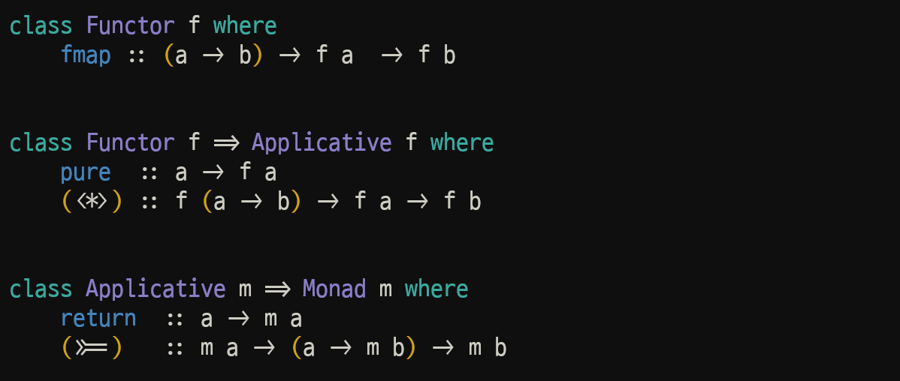
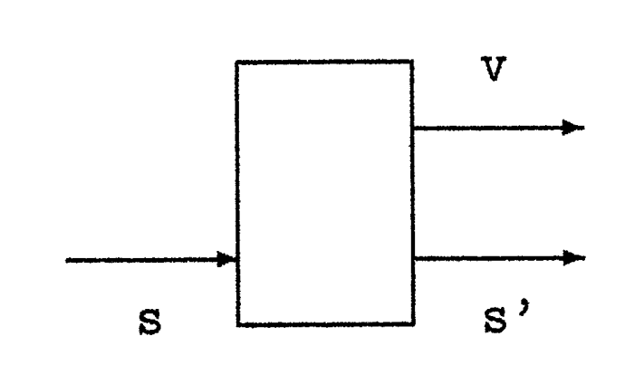
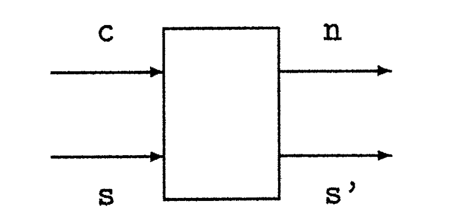
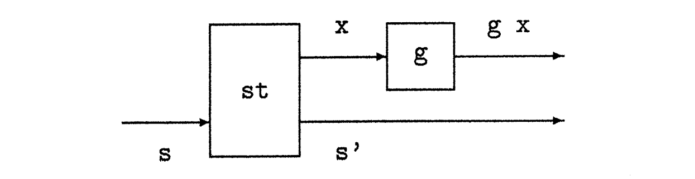
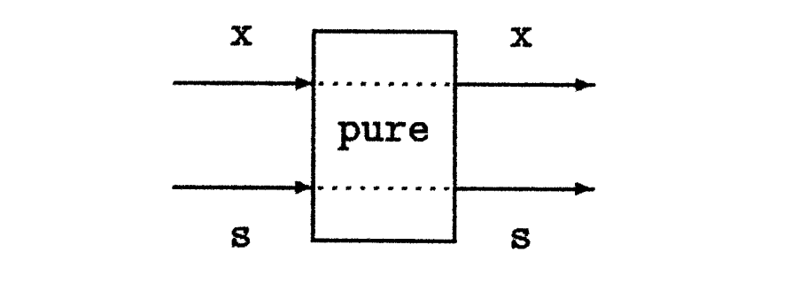
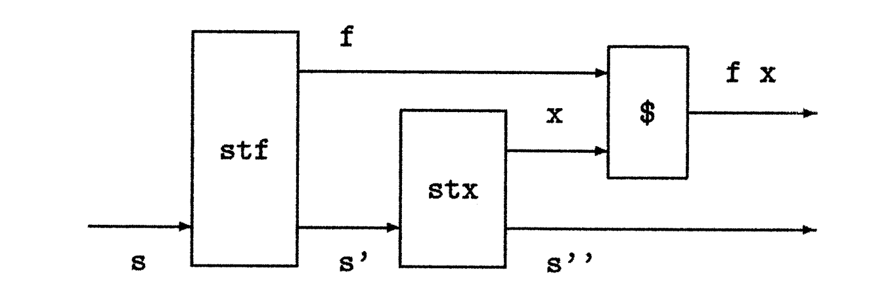
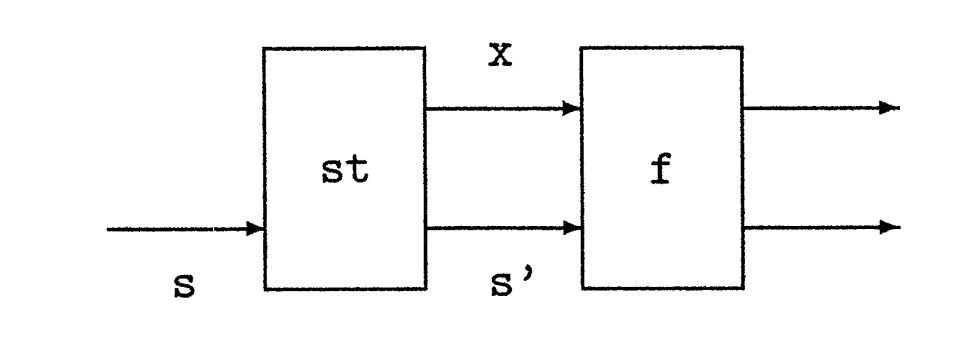

<!-- truncate -->

하스켈에서는 parameterised type에 함수를 적용할 수 있는 여러 방법들이 있다.

## Functors
다음과 같은 간단한 함수들을 보자.
```haskell
inc :: [Int] -> [Int]
inc []      = []
inc (n:ns)  = n+1 : inc ns

sqr :: [Int] -> [Int]
sqr []      = []
sqr (n:ns)  = n^2 : sqr ns
```
이 두 함수의 차이는 리스트의 각 원소에 적용되는 함수 뿐이다.  
이러한 패턴은 라이브러리 함수 `map`으로 간단히 정의할 수 있다.

우선 라이브러리 함수 `map`을 살펴보자.
```haskell
map :: (a -> b) -> [a] -> [b]
map f []        = []
map f (x:xs)    = f x : map f xs
```
위의 두개의 함수는 다음과 같이 간단하게 정의된다.
```haskell
inc = map (+1)
sqr = map (^2)
```
이 예시에서 볼 수 있듯이, `map`은 리스트에서의 각 원소에 대한 함수를 매핑 한다.  
그렇다면, 리스트 뿐만이 아닌 다른 자료구조, 더 나아가 여러 parameterised type들에 대해서도 일반화할 수 있지 않을까?

이러한 매핑 함수를 지원하는 타입의 클래스를 **Functor**라고 한다.
```haskell
class Functor f where
    fmap :: (a -> b) -> f a  -> f b
```
parameterised type `f`가 `Functor` 클래스의 인스턴스가 되려면, 명시된 타입의 `fmap` 함수를 지원해야 한다.  
`fmap`은 `a -> b` 타입의 함수와, 원소의 타입이 `a`인 `f a` 구조를 받아서, 그 함수를 각 원소에 적용한 결과로 원소의 타입이 `b`가 된 `f b` 구조를 생성한다.

### 예시
리스트 타입은 `fmap`을 `map` 함수로 간단히 정의함으로써 펑터로 만들 수 있다.

```haskell
instance Functor [] where
    -- fmap :: (a -> b) -> [a] -> [b]
    fmap = map
```
이 선언에서 `[]` 기호는 타입 매개변수가 없는 리스트 타입을 나타낸다. 이는 `[a]` 타입이 리스트 타입 `[]`을 매개변수 타입 `a`에 적용한 `[] a`라는 더 원시적인 형태로도 쓰일 수 있다는 사실에 근거한다.

또한, 위 코드에서 `fmap`의 타입이 명시적으로 선언되지 않고 주석으로 작성된 점에 주목해야 한다. 이는 하스켈이 인스턴스 선언에 이러한 타입 정보를 허용하지 않기 때문이다. 하지만 `fmap`의 정의를 드러내고 문서화를 위해, 타입을 주석으로 포함했다.

\
두 번째 예시로, 실패하거나 성공할 수 있는 `a` 타입의 값을 나타내는 내장 타입 `Maybe a`를 떠올려 보자.

```haskell
data Maybe a = Nothing | Just a
```
다음과 같이 적절한 타입의 `fmap` 함수를 정의하면 간단히 `Maybe` 타입을 펑터로 만들 수 있다.  
(펑터를 나타내는 `f`와의 혼동을 피하고자 인자로 받는 함수를 `g`라고 부름)
```haskell
instance Functor Maybe where
    -- fmap :: (a -> b) -> Maybe a -> Maybe b
    fmap _ Nothing = Nothing
    fmap g (Just x) = Just (g x)
```
즉, 실패한 값(`Nothing`)에 함수를 매핑하면 실패가 그대로 전파되는 결과가 나오고, 성공한 값(`Just`)의 경우에는 내부 값에 함수를 적용한 후 다시 태그를 붙인다. 

사용 예를 들면 다음과 같다.
```haskell
> fmap (+1) Nothing
Nothing

> fmap (*2) (Just 3)
Just 6

> fmap not (Just False)
Just True
```

\
사용자 정의 타입 또한 펑터로 만들 수 있다. 예를 들어, leaf에 데이터를 갖는 이진 트리 타입을 선언한다고 가정해 보자.
```haskell
data Tree a = Leaf a | Node (Tree a) (Tree a)
    deriving Show
```
`deriving Show` 구문은 트리가 화면에 표시될 수 있도록 보장한다. 그 후, 매개변수화된 타입 `Tree`는 주어진 함수를 트리의 각 잎 값에 적용하는 `fmap` 함수를 정의함으로써 펑터로 만들 수 있다.
```haskell
instance Functor Tree where
    -- fmap :: (a -> b) -> Tree a -> Tree b
    fmap g (Leaf x) = Leaf (g x)
    fmap g (Node l r) = Node (fmap g l) (fmap g r)
```
예를 들면 다음과 같다.
```haskell
> fmap length (Leaf "abc")
Leaf 3

> fmap even (Node (Leaf 1) (Leaf 2))
Node (Leaf False) (Leaf True)
```
하스켈에서 사용되는 많은 펑터 `f`는 위 세 예시와 유사하다. 즉, `f a`가 `a` 타입의 원소를 포함하는 자료 구조라는 의미에서 때로 **컨테이너 타입(container type)** 이라 불리며, `fmap`은 주어진 함수를 각 원소에 적용한다.

하지만 모든 인스턴스가 이 패턴에 들어맞는 것은 아니다. 예를 들어, `IO` 타입은 일반적인 의미의 컨테이너 타입이 아니다. 왜냐하면 그 값은 우리가 내부 구조에 접근할 수 없는 입출력 액션(action)을 나타내기 때문이다. 하지만 이는 쉽게 펑터로 만들 수 있다.
```haskell
instance Functor IO where
    -- fmap :: (a -> b) -> IO a -> IO b
    fmap g mx = do {x <- mx; return (g x)}
```
이 경우, `fmap`은 인자로 주어진 액션의 결과 값에 함수를 적용하며, 이를 통해 그러한 값들을 처리하는 수단을 제공한다. 예를 들면 다음과 같다.
```haskell
> fmap show (return True)
"True"
```

\
펑터를 사용하는 핵심적인 이점 두 가지
1. `fmap` 함수는 펑터의 성질을 만족하는(functorial) 어떤 구조의 원소든 처리하는 데 사용됨  
즉, 각 인스턴스마다 별개의 함수 이름을 만들어낼 필요 없이, 본질적으로 동일한 역할을 하는 함수들에 대해 같은 이름을 사용할 수 있다.
2. 어떤 펑터에나 사용할 수 있는 일반화된(generic) 함수를 정의  
예를 들어, 리스트의 각 정수를 1씩 증가시키던 이전의 함수는 `map` 대신 `fmap`을 사용하기만 하면 어떤 펑터 타입에도 적용되도록 일반화할 수 있다.
```haskell
inc :: Functor f => f Int -> f Int
inc = fmap (+1)
```
예를 들면 다음과 같다
```haskell
> inc (Just 1)
Just 2

> inc [1,2,3,4,5]
[2,3,4,5,6]

> inc (Node (Leaf 1) (Leaf 2))
Node (Leaf 2) (Leaf 3)
```

### Functor laws
명시된 타입의 `fmap` 함수를 제공하는 것 외에도, 펑터는 두 가지 등식 법칙을 만족해야 한다.
- `fmap id` = `id`
- `fmap (g . h)` = `fmap g . fmap h`

첫 번째 등식은 `fmap`이 **항등 함수(identity function)를 보존**한다는 것을 의미한다.  
즉, `fmap`을 항등 함수에 적용하면 결과로 같은 항등 함수를 반환한다. 하지만 이 등식에서 `id`는 두 번 나타나지만 서로 타입이 다르다는 점에 유의해야 한다. 좌변의 `id`는 `a -> a` 타입을 가지므로 `fmap id`의 타입은 `f a -> f a`가 된다. 따라서 등식이 성립하려면 우변의 `id` 또한 `f a -> f a` 타입을 가져야만 한다.

두 번째 등식은 `fmap`이 **함수 합성을 보존**한다는 것을 의미한다.  
즉, 두 함수의 합성에 `fmap`을 적용하는 것은, 두 함수 각각에 `fmap`을 적용한 뒤 그 결과를 합성하는 것과 결과가 같다. 이 합성이 타입 검사를 통과하려면, 구성 요소인 함수 `g`와 `h`는 각각 `b -> c`와 `a -> b` 타입을 가져야 한다.

`fmap`의 다형적 타입과 결합된 이 펑터 법칙들은 fmap이 실제로 매핑(mapping) 연산을 수행하도록 보장한다. 예를 들어, 리스트의 경우 이 법칙들은 원소가 추가되거나, 제거되거나, 재배열되지 않고 인자로 주어진 리스트의 구조가 보존됨을 보장한다. 

만약 내장 리스트 펑터를 리스트 원소의 순서를 뒤집는 `fmap`의 대체 버전으로 교체했다고 가정해 보자.
```haskell
instance Functor [] where
    -- fmap :: (a -> b) -> f a -> f b
    fmap g []     = []
    fmap g (x:xs) = fmap g xs ++ [g x]
```
(만약 이 예제를 GHCi에서 실행해보고 싶다면, 내장 리스트 펑터와의 충돌을 피하기 위해 위 선언을 수정하여 자신만의 리스트 타입을 먼저 선언해야 한다.) 이 선언은 타입은 올바르지만, 다음 예제에서 보듯이 펑터 법칙을 만족하지 못한다.
```haskell
> fmap id [1,2]
[2,1]

> id [1,2]
[1,2]

> fmap (not . even) [1,2]
[False,True]

> (fmap not . fmap even) [1,2]
[True,False]
```
우리가 예제 섹션에서 정의했던 모든 펑터들은 펑터 법칙을 만족한다. 사실, 하스켈의 어떤 매개변수화된 타입에 대해, 필요한 법칙들을 만족하는 `fmap` 함수는 기껏해야 하나뿐이다. 즉, 주어진 매개변수화된 타입을 펑터로 만들 수 있는 방법이 있다면, 그 방법은 단 하나뿐이라는 것이다. 따라서 우리가 정의했던 리스트, `Maybe`, `Tree`, `IO`에 대한 인스턴스들은 모두 유일하게 결정된 것이다.

## Applicatives
펑터는 구조의 각 원소 위로 함수를 매핑한다는 아이디어를 추상화한다. 이제 이 아이디어를 일반화하여, 단일 인자를 갖는 함수에 제약되는 대신 임의의 개수의 인자를 갖는 함수를 매핑할 수 있도록 하고 싶다고 가정해 보자. 더 정확히는, 다음과 같은 타입을 갖는 `fmap` 함수들의 계층을 정의하고 싶다고 가정해 보자.
```haskell
fmap0 :: a -> f a
fmap1 :: (a -> b) -> f a -> f b
fmap2 :: (a -> b -> c) -> f a -> f b -> f c
fmap3 :: (a -> b -> c -> d) -> f a -> f b -> f c -> f d
.
.
.
```
`fmap1`은 `fmap`의 다른 이름일 뿐이고, `fmap0`는 매핑되는 함수가 인자를 갖지 않는 퇴화된(degenerate) 경우이다. 한 가지 가능한 접근법은 각 경우에 대해 펑터 클래스의 특별한 버전(Functor0, Functor1, Functor2 등)을 선언하는 것이다. 그러면 예를 들어 다음과 같이 쓸 수 있다.
```haskell
> fmap2 (+) (Just 1) (Just 2)
Just 3
```
하지만 이 방법은 여러 면에서 만족스럽지 않다.
- 모든 펑터 클래스들이 유사한 패턴을 따름에도 불구하고 각 버전을 수동으로 선언해야 한다.
- 무한히 많은 클래스가 있지만 우리는 유한한 수만 선언할 수 있으므로, 얼마나 많은 클래스를 선언해야 할지 명확하지 않다.

`(a -> b) -> f a -> f b` 타입의 `fmap`을 `(a -> b) -> a -> b` 타입의 내장 함수 적용 연산자를 일반화한 것으로 간주한다면, 원하는 동작을 달성하기 위해 일종의 **커링(currying)** 을 사용할 수 있을 것이라 기대할 수 있다. 특히, 우리는 `add x y = x + y`와 같은 정의에서 커링에 의존할 뿐, 인자 개수가 다른 함수들을 위해 특별한 버전의 적용(application)을 필요로 하지 않는다.

\
커링(currying)의 아이디어를 사용하면, 임의의 인자 개수를 갖는 함수를 위한 `fmap`의 버전은 다음 두 가지 기본 함수의 타입으로 구성될 수 있다.
```haskell
pure :: a -> f a
(<*>) :: f (a -> b) -> f a -> f b
```
즉, `pure`는 `a` 타입의 값을 `f a` 타입의 구조로 변환하는 반면, `<*>`는 인자로 주어지는 함수, 인자 값, 그리고 결과 값이 모두 `f` 구조 안에 포함되는, 일반화된 형태의 함수 적용이다. 일반적인 함수 적용과 마찬가지로 `<*>` 연산자는 두 인자 사이에 중위(infix) 표기법으로 사용되며 왼쪽 결합(left-associative)을 한다고 가정한다.  
예를 들어, `g <*> x <*> y <*> z`는 다음과 같이 해석된다.
```haskell
(((g <*> x) <*> y) <*> z)
```
`pure`와 `<*>`의 전형적인 사용 형태는 다음과 같다.
```haskell
pure g <*> x1 <*> x2 <*> ... <*> xn
```
이러한 표현식은 **어플리커티브 스타일(applicative style)** 이라고 한다. 이는 일반적인 함수 적용 표기법인 `g x1 x2 ... xn`과의 유사성 때문이다. 두 경우 모두, `g`는 `a1 ... an` 타입의 인자 n개를 받아 `b` 타입의 결과를 생성하는 커링된 함수이다. 하지만 어플리커티브 스타일에서는 각 인자 `xi`가 `ai`가 아닌 `f ai` 타입을 가지며, 전체 결과 또한 `b`가 아닌 `f b` 타입을 갖는다. 이 아이디어를 사용하여 매핑 함수의 계층을 다음과 같이 정의할 수 있다.
```haskell
fmap0 :: a -> f a
fmap0 = pure

fmap1 :: (a -> b) -> f a -> f b
fmap1 g x = pure g <*> x

fmap2 :: (a -> b -> c) -> f a -> f b -> f c
fmap2 g x y = pure g <*> x <*> y

fmap3 :: (a -> b -> c -> d) -> f a -> f b -> f c -> f d
fmap3 g x y z = pure g <*> x <*> y <*> z

.
.
.
```
이 정의들의 타입을 직접 확인해보는 것은 좋은 연습이 된다. 하지만 실제로는 다음 섹션에서 보게 될 것처럼 필요에 따라 구성될 수 있으므로 이러한 매핑 함수들을 명시적으로 정의할 필요는 거의 없다.

`pure`와 `<*>` 개념을 지원하는 펑터를 어플리커티브 펑터(applicative functors), 줄여서 **어플리커티브(applicatives)** 라고 부른다. 하스켈에서 이 개념은 다음과 같은 내장 클래스 선언으로 구현된다.
```haskell
class Functor f => Applicative f where
    pure  :: a -> f a
    (<*>) :: f (a -> b) -> f a -> f b
```

### 예시
`Maybe`가 `fmap`을 지원하는 펑터라는 사실을 이용하면, 이 타입을 어플리커티브 펑터로 만드는 것은 간단하다.
```haskell
instance Applicative Maybe where
    -- pure :: a -> Maybe a
    pure = Just
    
    -- (<*>) :: Maybe (a -> b) -> Maybe a -> Maybe b
    Nothing <*> _ = Nothing
    (Just g) <*> mx = fmap g mx
```
즉, `pure` 함수는 값을 성공적인 결과(`Just`)로 변환하는 반면, `<*>` 연산자는 실패할 수도 있는 인자에 실패할 수도 있는 함수를 적용하여 결과를 생성한다. 

예를 들면 다음과 같다.
```haskell
> pure (+1) <*> Just 1
Just 2

> pure (+) <*> Just 1 <*> Just 2
Just 3

> pure (+) <*> Nothing <*> Just 2
Nothing
```
이러한 방식으로, `Maybe`의 어플리커티브 스타일은 실패 전파를 어플리커티브의 자동화된 메커니즘이 처리해주므로, 우리가 직접 실패 가능성이 있는 인자에 순수 함수를 적용하는 것을 관리할 필요가 없는 형태의 예외 처리 프로그래밍을 지원한다.

\
이제 리스트 타입으로 넘어가 보자. 표준적인 인스턴스 선언은 다음과 같다.
```haskell
instance Applicative [] where
    -- pure :: a -> [a]
    pure x = [x]
    
    -- (<*>) :: [a -> b] -> [a] -> [b]
    gs <*> xs = [g x | g <- gs, x <- xs]
```
즉, `pure`는 값을 원소가 하나인 리스트(singleton list)로 변환하고, `<*>`는 함수들의 리스트와 인자들의 리스트를 받아, 각 함수를 각 인자에 적용하여 모든 결과를 리스트로 반환한다. 예를 들면 다음과 같다.
```haskell
> pure (+1) <*> [1,2,3]
[2,3,4]

> pure (+) <*> [1] <*> [2]
[3]

> pure (*) <*> [1,2] <*> [3,4]
[3,4,6,8]
```
이 예제들을 어떻게 이해해야 할까? 핵심은 `[a]` 타입을 성공 시 여러 결과를 허용하는 `Maybe a`의 일반화로 보는 것이다. 더 정확히는, 빈 리스트는 실패를 나타내고, 비어있지 않은 리스트는 결과가 성공할 수 있는 모든 가능한 방식을 나타낸다고 생각할 수 있다. 따라서 마지막 예제에서 첫 번째 인자는 두 개의 가능한 값(`1` 또는 `2`)을 갖고, 두 번째 인자도 두 개의 가능한 값(`3` 또는 `4`)을 가지므로, 곱셈의 결과로 네 개의 가능한 결과(`3, 4, 6, 8`)가 나오는 것이다.

더 일반적으로, 리스트 컴프리헨션(list comprehension)을 사용하여 두 정수 리스트를 곱하는 모든 가능한 방법을 반환하는 함수를 생각해보자.
```haskell
prods :: [Int] -> [Int] -> [Int]
prods xs ys = [x*y | x <- xs, y <- ys]
```
리스트가 어플리커티브라는 사실을 이용하면, 중간 결과에 이름을 붙일 필요 없이 어플리커티브 정의를 내놓을 수 있다.
```haskell
prods :: [Int] -> [Int] -> [Int]
prods xs ys = pure (*) <*> xs <*> ys
```
요약하자면, 리스트의 어플리커티브 스타일은 일종의 **비결정적 프로그래밍(non-deterministic programming)** 을 지원한다. 이를 통해 값의 선택이나 실패 전파를 직접 관리할 필요 없이, 순수 함수를 다중-값 인자에 적용할 수 있으며, 이는 어플리커티브의 자동화된 메커니즘이 처리해준다.

이 섹션에서 다룰 마지막 타입은 `IO` 타입이며, 다음 선언을 사용하여 어플리커티브 펑터로 만들 수 있다.
```haskell
instance Applicative IO where
    -- pure :: a -> IO a
    pure = return
    
    -- (<*>) :: IO (a -> b) -> IO a -> IO b
    mg <*> mx = do {g <- mg; x <- mx; return (g x)}
```
이 경우 `pure`는 `IO` 타입을 위한 `return` 함수로 정의되고, `<*>`는 순수하지 않은(impure) 인자에 순수 함수를 적용하여 순수하지 않은 결과를 내놓는다. 예를 들어, 키보드로부터 주어진 개수의 문자를 읽는 함수는 어플리커티브 스타일로 다음과 같이 정의될 수 있다.
```haskell
getChars :: Int -> IO String
getChars 0 = return []
getChars n = pure (:) <*> getChar <*> getChars (n-1)
```
즉, 기본 케이스(base case)에서는 단순히 빈 리스트를 반환하고, 재귀 케이스에서는 첫 번째 문자를 읽은 결과와 나머지 문자 리스트에 리스트 생성자 (`:`)를 적용한다. 후자의 경우, 만약 이 함수가 `do` 표기법으로 정의되었다면 필요했을 cons 함수에 공급되는 인자들의 이름을 붙일 필요가 없다.

더 일반적으로, `IO`의 어플리커티브 스타일은 일종의 **interactive programming** 을 지원한다. 이를 통해 액션의 순서나 결과 값 추출을 직접 관리할 필요 없이, 순수 함수를 순수하지 않은 인자에 적용할 수 있으며, 이는 어플리커티브의 자동화된 메커니즘이 자동으로 처리해준다.

### Effectful programming
어플리커티브에 대한 원래 동기는 다중 인자 함수에 대한 매핑 아이디어를 일반화하려는 것이었다. 이는 어플리커티브의 개념에 대한 한가지 유효한 해석이지만, 앞서 살펴본 세 가지 인스턴스(`Maybe`, `List`, `IO`)를 통해 더 추상적인 또 다른 관점이 있다는 것이 분명해진다.

이 인스턴스들 사이의 공통된 주제는 모두 **effects** 를 사용한 프로그래밍과 관련이 있다는 점이다. 각 경우에, 어플리커티브 메커니즘은 친숙한 어플리커티브 스타일로 프로그램을 작성하게 해주는 `<*>` 연산자를 제공한다. 이 스타일에서는 함수가 인자에 적용되는데, 한 가지 핵심적인 차이점이 있다. 인자들은 더 이상 단순한 값이 아니라, 실패 가능성, 여러 성공 경로, 또는 입출력 액션 수행과 같은 effect를 가질 수 있다.

이러한 방식으로, 어플리커티브 펑터는 순수 함수를 **effectful arguments**에 적용하는 아이디어를 추상화한 것으로도 볼 수 있으며, 허용되는 효과의 정확한 형태는 기반이 되는 펑터의 성질에 따라 달라진다.

effectful programming의 한 형태에 대한 통일된 접근법을 제공하는 것 외에도, 어플리커티브를 사용하는 것은 어떤 어플리커티브 펑터와도 함께 사용할 수 있는 일반화된 함수를 정의할 수 있다는 중요한 이점도 있다. 

한 예로, 표준 라이브러리는 다음 함수를 제공한다.
```haskell
sequenceA :: Applicative f => [f a] -> f [a]
sequenceA [] = pure []
sequenceA (x:xs) = pure (:) <*> x <*> sequenceA xs
```
이 함수는 어플리커티브 액션들의 리스트를, 결과 값들의 리스트를 반환하는 단일 액션으로 변환하며, 어플리커티브 프로그래밍의 공통된 패턴을 포착한다. 예를 들어, `getChars` 함수는 이제 기본 액션인 `getChar`를 필요한 횟수만큼 복제하고 그 결과 시퀀스를 실행하는 더 간단한 방식으로 정의될 수 있다.
```haskell
getChars :: Int -> IO String
getChars n = sequenceA (replicate n getChar)
```

### Applicative laws
`pure`와 `<*>` 함수를 제공하는 것 외에도, 어플리커티브 펑터는 네 가지 등식 법칙을 만족해야 한다.
1. `pure id <*> x` = `x`
    - **항등(Identity)** : `pure`가 항등 함수를 보존한다는 것을 말한다. 즉, `pure id`를 적용하는 것은 아무것도 하지 않는 것과 같다.
2. `pure (g x)` = `pure g <*> pure x`
    - **동형사상(Homomorphism)** : `pure`가 함수 적용 또한 보존함을 말한다. `pure`는 일반적인 함수 적용을 어플리커티브 함수 적용으로 분배할 수 있다.
3. `x <*> pure y` = `pure (\g -> g y) <*> x`
    - **교환(Interchange)** : effectful 함수를 순수한(pure) 인자에 적용할 때, 두 구성 요소의 평가 순서는 중요하지 않다는 것을 말한다.
4. `x <*> (y <*> z)` = `(pure (.) <*> x <*> y) <*> z`
    - **결합(Composition)** : 관련된 타입들을 제외하면 `<*>` 연산자가 결합 법칙을 만족한다는 것을 말한다.

이 어플리커티브 법칙들은 `pure :: a -> f a` 함수에 대한 우리의 직관, 즉 `a` 타입의 값을 `f` 타입의 세상에 심는다는 개념을 공식화한다. 또한 이 법칙들은 `pure` 함수와 `<*>` 연산자를 사용하여 구축된 모든 타입이 올바른 표현식은 어플리커티브 스타일로 다시 작성될 수 있음을 보장한다. 즉, 다음과 같은 형태이다.
```
pure g <*> x1 <*> x2 <*> ... <*> xn
```
우리가 예제에서 정의했던 모든 어플리커티브 펑터는 위 법칙들을 만족한다. 더욱이, 이 인스턴스들은 각각 `fmap g x = pure g <*> x` 법칙 또한 만족하는데, 이는 `fmap`이 두 어플리커티브 기본 연산(`pure`, `<*>`)으로 어떻게 정의될 수 있는지 보여준다. 사실 이 `fmap` 관련 법칙은 이전에 언급된 사실, 즉 주어진 매개변수화된 타입을 펑터로 만드는 방법은 단 하나뿐이므로 `fmap`과 동일해야 하는 함수는 어떤 것이든 실제로 `fmap`과 같다는 사실 덕분에 공짜로 얻어진다.

마지막으로, 하스켈은 `g <$> x = fmap g x`로 정의되는 `fmap`의 중위(infix) 버전인 `<$>`를 제공한다. 이를 위 `fmap` 법칙과 결합하면 어플리커티브 스타일의 대안적인 형태를 얻을 수 있다.
```
g <$> x1 <*> x2 <*> ... <*> xn
```
이 버전이 약간 더 간결하지만, 설명 목적으로는 프로그래밍이 순수 함수를 효과가 있는 인자에 적용하는 것임을 명시적으로 강조하는 `pure` 버전을 선호한다. 하지만 `<$>`를 사용하는 버전은 실제 응용 프로그램에서 자주 사용된다.

## Monads
이 장에 나올 마지막 새로운 개념은 effectful programming의 또 다른 패턴을 포착한다. 예시로, 정수 값과 나눗셈 연산자로 구성된 다음 표현식 타입을 생각해보자.
```haskell
data Expr = Val Int | Div Expr Expr
```
이러한 표현식은 다음과 같이 평가될 수 있다.
```haskell
eval :: Expr -> Int
eval (Val n) = n
eval (Div x y) = eval x `div` eval y
```
하지만 이 함수는 0으로 나누는 가능성을 고려하지 않으며, 이 경우 오류를 발생시킨다.
```haskell
> eval (Div (Val 1) (Val 0))
*** Exception: divide by zero
```
이 문제를 해결하기 위해, 두 번째 인자가 `0`일 때 `Nothing`을 반환하는 안전한 버전의 나눗셈 함수를 정의하기 위해 `Maybe` 타입을 사용할 수 있다.
```haskell
safediv :: Int -> Int -> Maybe Int
safediv _ 0 = Nothing
safediv n m = Just (n `div` m)
```
그리고 `eval` 함수를 수정하여 두 인자 표현식에 재귀적으로 호출될 때 실패 가능성을 명시적으로 처리하도록 한다.
```haskell
eval :: Expr -> Maybe Int
eval (Val n) = Just n
eval (Div x y) = case eval x of
                   Nothing -> Nothing
                   Just n  -> case eval y of
                                Nothing -> Nothing
                                Just m  -> safediv n m
```
이제 예를 들면 다음과 같다.
```haskell
> eval (Div (Val 1) (Val 0))
Nothing
```
이 새로운 정의는 0으로 나누기 이슈를 해결하지만 다소 장황하다. 정의를 단순화하기 위해 `Maybe`가 어플리커티브라는 사실을 활용하여 `eval`을 어플리커티브 스타일로 재정의해볼 수 있다.
```haskell
eval :: Expr -> Maybe Int
eval (Val n) = pure n
eval (Div x y) = pure safediv <*> eval x <*> eval y
```
하지만 이 정의는 타입이 올바르지 않다. 특히, 위 컨텍스트에서는 `Int -> Int -> Int` 타입의 함수가 필요한데, `safediv` 함수는 `Int -> Int -> Maybe Int` 타입을 갖는다. `pure safediv`를 `Maybe (Int -> Int -> Maybe Int)` 타입을 갖는 커스텀 정의 함수로 교체해도 도움이 되지 않는데, 이는 두 번째 정수가 0일 때 실패를 나타낼 방법이 없기 때문이다.

결론은 `eval` 함수가 어플리커티브 펑터가 포착하는 effectful programming의 패턴에 맞지 않는다는 것이다. 어플리커티브 스타일은 순수 함수를 효과가 있는 인자에 적용하도록 제한한다. `eval`은 이 패턴에 맞지 않는데, `safediv`를 처리하는 데 사용되는 함수가 순수 함수가 아니라 그 자체로 실패할 수 있기 때문이다.

그렇다면 `eval :: Expr -> Maybe Int`를 어떻게 더 간단한 방식으로 다시 작성할 수 있을까? 핵심은 `eval` 정의에 두 번 나타나는 공통 패턴, 즉 `Maybe` 값에 대한 **경우 분석(case analysis)**을 수행하여 `Nothing`은 `Nothing`으로, `Just x`는 어떤 결과로 매핑하는 것을 관찰하는 것이다. 이 패턴을 추상화하면 다음과 같이 정의되는 새로운 연산자 `>>=`를 얻을 수 있다.
```haskell
(>>=) :: Maybe a -> (a -> Maybe b) -> Maybe b
mx >>= f = case mx of
             Nothing -> Nothing
             Just x  -> f x
```
즉, `>>=`는 실패할 수 있는 `a` 타입의 인자와, 그 결과가 실패할 수 있는 `a` 타입의 함수를 받아, 실패할 수 있는 `b` 타입의 결과를 반환한다. 만약 첫 번째 인자가 실패하면 실패를 전파하고, 그렇지 않으면 두 번째 인자인 함수를 첫 번째 인자의 결과에 적용한다. 이런 식으로 `>>=`는 `Maybe` 값의 연속과 그 결과 처리를 통합한다. `>>=` 연산자는 종종 **바인드(bind)** 라고 불린다. 두 번째 인자를 첫 번째 인자의 결과에 바인딩하기 때문이다.

바인드 연산자와 람다 표기법을 사용하여, 이제 `eval` 함수를 더 간결한 방식으로 재정의할 수 있다.
```haskell
eval :: Expr -> Maybe Int
eval (Val n) = Just n
eval (Div x y) = eval x >>= \n ->
                 eval y >>= \m ->
                 safediv n m
```
`Div`의 경우는 먼저 `x`를 평가하여 그 결과를 `n`이라 하고, 그 다음 `y`를 평가하여 그 결과를 `m`이라 한 뒤, `safediv`를 사용하여 두 결과를 결합하는 상태를 명시한다.

위 예제로부터 일반화하면, `>>=` 연산자를 사용하여 구축된 표현식은 전형적으로 다음과 같은 구조를 가진다.
```haskell
m1 >>= \x1 ->
m2 >>= \x2 ->
...
mn >>= \xn ->
f x1 x2 ... xn
```
즉, 우리는 `m1 ... mn` 각각의 표현식을 차례로 평가하고, 그 결과 값 `x1 ... xn`을 함수 `f`에 적용하여 결합한다. `>>=` 연산자의 정의는 시퀀스의 모든 구성요소 `mi`가 성공할 경우에만 이러한 표현식이 성공하도록 보장한다. 더 나아가, `>>=` 연산자의 정의에 의해 시퀀스의 어느 지점에서든 실패를 처리하는 문제가 자동으로 처리되므로 사용자는 이에 대해 걱정할 필요가 없다.

하스켈은 위와 같은 형태의 표현식을 다음과 같이 더 간단한 방식으로 작성할 수 있도록 특별한 표기법을 제공한다.
```haskell
do x1 <- m1
   x2 <- m2
   ...
   xn <- mn
   f x1 x2 ... xn
```
이는 상호작용 프로그래밍(interactive programming)에서도 사용되는 것과 동일한 표기법이다. 여기에서도 시퀀스의 각 항목은 동일한 열에서 시작해야 하며, 결과 값 `xi`가 필요하지 않은 경우 `xi <- mi`는 `mi`로 축약될 수 있다. 이 `do` 표기법을 사용하면 `eval`은 이제 다음과 같이 간단하게 재정의될 수 있다.
```haskell
eval :: Expr -> Maybe Int
eval (Val n) = Just n
eval (Div x y) = do n <- eval x
                    m <- eval y
                    safediv n m
```
더 일반적으로, `do` 표기법은 `IO`나 `Maybe` 타입에만 국한되지 않고, **모나드(monad)** 를 형성하는 모든 어플리커티브 타입과 함께 사용될 수 있다. 하스켈에서 모나드의 개념은 다음과 같은 내장 선언으로 구현된다.
```haskell
class Applicative m => Monad m where
    return :: a -> m a
    (>>=)  :: m a -> (a -> m b) -> m b
    
    return = pure
```
즉, 모나드는 명시된 타입의 `return`과 `>>=` 함수를 지원하는 어플리커티브 타입이다. 기본 정의 `return = pure`는 `return`이 일반적으로 어플리커티브 함수 `pure`의 다른 이름일 뿐이지만, 원한다면 인스턴스 선언에서 오버라이드(override)될 수 있음을 의미한다.

`return` 함수는 역사적인 이유로, 그리고 `return`과 `>>=` 함수를 모두 포함한다고 가정하는 기존 코드, 논문, 교과서와의 하위 호환성을 보장하기 위해 `Monad` 클래스에 포함되어 있다. 하지만 미래의 어느 시점에는 `return`이 `Monad` 클래스에서 제거되고 대신 다음과 같은 정의를 갖는 라이브러리 함수가 될 수도 있다.
```haskell
return :: Applicative f => a -> f a
return = pure
```
만약 이 변경이 구현되면, 더 이상 인스턴스 선언에서 `return`을 정의하는 것이 불가능해지지만, 우리는 일반적으로 기본 정의인 `return = pure`를 사용하므로 대부분의 예제는 영향을 받지 않을 것이다.

### 예시
표준 라이브러리(prelude)에서, `Maybe` 타입의 바인드(bind) 연산자는 단순성을 위해 케이스 분석 대신 패턴 매칭을 사용하여 정의된다.
```haskell
instance Monad Maybe where
    -- (>>=) :: Maybe a -> (a -> Maybe b) -> Maybe b
    Nothing >>= _ = Nothing
    (Just x) >>= f = f x
```
이 선언 때문에 `do` 표기법이 이전 섹션의 `eval` 함수에서처럼 `Maybe` 값을 프로그래밍하는 데 사용될 수 있는 것이다.

\
리스트 또한 다음과 같이 모나드 타입으로 만들어질 수 있다.
```haskell
instance Monad [] where
    -- (>>=) :: [a] -> (a -> [b]) -> [b]
    xs >>= f = [y | x <- xs, y <- f x]
```
즉, `xs >>= f`는 `xs`의 각 결과 `x`에 함수 `f`를 적용하고, 그 결과 값들을 모두 리스트에 모은다. 이런 식으로 리스트의 바인드 연산자는 여러 결과를 생성할 수 있는 표현식을 시퀀싱하는 수단을 제공한다. 예를 들어, 두 리스트의 원소를 짝짓는 모든 가능한 방법을 반환하는 함수는 이제 `do` 표기법을 사용하여 정의할 수 있다.
```haskell
pairs :: [a] -> [b] -> [(a,b)]
pairs xs ys = do x <- xs
                 y <- ys
                 return (x,y)
```
예를 들면 다음과 같다.
```haskell
> pairs [1,2] [3,4]
[(1,3),(1,4),(2,3),(2,4)]
```
`pairs`의 마지막 줄에서 기본 정의인 `return = pure` 때문에 `pure (x,y)`를 쓸 수도 있었지만, 모나드 프로그래밍에서는 `return` 함수를 사용하는 것이 관례라는 점에 유의하자. 또한 이 정의가 리스트 컴프리헨션 표기법을 사용한 정의와 유사하다는 점도 흥미롭다.
```haskell
pairs xs ys = [(x,y) | x <- xs, y <- ys]
```
하지만 컴프리헨션 표기법은 리스트 타입에만 특정되지만, `do` 표기법은 임의의 모나드와 함께 사용될 수 있다.

\
표준 라이브러리는 또한 `IO` 타입에 대한 인스턴스도 포함하며, 이는 상호작용 프로그래밍을 위한 `do` 표기법 사용을 지원한다. 위의 다른 예제들과 달리, 이 경우 `return`과 `>>=`의 정의는 하스켈 자체 내에서 정의되기보다는 언어에 내장되어 있다.
```haskell
instance Monad IO where
    -- return :: a -> IO a
    return x = ...
    
    -- (>>=) :: IO a -> (a -> IO b) -> IO b
    mx >>= f = ...
```

### The state monad
이제 시간에 따라 변할 수 있는 어떤 형태의 **상태(state)** 를 조작하는 함수를 작성하는 문제를 생각해 보자. 여기서는 간단하게 상태는 단지 정수 값이라고 가정하지만, 필요에 따라 수정될 수 있다:
```haskell
type State = Int
```
이 타입에 대한 가장 기본적인 형태의 함수는 상태 변환자(state transformer), 약자로 ST이다. 이것은 입력 상태를 인자로 받아서 결과로 출력 상태를 만들어내며, 이때 출력 상태는 함수 실행 중에 상태에 가해진 모든 변경 사항을 반영한다:
```haskell
type ST = State -> State
```
하지만 일반적으로, 상태를 갱신하는 것 외에도 결과 값을 반환하고 싶을 수 있다. 예를 들어, 상태가 카운터를 나타낸다면, 카운터를 증가시키는 함수는 그것의 현재 값을 반환하고 싶을 수도 있다. 이러한 이유로, 상태 변환자의 타입을 일반화하여 결과 값도 반환하도록 하며, 이러한 값의 타입은 ST 타입의 파라미터가 된다:
```haskell
type ST a = State -> (a, State)
```
\
이러한 함수는 다음과 같이 그림 형태로 표시될 수 있다. 여기서 **s** 는 입력 상태, **s'** 는 출력 상태, **v** 는 결과 값이다:



반대로, 상태 변환자는 인자 값을 받고 싶을 수도 있다. 하지만 이를 고려하기 위해 ST 타입을 더 일반화할 필요는 없는데, 왜냐하면 이러한 동작은 이미 **커링(currying)** 을 활용하여 달성할 수 있기 때문이다. 예를 들어, 문자를 받아서 정수를 반환하는 상태 변환자는 `Char -> ST Int` 타입을 가질 것이며, 이는 아래 그림과 같이 커링된 함수 타입인 `Char -> State -> (Int, State)`를 축약한 것이다:



ST가 파라미터화된 타입이라는 점을 감안할 때, 이를 **모나드(monad)** 로 만들어서 상태가 있는(stateful) 프로그램을 작성하는 데 `do` 표기법을 사용할 수 있도록 시도하는 것은 자연스럽다. 하지만, `type` 메커니즘을 사용해 선언된 타입은 클래스의 인스턴스가 될 수 없다. 따라서, 먼저 newtype 메커니즘을 사용하여 `ST` 타입을 재정의하는데, 여기에는 **S** 라고 부르는 **더미 생성자(dummy constructor)** 를 도입해야 한다:
```haskell
newtype ST a = S (State -> (a, State))
```

또한 이 타입을 위해 더미 생성자를 단순히 제거하는 특수 목적의 적용 함수(application function)를 정의하는 것이 편리하다:
```haskell
app :: ST a -> State -> (a, State)
app (S st) x = st x
```

파라미터화된 ST 타입을 모나드로 만들기 위한 첫 단계로서, 이 타입을 간단히 **펑터(functor)** 로 만들 수 있다.
```haskell
instance Functor ST where
    -- fmap :: (a -> b) -> ST a -> ST b
    fmap g st = S (\s -> let (x,s') = app st s in (g x, s'))
```
즉, `fmap`은 다음 그림에서처럼 상태 변환자의 결과 값에 함수를 적용하게 해준다.



위 정의에 사용된 하스켈의 `let` 메커니즘은 `where` 메커니즘과 유사하지만, 함수 정의 수준이 아닌 표현식 수준에서 local definition을 할 수 있게 해준다는 점이 다르다. 
결과적으로, `ST` 타입은 **어플리커티브 펑터(applicative functor)** 로 만들어질 수 있다.

```haskell
instance Applicative ST where
    -- pure :: a -> ST a
    pure x = S (\s -> (x,s))
    
    -- (<*>) :: ST (a -> b) -> ST a -> ST b
    stf <*> stx = S (\s ->
    let (f,s')   = app stf s
        (x,s'')  = app stx s' in (f x, s''))
```
이 경우, `pure` 함수는 어떤 값을 상태 변경 없이 그대로 반환하는 상태 변환자로 변환한다.



한편, `<*>` 연산자는 함수를 반환하는 상태 변환자를 인자를 반환하는 상태 변환자에 적용하여, 그 함수를 인자에 적용한 결과를 반환하는 상태 변환자를 만들어낸다.



기호 `$`는 일반적인 함수 적용을 나타내며, `f $ x` = `f x`로 정의된다.

마지막으로, `ST`에 대한 모나드 인스턴스는 다음과 같이 선언된다.
```haskell
instance Monad ST where
    -- (>>=) :: ST a -> (a -> ST b) -> ST b
    st >>= f = S (\s -> let (x,s') = app st s in app (f x) s')
```
즉, `st >>= f`는 상태 변환자 `st`를 초기 상태 `s`에 적용한 다음, 그 결과 값 `x`에 함수 `f`를 적용하여 새로운 상태 변환자 `f x`를 얻는다. 그리고 이 `f x`를 새로운 상태 `s'`에 적용하여 최종 결과를 얻는다.



이런 방식으로, 상태 모나드의 **바인드(bind) 연산자(>>=)** 는 상태 변환자들의 순차적 실행과 그 결과 값의 처리를 통합한다. `>>=`의 정의 내에서는 첫 번째 인자의 결과 값 `x`에 따라 동작이 달라질 수 있는 새로운 상태 변환자 `f x`를 만들어내는 반면, `<*>`에서는 인자로 명시적으로 제공된 상태 변환자만 사용하도록 제한된다는 점에 주목해야 한다. 따라서 `>>=` 연산자를 사용하면 더 큰 유연성을 얻을 수 있다.