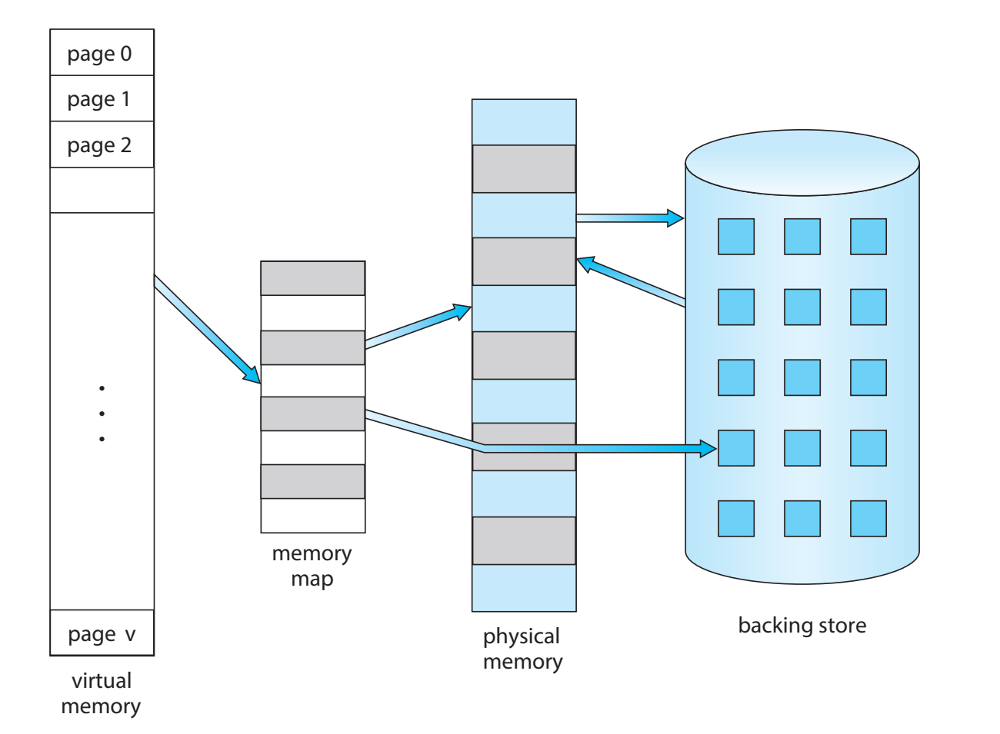

이 게시글은 C언어의 `malloc`에 대해 좀 더 자세하게 알아보기 위해 작성됐다.

- C언어의 기본적인 문법과 프로세스, 가상 메모리, 뮤텍스 같은 개념은 대략적으로 안다고 가정
- 이 글에서는 리눅스 glibc 2.41 버전을 기준으로 설명
    - 운영체제가 다르거나, 다른 libc를 쓰거나, 버전이 다르다면 맞지 않을 수 있음!

<!-- truncate -->

---

## 메모리 할당이란 무엇인가?

### 프로세스와 가상 메모리

:::info

프로세스는 가상 메모리를 사용하고, 그 메모리는 페이지 단위로 나뉜다

:::

우선 프로세스 관련 내용을 복습해보자.



- 프로세스가 사용할 수 있는 가장 기본적인 자원 중 하나는 **메모리**
- 가상 메모리는 **페이지**(일반적으로 4킬로바이트) 단위로 나뉨
    - 페이지는 실제 메모리 **프레임**이나, 디스크 공간에 연결됨


- 여러 프로세스에 속하는 가상 페이지들이 하나의 메모리 프레임에 연결될 수 있음
    - GNU C 라이브러리 코드에 의해 사용되는 가상 메모리가 예시
        - `printf` 함수를 포함하는 동일한 실제 메모리 프레임은 프로그램 내에 `printf` 호출이 있는 각 기존 프로세스의 가상 메모리 페이지에 연결됨
- 일반적으로 **실제 메모리보다 훨씬 많은 가상 메모리**가 존재
    - 페이지는 프로세스가 접근해야 할 때 실제 메모리로 이동하고 더 이상 필요하지 않을 때 보조 저장 장치로 다시 이동하는 과정을 규칙적으로 거쳐야 함
    - 이런 이동을 **페이징**이라고 함
- 프로그램이 현재 실제 메모리에 의해 지원되지 않는 페이지에 접근하려고 시도하면, **페이지 폴트**가 발생
    - 페이지 폴트가 발생하면 커널은 해당 프로세스를 일시 중단하고, 해당 페이지를 실제 페이지 프레임에 넣은 다음("페이지 인" 또는 "폴트 인"이라고 함), 프로세스를 다시 시작
    - 따라서 프로세스 관점에서 보면 해당 페이지는 처음부터 실제 메모리에 있었던 것처럼 보임
    - 그러나 수 나노초밖에 걸리지 않는 명령의 실행 시간이 갑자기 훨씬 더 길어질 수 있음!
        - 커널이 페이지 인을 완료하기 위해 일반적으로 I/O를 수행해야 하기 때문

### 메모리 할당의 정의

:::info

메모리 할당이란, **각 가상 주소 공간 내에서 프로세스가 어떤 주소에 무엇이 있는지 추적하는 과정**

:::

이해가 잘 안될 수도 있다. 메모리 할당을 생각할 때,

- 메모리를 요청하고 받는 과정?
- 자원을 분배하는 것?

이런 정의를 생각했는가? 이는 엄밀히 말해 틀렸다.

**가상 메모리 할당이 항상 실제 물리 메모리 할당으로 즉시 이어지지는 않기 때문이다.**

앞서 말했듯이, 가상 메모리 공간은 일반적으로 실제 메모리 공간보다 훨씬 크다.

이는, 가상 메모리 할당에 따른 즉각적인 물리 메모리 할당은 불가능할 수 있다는 것을 의미한다.

가상 메모리 공간의 할당은

- 일부는 **즉시** 물리 메모리에 연결될 수 있다
- 일부는 **페이지 폴트 발생 시** 물리 메모리에 연결된다
- 일부는 **특별한 처리**(예: 모두 0으로 된 페이지)가 발생한다

:::note

**제로 페이지(zero page) 처리**

모든 값이 0인 페이지는 실제 물리 메모리나 디스크에 연결되지 않을 수 있다.
대신 "이 페이지는 모두 0이다"라는 식의 **플래그만 표시**된다.

이는 일종의 메모리 최적화 기법이다.

- 모든 프로세스가 공유할 수 있는 읽기 전용 제로 페이지를 유지
- 프로세스의 가상 주소 공간에서 요청된 크기의 영역이 할당되지만, 실제 물리 메모리는 아직 할당되지 않음
- 프로그램이 실제로 해당 메모리에 접근(특히 쓰기)하기 전까지는 물리 메모리가 할당되지 않음
- 처음 읽기 접근 시, 모든 값이 0인 페이지를 가리키게 됨
- 쓰기 접근이 발생하면 페이지 폴트가 발생하고, 그제서야 실제 물리 메모리 프레임이 할당되고 0으로 초기화

이런 방식을 **지연 할당(Lazy Allocation)**이라고 한다.

:::

따라서 프로세스 내에서의 메모리 할당의 주목적은, 물리 자원을 할당하는 것이 아니라, 
동일한 메모리 위치가 서로 다른 데이터에 중복 사용되지 않도록 하는 것

- 즉, **메모리 공간의 조직화와 충돌 방지**가 핵심이다.

## 메모리 할당의 방식

프로세스에서 메모리를 할당하는 방식은 주로 두 가지이다.

- `exec` 방식
    - 프로세스를 위한 가상 주소 공간을 생성하고, 기본 프로그램을 그 안에 로드하고, 프로그램을 실행하는 작업
    - "exec" 함수군(예: `execl`)에 의해 수행
    - 프로그램 파일(실행 파일)을 가져와서, 실행 파일의 모든 데이터를 로드할 공간을 할당하고, 그것을 로드한 다음, 제어권을 넘김
    - 그 데이터는 주로 프로그램의 명령어(*텍스트*)이지만, 프로그램의 리터럴과 상수, 심지어 일부 변수(정적 저장 클래스의 C 변수)도 포함
- 프로그래밍 방식
    - **이 글에서 주로 다룰 내용**
    - 프로그램이 실행되기 시작하면, 추가 메모리를 얻기 위해 사용
    - 두 가지 종류의 방식이 있음
        - 자동 할당 (automatic allocation)
        - 동적 할당 (dynamic allocation)

`fork` 로 메모리를 할당하는 세번째 방식도 있지만, 여기서는 다루지 않겠다.

<aside>
📝

**Memory-mapped I/O**

메모리 맵 I/O는 **동적 가상 메모리 할당의 또 다른 형태**이다. 

메모리를 파일에 매핑한다는 것은 프로세스 주소의 특정 범위의 내용이 지정된 일반 파일의 내용과 동일해야 한다고 선언하는 것을 의미한다.

이를 통해, 

- 시스템은 가상 메모리가 초기에 파일의 내용을 포함하도록 만들고
- 메모리를 수정하면 시스템은 동일한 수정 사항을 파일에 기록
- 가상 메모리와 페이지 폴트 덕분에, 프로그램이 가상 메모리에 접근하기 전까지는 시스템이 파일을 읽기 위한 I/O를 수행하거나 그 내용을 위한 실제 메모리를 할당할 이유가 없음
</aside>

## C 프로그램에서의 메모리 할당

<aside>
💡

C언어에서는 변수를 통한 할당은 **정적 할당**과 **자동 할당**을 지원한다. 
**동적 할당**은 라이브러리 함수를 통해 지원한다.

</aside>

C언어는 C 프로그램의 **변수를 통해** 두 가지 종류의 메모리 할당을 지원

- 정적 할당(static allocation): 정적 변수나 전역 변수를 선언할 때 발생
    - 각 정적 변수나 전역 변수는 고정된 크기의 하나의 공간 블록을 정의
    - 이 공간은 프로그램이 시작될 때(`exec` 작업의 일부로) 한 번 할당되며, 절대 해제되지 않음
- 자동 할당(automatic allocation): 함수 인자나 지역 변수와 같은 자동 변수를 선언할 때 발생
    - 자동 변수를 위한 공간은 선언을 포함하는 복합문이 시작될 때 할당되고, 
    그 복합문이 종료될 때 해제
    - GNU C에서는 **자동 저장소의 크기가 변하는 표현식일 수 있음**, 다른 C 구현에서는 상수

세 번째는 **동적 할당(dynamic allocation)**이다. 
이 방식은 C 변수에 의해 지원되지 않지만 GNU C 라이브러리 함수를 통해 사용할 수 있다.

### 동적 할당

동적 메모리 할당은 프로그램이 실행 중에 정보를 저장할 위치를 결정하는 기술 

- 필요한 메모리의 양이나 필요한 기간이 프로그램 실행 전에 알려지지 않은 요인에 의존할 때 동적 할당이 필요

동적 할당은 C 변수에 의해 지원되지 않는다. 

- "동적"이라는 저장 클래스는 없음
- 동적으로 할당된 공간에 값이 저장되는 C 변수는 결코 있을 수 없음
- 동적으로 할당된 메모리를 얻는 유일한 방법은 시스템 콜(일반적으로 GNU C 라이브러리 함수 호출을 통함)
- 동적으로 할당된 공간을 참조하는 유일한 방법은 포인터를 통하는 것

그렇다면 리눅스의 glibc는 `malloc` 을 어떻게 **구현** 했는가?

## 아이디어

glibc에서 구현한 `malloc` 의 주요 아이디어는 다음과 같다.

### 청크

<aside>
💡

`malloc`은 연속적인 메모리 영역인 **힙**에서 메모리 부분인 **청크**를 할당한다.
청크엔 **경계 태그**라는 메타 데이터가 있고, 크기 별로 그룹화된 **빈(bin)**으로 관리된다.

</aside>

메모리 청크는 **청크 앞뒤로 크기 정보 필드**를 가지고 있다. 이를 통해 두 가지 중요한 기능이 가능하다

- 두 개의 인접한 미사용 청크를 하나의 더 큰 청크로 **병합** 가능
    - 이는 사용할 수 없는 작은 청크의 수를 최소화함
- 모든 청크는 알려진 어떤 청크에서든 시작하여 앞이나 뒤 방향으로 **순회** 가능


**사용 가능한 청크**들은 크기 별로 그룹화된 **빈(bins)에 유지**된다


위의 그림의 경우에는,

- 512바이트 미만 크기의 빈들은 각각 정확히 하나의 크기만 보유함
    - **정렬이 강제**되어 8바이트 간격으로 배치됨
- 사용 가능한 청크 검색은 가장 작은 것부터 시작하는 최적 맞춤(best-fit) 순서로 처리
    - 선착순(first-fit)과 같은 다른 접근 방식에 비해 **단편화를 최소화**하는 경향이 있음

### 아레나

<aside>
💡

효율적인 멀티 스레드 프로그램을 위해, 한번에 둘 이상의 힙이 활성화 될 수 있다.
서로 다른 스레드간 메모리 할당 경합 문제는 **아레나**를 통해 관리된다.

</aside>

다중 스레드 프로그램에서는 **여러 스레드가 동시에 작동**

- 각 스레드가 메모리를 동시에 할당 가능
- **여러 스레드가 동일한 청크**에 접근할 수 있음

이러한 문제를 막기 위해 **상호 배제**가 필요

- 그러나 이는 메모리 할당이 빈번한 멀티 스레드 프로그램에서 **병목현상**을 일으킴

이를 위해 자체 **뮤텍스로 보호되는 아레나**가 필요

- 각 아레나는 대규모 메모리 영역으로, **자체 뮤텍스**로 보호
- 스레드가 메모리를 요청하면 사용 가능한(잠금 해제된) 아레나로 할당
- 여러 아레나가 있으므로 스레드들이 서로 다른 아레나를 사용할 수 있음
- 각 아레나가 독립적인 뮤텍스를 가지므로 **병합이 분산**

## GNU 할당자

이제 glibc가 **실제로 어떤 방식으로 구현했는지** 살펴볼 것이다.

### Malloc의 할당 방식

`malloc`은 **크기에 따라 할당 방식**이 다르다.

- **큰 요청($>=$ 512 바이트)** 의 경우, 순수한 **최적 맞춤(best-fit)** 할당자
    - 크기가 같은 청크들에서는 일반적으로 FIFO(가장 최근에 사용되지 않은 것)로 결정
- **작은 요청($\leq$ 64 바이트, 기본값)** 의 경우, 빠르게 재활용되는 청크의 풀을 유지하는 **캐싱 할당자**
- **그 사이의 크기 및 크고 작은 요청의 조합**에 대해서는 두 가지 목표를 동시에 충족하기 위해 최선을 다함
- **매우 큰 요청($>=$ 128KB, 기본값)** 의 경우, 지원된다면 **시스템 메모리 매핑 기능**에 의존

- 가장 일반적인 방법은 **힙(**연속적인 메모리 영역)에서 **청크**(메모리 부분)를 할당하고, 관리하는 것
    - 전통적으로 시스템 힙은 하나의 큰 메모리 영역으로 설정되었지만, GNU C 라이브러리 `malloc` 구현은 다중 스레드 응용 프로그램에서 사용을 최적화하기 위해 여러 힙을 유지
    - 이러한 각 영역은 내부적으로 **아레나(arena)**라고 불림
    - 여러 아레나의 존재는 여러 스레드가 별도의 아레나에서 동시에 메모리를 할당할 수 있게 하여 성능을 향상시킴
    - 다른 버전들과 달리, GNU C 라이브러리의 `malloc`은 큰 크기나 작은 크기 모두 청크 크기를 2의 거듭제곱으로 올림하지 않음
    - 인접한 청크들은 그 크기에 관계없이 `free` 시에 병합
- 다른 메모리 할당 방식은 매우 큰 블록, 즉 **페이지보다 훨씬 큰 블록**을 위한 것
    - 이러한 요청은 `mmap`(익명 또는 /dev/zero를 통해)으로 할당
    - 이러한 청크들은 해제될 때 즉시 시스템에 반환
    - 따라서 큰 청크가 작은 청크들 사이에 "갇히게" 되어 `free`를 호출한 후에도 메모리를 낭비하는 일이 발생할 수 없음

### Malloc Internal

glibc의 `malloc` 은 **힙** 스타일의 `malloc` 

- 비트맵과 배열을 사용하거나 동일한 크기의 블록 영역을 사용하는 구현과는 다름
- 과거에는 애플리케이션당 하나의 힙만 있었지만, glibc의 `malloc`은 각각 자신의 주소 공간 내에서 성장하는 여러 힙을 허용

앞으로 사용될 용어들의 정의는 다음과 같다.

- **아레나(Arena)**
    - 하나 이상의 스레드 간에 공유되는 구조
    - 하나 이상의 힙에 대한 참조와 해제(free) 상태인 해당 힙 내의 청크들의 연결 리스트를 포함
    - 각 아레나에 할당된 스레드는 해당 아레나의 자유 리스트에서 메모리를 할당받음
- **힙(Heap)**
    - 청크로 세분화되어 할당될 수 있는 연속적인 메모리 영역
    - 각 힙은 정확히 하나의 아레나에 속함
- **청크(Chunk)**
    - 할당될 수 있는(애플리케이션 소유) 작은 메모리 범위, 해제될 수 있는(glibc 소유) 범위, 또는 인접한 청크들과 결합하여 더 큰 범위를 형성할 수 있는 범위
    - 청크는 애플리케이션에 제공되는 메모리 블록을 감싸고 있음
    - 각 청크는 하나의 힙에 존재하며 하나의 아레나에 속함
- **메모리(Memory)**
    - 일반적으로 RAM이나 스왑에 의해 지원되는 애플리케이션 주소 공간의 일부

### 청크

Glibc의 `malloc`은 **청크 지향적**

- 큰 메모리 영역(힙)을 다양한 크기의 청크로 나눔
- 각 청크는 자신의 크기(청크 헤더의 `size` 필드를 통해)에 대한 메타데이터를 포함하며, 이를 통해 인접한 청크들의 위치를 알 수 있음
- 청크가 애플리케이션에 의해 사용 중일 때는 청크의 크기만 기억됨
- 청크가 해제(free)되면, 이전에 애플리케이션 데이터로 사용되던 메모리는 연결 리스트 내의 포인터와 같은 추가적인 아레나 관련 정보를 위해 **재사용**
- 이를 통해 필요할 때 적합한 청크를 빠르게 찾아 재사용 가능
- 해제된 청크의 마지막 워드에는 청크 크기의 복사본이 포함
(3개의 LSB가 0으로 설정됨, 청크 앞부분의 size의 3개 LSB는 플래그로 사용됨)


In-use Chunk


Free Chunk

각 구성요소의 의미는

- **mchunkptr**
    - 청크 포인터
    - 이전 청크의 마지막 워드를 가리킴
    - 이전 청크가 free된 상태임을 알지 못하면 `mchunkptr`의 첫 번째 필드는 유효하지 않음
- **AMP 플래그**
    - 모든 청크는 8바이트의 배수이므로, 청크 크기의 3 LSB를 플래그로 사용 가능
    - 세가지 플레그의 정의
        - **A (0x04)**: 할당된 아레나 (NON_MAIN_ARENA)
            - 0 - 청크는 메인 아레나와 메인 힙에서 온 것
            - 1 - 청크는 `mmap`된 메모리에서 온 것
                - 힙의 위치는 청크의 주소로부터 계산할 수 있음
            - 메인 아레나는 애플리케이션의 힙을 사용하고 다른 아레나는 `mmap`된 힙을 사용하므로,
            청크를 힙에 매핑하려면 어떤 경우가 적용되는지 알아야 함
        - **M (0x02)**: 단일 mmap 호출로 할당 여부 (IS_MMAPPED)
            - 설정되었다면 이 청크는 단일 mmap 호출로 할당되었으며 힙의 일부가 아님
        - **P (0x01)**: 이전 청크가 사용 중 (PREV_INUSE)
            - 설정되었다면 이전 청크가 애플리케이션에 의해 사용 중이므로 `prev_size` 필드는 유효하지 않음
            - 일부 청크는 애플리케이션에 의해 free되었음에도 이 비트가 설정될 수 있음
                - 이전 청크가 병합 후보로 고려되어서는 안 된다는 것을 의미
                - 애플리케이션이나 `malloc`의 원래 코드 위에 레이어된 다른 최적화에 의해 사용 중

`malloc`이 필요로 하는 오버헤드를 청크의 페이로드 영역이 충분히 담을 수 있도록 하기 위해, 
청크의 최소 크기는 `4*sizeof(void*)`

- 플랫폼의 ABI가 추가 정렬을 요구하면 최소 크기는 더 클 수 있음
- `prev_size`가 최소 청크 크기를 `5*sizeof(void*)`로 증가시키지 않는 이유는 청크가 작을 때 `bk_nextsize` 포인터는 사용되지 않으며, 청크가 이를 사용하기에 충분히 클 때는 끝 부분에 충분한 공간이 있기 때문

메모리에서 청크들은 서로 인접해있다.

- 힙에서 첫 번째 청크(가장 낮은 주소)의 주소를 알고 있다면 크기 정보를 사용하여 힙의 모든 청크를 반복해서 탐색 가능
- 이는 주소가 증가하는 방향으로만 가능하며, 힙의 마지막 청크에 도달했는지 감지는 어려울 수 있음

실제 glibc의 chunk 구조체 소스코드는 다음과 같다.

```c
struct malloc_chunk {
  INTERNAL_SIZE_T      mchunk_prev_size;  /* Size of previous chunk (if free).  */
  INTERNAL_SIZE_T      mchunk_size;       /* Size in bytes, including overhead. */

  struct malloc_chunk* fd;         /* double links -- used only if free. */
  struct malloc_chunk* bk;

  /* Only used for large blocks: pointer to next larger size.  */
  struct malloc_chunk* fd_nextsize; /* double links -- used only if free. */
  struct malloc_chunk* bk_nextsize;
};
```

### 아레나와 힙

- **기본 구조**
    - 각 아레나는 하나 이상의 힙을 관리
    - 아레나 구조체에는 메모리 관리에 필요한 메타데이터가 포함
    - 각 아레나는 다음 아레나를 가리키는 포인터를 가지며, 연결 리스트 형태로 구성
- **동기화 메커니즘**:
    - 각 아레나에는 접근을 제어하기 위한 뮤텍스(mutex)가 포함
    - 이 뮤텍스는 메모리 할당/해제 작업 시 아레나의 데이터 구조를 보호
- **메모리 관리 구성 요소**:
    - "top" 청크: 각 아레나가 추적하는 특별한 청크로, 일반적으로 가장 큰 사용 가능한 청크
    - 빈(bins): 사용 가능한 청크를 관리하는 다양한 리스트 (fastbin, unsorted bin, small bin, large bin)
    - 힙 목록: 아레나가 관리하는 하나 이상의 힙을 추적하는 구조

할당된 아레나를 위한 메모리는 해당 아레나의 초기 힙에서 가져온다.


이 그림의 경우, 각 힙의 구성 요소는

- **`heap_info` 구조체**
    - `ar_ptr`: 이 힙이 속한 아레나를 가리키는 포인터
    - `prev`: 이전 힙을 가리키는 포인터
    - `size`: 힙의 크기 정보
    - 기타 메타데이터(그림에서 `...`로 표시)
- **아레나 영역**
    - Heap #1에만 실제 `arena` 구조체가 포함(노란색으로 표시)
    - 이 아레나는 세가지 힙의 메모리 할당을 관리
- **청크 영역**
    - 각 힙은 실제 메모리 청크들을 저장하는 영역을 가짐
    - 이 청크들은 사용자 프로그램에 할당되거나 사용 가능한 상태로 관리
- **"top" 청크**
    - Heap #3의 끝부분에 "top" 청크가 존재
    - 이는 아레나의 현재 가용 메모리의 끝을 나타내는 특별한 청크
    - 추가 메모리가 필요할 때 이 청크가 확장되거나, 새로운 힙이 할당

이제 **아레나 내부**를 살펴보자.


그림에서 보다시피 다음 아레나를 가리키는 포인터를 가진다 - 연결 리스트 형태

각 아레나 내에서 청크는, 애플리케이션에 의해 사용 중이거나 사용 가능한(free) 상태

- 사용 중인 청크는 아레나에서 추적되지 않음
- 사용 가능한 청크는 크기와 이력에 따라 다양한 목록에 저장
    - 이러한 목록이 빈(bin) - 라이브러리가 할당 요청을 충족하기 위해 적합한 청크를 빠르게 검색 가능

빈들의 목록은

- **빠른 빈(Fast):** 크기가 정해진 빈에 작은 청크가 저장
    - 빠른 빈("fastbin")에 추가된 청크는 인접한 청크와 결합되지 않음
    - 로직은 접근을 빠르게하기 위해 최소화되어 있음
    - 청크는 필요에 따라 다른 빈으로 이동될 수 있음
    - 청크는 단일 연결 리스트 배열에 저장
    - 모두 같은 크기 - 리스트 중간의 청크는 접근할 필요가 없기 때문
- **정렬되지 않은 빈(Unsorted):** 청크가 해제될 때 처음에는 단일 빈에 저장
    - `malloc`에서 정렬되어 빠르게 재사용될 수 있는 기회를 한 번 제공
    - 이는 정렬 로직이 한 지점에만 존재하면 된다는 것을 의미
    - 다른 모든 곳에서는 해제된 청크를 이 빈에 넣기만 하면 나중에 정렬됩니다.
    - "정렬되지 않은" 빈은 단순히 일반 빈의 첫 번째 빈
- **일반 빈**은 small 빈과 large 빈으로 나뉨
    - **작은 빈(Small):** 각 청크가 같은 크기
        - 이러한 빈에 청크가 추가될 때, 먼저 인접한 청크와 결합하여 더 큰 청크로 "합체"
        - 따라서, 이러한 청크는 다른 유사한 청크와 절대 인접하지 않음(단, 빠른 빈이나 정렬되지 않은 빈의 청크, 그리고 사용 중인 청크와는 인접할 수 있음)
        - 작은 청크와 큰 청크는 이중 연결되어 있으므로 중간에서 청크 제거가 가능(예: 새로 해제된 청크와 결합될 때)
    - **큰 빈(Large):** 빈에 두 개 이상의 크기가 포함
        - 작은 빈의 경우, 첫 번째 청크를 선택하여 사용할 수 있습니다.
        - 큰 빈의 경우, "최적" 청크를 찾아야 하며, 가능하면 두 개의 청크(필요한 크기의 하나와 나머지를 위한 하나)로 분할해야 함


큰 청크를 위한 최적 맞춤을 찾아야 하기 때문에, 큰 청크들은 리스트 내 각 크기의 첫 번째 청크를 연결하는 추가적인 이중 연결 리스트를 가지고 있다. 그리고 청크들은 크기별로 가장 큰 것부터 가장 작은 것까지 정렬 

이를 통해 `malloc`은 충분히 큰 첫 번째 청크를 빠르게 스캔 가능

각 스레드는 마지막으로 사용한 아레나를 기억하는 스레드-로컬 변수를 가지고 있다

- 스레드가 아레나를 사용해야 할 때 해당 아레나가 사용 중이면, 스레드는 아레나가 사용 가능해질 때까지 대기
- 스레드가 이전에 아레나를 사용한 적이 없다면, 사용되지 않은 아레나를 재사용하거나, 새 아레나를 생성하거나, 글로벌 리스트의 다음 아레나를 선택할 수 있음