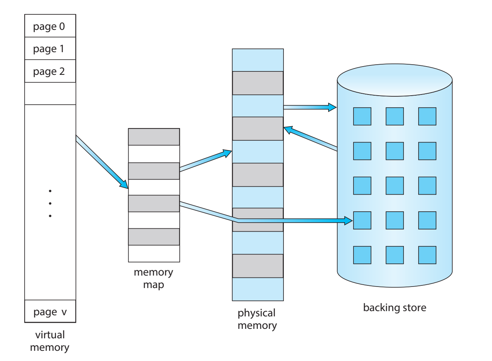
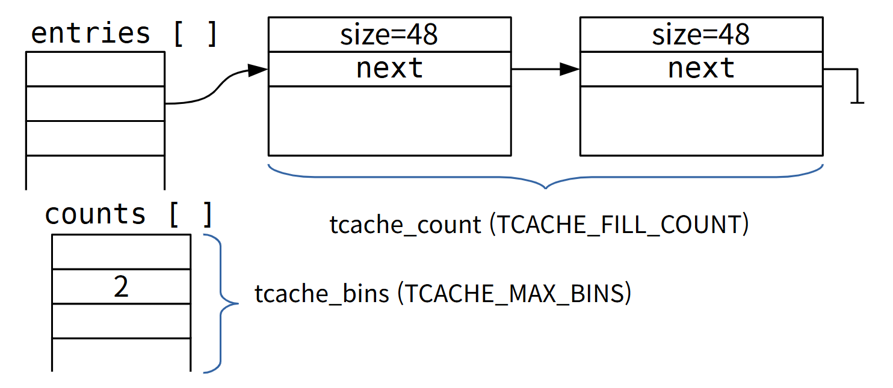

이 게시글은 C언어의 `malloc`에 대해 좀 더 자세하게 알아보기 위해 작성됐다.

- C언어의 기본적인 문법과 프로세스, 가상 메모리, 뮤텍스 같은 개념은 대략적으로 안다고 가정
- 이 글에서는 리눅스 glibc 2.41 버전을 기준으로 설명
    - 운영체제가 다르거나, 다른 libc를 쓰거나, 버전이 다르다면 맞지 않을 수 있음!

<!-- truncate -->

---

## 메모리 할당이란 무엇인가?

### 프로세스와 가상 메모리

:::info

프로세스는 가상 메모리를 사용하고, 그 메모리는 페이지 단위로 나뉜다

:::

우선 프로세스 관련 내용을 복습해보자.



- 프로세스가 사용할 수 있는 가장 기본적인 자원 중 하나는 **메모리**
- 가상 메모리는 **페이지**(일반적으로 4킬로바이트) 단위로 나뉨
    - 페이지는 실제 메모리 **프레임**이나, 디스크 공간에 연결됨


- 여러 프로세스에 속하는 가상 페이지들이 하나의 메모리 프레임에 연결될 수 있음
    - GNU C 라이브러리 코드에 의해 사용되는 가상 메모리가 예시
        - `printf` 함수를 포함하는 동일한 실제 메모리 프레임은 프로그램 내에 `printf` 호출이 있는 각 기존 프로세스의 가상 메모리 페이지에 연결됨
- 일반적으로 **실제 메모리보다 훨씬 많은 가상 메모리**가 존재
    - 페이지는 프로세스가 접근해야 할 때 실제 메모리로 이동하고 더 이상 필요하지 않을 때 보조 저장 장치로 다시 이동하는 과정을 규칙적으로 거쳐야 함
    - 이런 이동을 **페이징**이라고 함
- 프로그램이 현재 실제 메모리에 의해 지원되지 않는 페이지에 접근하려고 시도하면, **페이지 폴트**가 발생
    - 페이지 폴트가 발생하면 커널은 해당 프로세스를 일시 중단하고, 해당 페이지를 실제 페이지 프레임에 넣은 다음("페이지 인" 또는 "폴트 인"이라고 함), 프로세스를 다시 시작
    - 따라서 프로세스 관점에서 보면 해당 페이지는 처음부터 실제 메모리에 있었던 것처럼 보임
    - 그러나 수 나노초밖에 걸리지 않는 명령의 실행 시간이 갑자기 훨씬 더 길어질 수 있음!
        - 커널이 페이지 인을 완료하기 위해 I/O를 일반적으로 수행해야 하기 때문

### 메모리 할당의 정의

:::info

메모리 할당이란, **각 가상 주소 공간 내에서 프로세스가 어떤 주소에 무엇이 있는지 추적하는 과정**

:::

이해가 잘 안될 수도 있다. 메모리 할당을 생각할 때,

- 메모리를 요청하고 받는 과정?
- 자원을 분배하는 것?

이런 정의를 생각했는가? 이는 엄밀히 말해 틀렸다.

**가상 메모리 할당이 항상 실제 물리 메모리 할당으로 즉시 이어지지는 않기 때문이다.**

앞서 말했듯이, 가상 메모리 공간은 일반적으로 실제 메모리 공간보다 훨씬 크다.

이는, 가상 메모리 할당에 따른 즉각적인 물리 메모리 할당은 불가능할 수 있다는 것을 의미한다.

가상 메모리 공간의 할당은

- 일부는 **즉시** 물리 메모리에 연결될 수 있다
- 일부는 **페이지 폴트 발생 시** 물리 메모리에 연결된다
- 일부는 **특별한 처리**(예: 모두 0으로 된 페이지)가 발생한다

:::note

**제로 페이지(zero page) 처리**

모든 값이 0인 페이지는 실제 물리 메모리나 디스크에 연결되지 않을 수 있다.
대신 "이 페이지는 모두 0이다"라는 식의 **플래그**만 표시된다.

이는 일종의 메모리 최적화 기법이다.

- 모든 프로세스가 공유할 수 있는 읽기 전용 제로 페이지를 유지
- 프로세스의 가상 주소 공간에서 요청된 크기의 영역이 할당되지만, 실제 물리 메모리는 아직 할당되지 않음
- 프로그램이 실제로 해당 메모리에 접근(특히 쓰기)하기 전까지는 물리 메모리가 할당되지 않음
- 처음 읽기 접근 시, 모든 값이 0인 페이지를 가리키게 됨
- 쓰기 접근이 발생하면 페이지 폴트가 발생하고, 그제서야 실제 물리 메모리 프레임이 할당되고 0으로 초기화

이런 방식을 **지연 할당(Lazy Allocation)** 이라고 한다.

:::

따라서 프로세스 내에서의 메모리 할당의 주목적은, 물리 자원을 할당하는 것이 아니라, 
동일한 메모리 위치가 서로 다른 데이터에 중복 사용되지 않도록 하는 것

- 즉, **메모리 공간의 조직화와 충돌 방지**가 핵심이다.

## 메모리 할당의 방식

프로세스에서 메모리를 할당하는 방식은 주로 두 가지이다.

- `exec` 방식
    - 프로세스를 위한 가상 주소 공간을 생성하고, 기본 프로그램을 그 안에 로드하고, 프로그램을 실행하는 작업
    - "exec" 함수군(예: `execl`)에 의해 수행
    - 프로그램 파일(실행 파일)을 가져와서, 실행 파일의 모든 데이터를 로드할 공간을 할당하고, 그것을 로드한 다음, 제어권을 넘김
    - 그 데이터는 주로 프로그램의 명령어(*텍스트*)이지만, 프로그램의 리터럴과 상수, 심지어 일부 변수(정적 저장 클래스의 C 변수)도 포함
- 프로그래밍 방식
    - **이 글에서 주로 다룰 내용**
    - 프로그램이 실행되기 시작하면, 추가 메모리를 얻기 위해 사용
    - 두 가지 종류의 방식이 있음
        - 자동 할당 (automatic allocation)
        - 동적 할당 (dynamic allocation)

`fork` 로 메모리를 할당하는 세번째 방식도 있지만, 여기서는 다루지 않겠다.

:::note

**Memory-mapped I/O**

메모리 맵 I/O는 **동적 가상 메모리 할당의 또 다른 형태**이다. 

메모리를 파일에 매핑한다는 것은 프로세스 주소의 특정 범위의 내용이 지정된 일반 파일의 내용과 동일해야 한다고 선언하는 것을 의미한다.

이를 통해, 

- 시스템은 가상 메모리가 초기에 파일의 내용을 포함하도록 만들고
- 메모리를 수정하면 시스템은 동일한 수정 사항을 파일에 기록
- 가상 메모리와 페이지 폴트 덕분에, 프로그램이 가상 메모리에 접근하기 전까지는 시스템이 파일을 읽기 위한 I/O를 수행하거나 그 내용을 위한 실제 메모리를 할당할 이유가 없음

:::

## C 프로그램에서의 메모리 할당

:::info

C언어에서는 변수를 통한 할당은 **정적 할당**과 **자동 할당**을 지원한다.  
**동적 할당**은 라이브러리 함수를 통해 지원한다.

:::

C언어에서는 **변수를 통해** 두 가지 종류의 메모리 할당을 지원

- 정적 할당(static allocation): 정적 변수나 전역 변수를 선언할 때 발생
    - 각 정적 변수나 전역 변수는 고정된 크기의 하나의 공간 블록을 정의
    - 이 공간은 프로그램이 시작될 때(`exec` 작업의 일부로) 한 번 할당되며, 절대 해제되지 않음
- 자동 할당(automatic allocation): 함수 인자나 지역 변수와 같은 자동 변수를 선언할 때 발생
    - 자동 변수를 위한 공간은 선언을 포함하는 복합문이 시작될 때 할당되고, 
    그 복합문이 종료될 때 해제
    - GNU C에서는 **자동 저장소의 크기가 변하는 표현식일 수 있음**, 다른 C 구현에서는 상수

세 번째는 **동적 할당(dynamic allocation)** 이다. 
이 방식은 C 변수에 의해 지원되지 않지만 GNU C 라이브러리 함수를 통해 사용할 수 있다.

:::note

**VLA(Variable Length Array, 가변길이 배열)** 

앞서 말한 자동 저장소의 크기가 변하는 표현식은 VLA라는 기능으로 구현되었다.

```c
#include<stdio.h>

int main(void) {
    int n;
    scanf("%d", &n);

    int arr[n];
    printf("배열의 크기는: %d\n", sizeof(arr)/sizeof(arr[0]));

    return 0;
}
```
다음과 같이 GNU C에서는 사용자 입력으로 크기를 받아 배열을 생성하는 코드가 지원된다.

:::

### 동적 할당

동적 메모리 할당은 프로그램이 **실행 중에** 정보를 저장할 위치를 결정하는 기술 

- 필요한 메모리의 양이나 필요한 기간이 프로그램 실행 전에 알려지지 않은 요인에 의존할 때 동적 할당이 필요

동적 할당은 C 변수에 의해 지원되지 않는다. 

- "동적"이라는 저장 클래스는 없음
- 동적으로 할당된 공간에 값이 저장되는 C 변수는 결코 있을 수 없음
- 동적으로 할당된 메모리를 얻는 유일한 방법은 시스템 콜(일반적으로 GNU C 라이브러리 함수 호출을 통함)
- 동적으로 할당된 공간을 참조하는 유일한 방법은 포인터를 통하는 것

그렇다면 리눅스의 glibc는 `malloc` 을 어떻게 구현 했는가?

## 아이디어

glibc에서 구현한 `malloc` 의 주요 아이디어는 다음과 같다.

### 청크

:::info

`malloc`은 연속적인 메모리 영역인 **힙**에서 메모리 부분인 **청크**를 할당한다.  
청크엔 **경계 태그**라는 메타 데이터가 있고, 크기 별로 그룹화된 **빈(bin)** 으로 관리된다.

:::

메모리 청크는 **청크 앞뒤로 크기 정보 필드**를 가지고 있다. 이를 통해 두 가지 중요한 기능이 가능하다

- 두 개의 인접한 미사용 청크를 하나의 더 큰 청크로 **병합** 가능
    - 이는 사용할 수 없는 작은 청크의 수를 최소화함
- 모든 청크는 알려진 어떤 청크에서든 시작하여 앞이나 뒤 방향으로 **순회** 가능


**사용 가능한 청크**들은 크기 별로 그룹화된 **빈(bins)에 유지**된다


위의 그림의 경우에는,

- 512바이트 미만 크기의 빈들은 각각 정확히 하나의 크기만 보유함
    - **정렬이 강제**되어 8바이트 간격으로 배치됨
- 사용 가능한 청크 검색은 가장 작은 것부터 시작하는 최적 맞춤(best-fit) 순서로 처리
    - 선착순(first-fit)과 같은 다른 접근 방식에 비해 **단편화를 최소화**하는 경향이 있음

### 아레나

:::info

효율적인 멀티 스레드 프로그램을 위해, 한번에 둘 이상의 힙이 활성화 될 수 있다.  
서로 다른 스레드간 메모리 할당 경합 문제는 **아레나**를 통해 관리된다.

:::

다중 스레드 프로그램에서는 **여러 스레드가 동시에 작동**

- 각 스레드가 메모리를 동시에 할당 가능
- **여러 스레드가 동일한 청크**에 접근할 수 있음

이러한 문제를 막기 위해 **상호 배제**가 필요

- 그러나 이는 메모리 할당이 빈번한 멀티 스레드 프로그램에서 **병목현상**을 일으킴

이를 위해 자체 **뮤텍스로 보호되는 아레나**가 필요

- 각 아레나는 대규모 메모리 영역으로, **자체 뮤텍스**로 보호
- 스레드가 메모리를 요청하면 사용 가능한(잠금 해제된) 아레나로 할당
- 여러 아레나가 있으므로 스레드들이 서로 다른 아레나를 사용할 수 있음
- 각 아레나가 독립적인 뮤텍스를 가지므로 **병합이 분산**

:::note

만일 하나의 힙만 활성화되고, 상호 배제를 위해 단 하나의 뮤텍스만 있다면, 한 스레드가 할당을 위해 이 전역 뮤텍스를 잠근다면 풀때까지 다른 모든 스레드들이 기다려야 할 것이다.

이는 메모리 할당이 빈번한 멀티 스레드 프로그램에서 상당한 병목현상을 일으킬 것이다.

따라서 여러 힙을 활성화하고, 아레나를 통해 여러 뮤텍스로 분산하도록 하면, 여러 스레드들이 동시에 메모리를 할당받을 수 있다.

:::

## GNU 할당자

이제 glibc가 **실제로 어떤 방식으로 구현했는지** 살펴볼 것이다.

### Malloc의 할당 방식

`malloc`은 **크기에 따라 할당 방식**이 다르다.

- **큰 요청($\geq$ 512 바이트)** 의 경우, 순수한 **최적 맞춤(best-fit)** 할당자
    - 크기가 같은 청크들에서는 일반적으로 FIFO(가장 최근에 사용되지 않은 것)로 결정
- **작은 요청($\leq$ 64 바이트, 기본값)** 의 경우, 빠르게 재활용되는 청크의 풀을 유지하는 **캐싱 할당자**
- **그 사이의 크기 및 크고 작은 요청의 조합**에 대해서는 두 가지 목표를 동시에 충족하기 위해 최선을 다함
- **매우 큰 요청($\geq$ 128KB, 기본값)** 의 경우, 지원된다면 **시스템 메모리 매핑 기능**에 의존

- 가장 일반적인 방법은 **힙**(연속적인 메모리 영역)에서 **청크**(메모리 부분)를 할당하고, 관리하는 것
    - 전통적으로 시스템 힙은 하나의 큰 메모리 영역으로 설정되었지만, GNU C 라이브러리 `malloc` 구현은 다중 스레드 응용 프로그램에서 사용을 최적화하기 위해 여러 힙을 유지
    - 이러한 각 영역은 내부적으로 **아레나(arena)** 라고 불림
    - 여러 아레나의 존재는 여러 스레드가 별도의 아레나에서 동시에 메모리를 할당할 수 있게 하여 성능을 향상시킴
    - 다른 버전들과 달리, GNU C 라이브러리의 `malloc`은 큰 크기나 작은 크기 모두 청크 크기를 2의 거듭제곱으로 올림하지 않음
    - 인접한 청크들은 그 크기에 관계없이 `free` 시에 병합
- 다른 메모리 할당 방식은 매우 큰 블록, 즉 **페이지보다 훨씬 큰 블록**을 위한 것
    - 이러한 요청은 `mmap`(익명 또는 `/dev/zero`를 통해)으로 할당
    - 이러한 청크들은 해제될 때 즉시 시스템에 반환
    - 따라서 큰 청크가 작은 청크들 사이에 "갇히게" 되어 `free`를 호출한 후에도 메모리를 낭비하는 일이 발생할 수 없음

:::note

만일 매우 큰 블록도 시스템 메모리 매핑 기능이 아닌 힙에 할당한다면, 다음과 같은 문제점이 발생한다.
1. 애플리케이션이 `free` 호출
2. 매우 큰 청크가 free chunk가 됨
3. 양 옆에 작은 청크들이 존재한다면, OS에 반환될 수 없음
4. 매우 큰 영역의 메모리가 애플리케이션에 의해 점유되고, OS가 사용 불가함

:::

### Malloc Internal

glibc의 `malloc` 은 **힙** 스타일의 `malloc` 

- 비트맵과 배열을 사용하거나 동일한 크기의 블록 영역을 사용하는 구현과는 다름
- 과거에는 애플리케이션당 하나의 힙만 있었지만, glibc의 `malloc`은 각각 자신의 주소 공간 내에서 성장하는 여러 힙을 허용

앞으로 사용될 용어들의 정의는 다음과 같다.

- **아레나(Arena)**
    - 하나 이상의 스레드 간에 공유되는 구조
    - 하나 이상의 힙에 대한 참조와, 해제(free) 상태인 해당 힙 내의 청크들의 연결 리스트를 포함
    - 각 아레나에 할당된 스레드는 해당 아레나의 free 리스트에서 메모리를 할당받음
- **힙(Heap)**
    - 청크로 세분화되어 할당될 수 있는 연속적인 메모리 영역
    - 각 힙은 정확히 하나의 아레나에 속함
- **청크(Chunk)**
    - 할당될 수 있는(애플리케이션 소유) 작은 메모리 범위, 해제될 수 있는(glibc 소유) 범위, 또는 인접한 청크들과 결합하여 더 큰 범위를 형성할 수 있는 범위
    - 청크는 애플리케이션에 제공되는 메모리 블록을 감싸고 있음
    - 각 청크는 하나의 힙에 존재하며 하나의 아레나에 속함
- **메모리(Memory)**
    - 일반적으로 RAM이나 스왑에 의해 지원되는 애플리케이션 주소 공간의 일부

### 청크

Glibc의 `malloc`은 **청크 지향적**

- 큰 메모리 영역(힙)을 다양한 크기의 청크로 나눔
- 각 청크는 자신의 크기(청크 헤더의 `size` 필드를 통해)에 대한 메타데이터를 포함하며, 이를 통해 인접한 청크들의 위치를 알 수 있음
- 청크가 애플리케이션에 의해 사용 중일 때는 청크의 크기만 기억됨
- 청크가 해제(free)되면, 이전에 애플리케이션 데이터로 사용되던 메모리는 연결 리스트 내의 포인터와 같은 추가적인 아레나 관련 정보를 위해 **재사용**
- 이를 통해 필요할 때 적합한 청크를 빠르게 찾아 재사용 가능
- 해제된 청크의 마지막 워드에는 청크 크기의 복사본이 포함
(3개의 LSB가 0으로 설정됨, 청크 앞부분의 size의 3개 LSB는 플래그로 사용됨)

:::info

청크는 항상 짝수 워드 경계에서 시작한다. 따라서 `mem` 부분 또한 짝수 워드 경계에 위치하게 되며, 이는 적어도 double-word 정렬이 됨을 의미한다.

최소 double-word 정렬이 강제되는 이유는, `long double`이나 SIMD 벡터가 단일 워드를 넘어서는 데이터 단위를 처리하기 때문이라고 한다.
만일 이러한 보장이 없을 경우, 프로그램이 즉시 충돌할 수 있다.

:::

청크의 실제 구조는 다음과 같다. 메모리에서 청크들은 서로 인접해있다.
- 할당된 청크
```
    chunk-> +-+-+-+-+-+-+-+-+-+-+-+-+-+-+-+-+-+-+-+-+-+-+-+-+-+-+-+-+-+-+-+-+
	    |             Size of previous chunk, if unallocated (P clear)  |
	    +-+-+-+-+-+-+-+-+-+-+-+-+-+-+-+-+-+-+-+-+-+-+-+-+-+-+-+-+-+-+-+-+
	    |             Size of chunk, in bytes                     |A|M|P|
      mem-> +-+-+-+-+-+-+-+-+-+-+-+-+-+-+-+-+-+-+-+-+-+-+-+-+-+-+-+-+-+-+-+-+
	    |             User data starts here...                          .
	    .                                                               .
	    .             (malloc_usable_size() bytes)                      .
	    .                                                               |
nextchunk-> +-+-+-+-+-+-+-+-+-+-+-+-+-+-+-+-+-+-+-+-+-+-+-+-+-+-+-+-+-+-+-+-+
	    |             (size of chunk, but used for application data)    |
	    +-+-+-+-+-+-+-+-+-+-+-+-+-+-+-+-+-+-+-+-+-+-+-+-+-+-+-+-+-+-+-+-+
	    |             Size of next chunk, in bytes                |A|0|1|
	    +-+-+-+-+-+-+-+-+-+-+-+-+-+-+-+-+-+-+-+-+-+-+-+-+-+-+-+-+-+-+-+-+
```
- free chunk
```
    chunk-> +-+-+-+-+-+-+-+-+-+-+-+-+-+-+-+-+-+-+-+-+-+-+-+-+-+-+-+-+-+-+-+-+
	    |             Size of previous chunk, if unallocated (P clear)  |
	    +-+-+-+-+-+-+-+-+-+-+-+-+-+-+-+-+-+-+-+-+-+-+-+-+-+-+-+-+-+-+-+-+
    `head:' |             Size of chunk, in bytes                     |A|0|P|
      mem-> +-+-+-+-+-+-+-+-+-+-+-+-+-+-+-+-+-+-+-+-+-+-+-+-+-+-+-+-+-+-+-+-+
	    |             Forward pointer to next chunk in list             |
	    +-+-+-+-+-+-+-+-+-+-+-+-+-+-+-+-+-+-+-+-+-+-+-+-+-+-+-+-+-+-+-+-+
	    |             Back pointer to previous chunk in list            |
	    +-+-+-+-+-+-+-+-+-+-+-+-+-+-+-+-+-+-+-+-+-+-+-+-+-+-+-+-+-+-+-+-+
	    |             Unused space (may be 0 bytes long)                .
	    .                                                               .
	    .                                                               |
nextchunk-> +-+-+-+-+-+-+-+-+-+-+-+-+-+-+-+-+-+-+-+-+-+-+-+-+-+-+-+-+-+-+-+-+
    `foot:' |             Size of chunk, in bytes                           |
	    +-+-+-+-+-+-+-+-+-+-+-+-+-+-+-+-+-+-+-+-+-+-+-+-+-+-+-+-+-+-+-+-+
	    |             Size of next chunk, in bytes                |A|0|0|
	    +-+-+-+-+-+-+-+-+-+-+-+-+-+-+-+-+-+-+-+-+-+-+-+-+-+-+-+-+-+-+-+-+
```
각 구성요소의 의미는
- **chunk**: 청크의 시작부분
- **nextchunk**: 다음 청크의 시작부분
- **mem**: `malloc` 호출시 사용자에게 반환되는 포인터
- **AMP 플래그**
    - 청크 크기의 3 LSB를 플래그로 사용한다.
    - 세가지 플레그의 정의
        - **A (0x04)**: 할당된 아레나 (NON_MAIN_ARENA)
            - 0 - 청크는 메인 아레나와 메인 힙에서 온 것
            - 1 - 청크는 `mmap`된 메모리에서 온 것
                - 힙의 위치는 청크의 주소로부터 계산할 수 있음
            - 메인 아레나는 애플리케이션의 힙을 사용하고 다른 아레나는 `mmap`된 힙을 사용하므로,
            청크를 힙에 매핑하려면 어떤 경우가 적용되는지 알아야 함
        - **M (0x02)**: 단일 mmap 호출로 할당 여부 (IS_MMAPPED)
            - 설정되었다면 이 청크는 단일 mmap 호출로 할당되었으며 힙의 일부가 아님
        - **P (0x01)**: 이전 청크가 사용 중 (PREV_INUSE)
            - 설정되었다면 이전 청크가 애플리케이션에 의해 사용 중이므로 `prev_size` 필드는 유효하지 않음
            - 일부 청크는 애플리케이션에 의해 free되었음에도 이 비트가 설정될 수 있음
                - 이전 청크가 병합 후보로 고려되어서는 안 된다는 것을 의미
                - 애플리케이션이나 `malloc`의 원래 코드 위에 레이어된 다른 최적화에 의해 사용 중

free chunk의 구조에 나오는 `head`와 `foot` 덕분에, 현재 청크의 바로 위 청크든 바로 아래 청크이든 O(1) 속도로 점프 할 수 있고, 이는 병합을 매우 빠르게 할 수 있게 만든다. 

앞선 내용에 예외 사항들이 있다.
- top 청크
    - 힙 또는 아레나의 가장 높은 주소에 위치한 미할당된 메모리 영역
    - 자신을 기준으로 오프셋을 계산할 다음 연속 청크가 없기 때문에 trailing size field를 사용하지 않음
    - 초기화 이후에는 항상 존재하도록 강제됨
- fastbin에 있는 청크
    - chunk allocator의 관점에서 할당된 청크로 취급됨
    - 내부적으로 `malloc_consolidate` 함수 내에서만 이웃 청크들과 대량으로 병합됨
    - fastbin이 정확히 무엇인지는 다룰 것임

:::note

앞선 내용들을 다음과 같은 C언어 함수로 실제 청크의 크기와 AMP 플래그를 확인해 볼 수 있다.
```c
// malloc의 반환값(mem)을 인자로 넘김
void print(size_t *mem) {
  size_t head = *(mem - 1);
  printf("A:%d M:%d P:%d chunk size:%zu\n",
      !!(head & 0x4),
      !!(head & 0x2),
      !!(head & 0x1),
      head & ~0x7
  );
}
```
이 코드를 x86_64 리눅스 머신으로 실행해서 다음과 같은 내용을 확인 할 수 있었다.
- 청크 크기가 16바이트 단위로 정렬된다.
- 청크 크기가 128KB를 넘어가면 M 플래그가 1이 된다. 
    - `mmap`을 통해 힙 외부의 공간에서 할당된 것
- `malloc`으로 1032 바이트 이하의 메모리 할당을 요청하면 `free`를 해도 다음 청크의 P 플래그가 0이 되지 않는다.
    - 이는 tcache 때문, 아래에서 다룰 것이다.

:::

glibc에서의 청크 소스 코드는 다음과 같다.
```c
struct malloc_chunk {

  INTERNAL_SIZE_T      mchunk_prev_size;  /* Size of previous chunk (if free).  */
  INTERNAL_SIZE_T      mchunk_size;       /* Size in bytes, including overhead. */

  struct malloc_chunk* fd;         /* double links -- used only if free. */
  struct malloc_chunk* bk;

  /* Only used for large blocks: pointer to next larger size.  */
  struct malloc_chunk* fd_nextsize; /* double links -- used only if free. */
  struct malloc_chunk* bk_nextsize;
};
```
`fd`, `bk`, `fd_nextsize`, `bk_nextsize` 포인터들은 **빈(bin)** 구현에 사용된다.

### 아레나와 힙

- **기본 구조**
    - 각 아레나는 하나 이상의 힙을 관리
    - 아레나 구조체에는 메모리 관리에 필요한 메타데이터가 포함
    - 각 아레나는 다음 아레나를 가리키는 포인터를 가지며, 연결 리스트 형태로 구성
- **동기화 메커니즘**:
    - 각 아레나에는 접근을 제어하기 위한 뮤텍스(mutex)가 포함
    - 이 뮤텍스는 메모리 할당/해제 작업 시 아레나의 데이터 구조를 보호
- **메모리 관리 구성 요소**:
    - "top" 청크: 각 아레나가 추적하는 특별한 청크로, 일반적으로 가장 큰 사용 가능한 청크
    - 빈(bins): 사용 가능한 청크를 관리하는 다양한 리스트 (fastbin, unsorted bin, small bin, large bin)
    - 힙 목록: 아레나가 관리하는 하나 이상의 힙을 추적하는 구조

할당된 아레나를 위한 메모리는 해당 아레나의 초기 힙에서 가져온다.


이 그림의 경우, 각 힙의 구성 요소는

- **`heap_info` 구조체**
    - `ar_ptr`: 이 힙이 속한 아레나를 가리키는 포인터
    - `prev`: 이전 힙을 가리키는 포인터
    - `size`: 힙의 크기 정보
    - 기타 메타데이터(그림에서 `...`로 표시)
- **아레나 영역**
    - Heap #1에만 실제 `arena` 구조체가 포함(노란색으로 표시)
    - 이 아레나는 세가지 힙의 메모리 할당을 관리
- **청크 영역**
    - 각 힙은 실제 메모리 청크들을 저장하는 영역을 가짐
    - 이 청크들은 사용자 프로그램에 할당되거나 사용 가능한 상태로 관리
- **"top" 청크**
    - Heap #3의 끝부분에 "top" 청크가 존재
    - 이는 아레나의 현재 가용 메모리의 끝을 나타내는 특별한 청크
    - 추가 메모리가 필요할 때 이 청크가 확장되거나, 새로운 힙이 할당

:::info

top 청크의 확장은 `sbrk` 시스템 콜을 통해 구현된다.

이 시스템 콜을 통해 데이터 세그먼트의 영역을 확장하고, 논리적으로는 늘어난 만큼의 공간이 기존 Top Chunk 뒤에 붙게 된다.

:::

:::note

glibc 소스코드의 `heap_info` 구조체 코드는 다음과 같다.
```c
/* A heap is a single contiguous memory region holding (coalesceable)
   malloc_chunks.  It is allocated with mmap() and always starts at an
   address aligned to HEAP_MAX_SIZE.  */

typedef struct _heap_info
{
  mstate ar_ptr; /* Arena for this heap. */
  struct _heap_info *prev; /* Previous heap. */
  size_t size;   /* Current size in bytes. */
  size_t mprotect_size; /* Size in bytes that has been mprotected
                           PROT_READ|PROT_WRITE.  */
  size_t pagesize; /* Page size used when allocating the arena.  */
  /* Make sure the following data is properly aligned, particularly
     that sizeof (heap_info) + 2 * SIZE_SZ is a multiple of
     MALLOC_ALIGNMENT. */
  char pad[-3 * SIZE_SZ & MALLOC_ALIGN_MASK];
} heap_info;
```

:::


이제 **아레나 내부**를 살펴보자.


그림에서 보다시피 다음 아레나를 가리키는 포인터를 가진다 - 연결 리스트 형태

각 아레나 내에서 청크는, 애플리케이션에 의해 사용 중이거나 사용 가능한(free) 상태

- 사용 중인 청크는 아레나에서 추적되지 않음
- 사용 가능한 청크는 크기와 이력에 따라 다양한 목록에 저장
    - 이러한 목록이 **빈** - 라이브러리가 할당 요청을 충족하기 위해 적합한 청크를 빠르게 검색 가능

bins는 해제된 free chunk들을 관리하기 위한 빈 헤더의 배열
- 각 빈은 이중 연결 리스트로 되있음
- 빈들은 대략적인 logarithmic 간격으로 나뉘어져 있음
- 빈의 총 개수는 128개

:::note

빈의 목적은 결국 사용 가능한(free) 청크를 **파편화를 방지**하면서 **빠르게** 검색할 수 있도록 분류하는 것  

빈 없이 만일 모든 free chunk를 정렬하고, 검색하려면 매우 오랜 시간이 걸릴 것이다.  
따라서 우선 128개의 빈을 검색하고, 검색한 빈에서 다시 free chunk를 찾는 두 단계를 거친다.

:::

추가적인 효율성을 위해, 빈도 4가지로 나뉜다.

작은 청크들은 **Fast** 빈에 저장되고, 크기가 고정되며 정렬 및 순회를 하지도 않는다.
- 접근 속도를 빠르게 유지하기 위해 로직을 최소화
- 인접한 청크와 병합되지 않음
- 모두 같은 크기이므로 리스트의 중간에 있는 청크에 접근할 필요가 없음
    - singly-linked lists로 저장

청크가 분할되고 남은 조각들이나 `free`로 반환된 모든 청크들은, 우선 **Unsorted** 빈에 배치
- 청크들에게 (정렬되기 전에) 빠르게 재사용될 수 있는 한 번의 기회 - 할당 지역성!
- `free` 함수가 정렬할 필요가 없으므로 효율성이 높아짐 

**Unsorted** 빈에서 재사용될 기회를 놓친 청크는 일반빈 - **Small** 혹은 **Large** 빈으로 이동
- 청크가 이동하기 전에 먼저 인접한 free 청크와 결합됨
- doubly-linked lists로 되어있어 리스트의 중간에서도 청크를 제거할 수 있음
- **Small** 빈은 각 청크가 모두 같은 크기
- **Large** 빈은 크기가 서로 다를 수 있음
    - best-fit 청크 검색이 필요하며, 청크가 요청한 크기와 나머지로 쪼개질 수도 있음

표로 정리하면 다음과 같다.

| 빈 종류 | 대상 | 핵심 전략 |
| --- | --- | --- |
| **Fast Bins** | 아주 작음 | 속도 최우선 (병합 X) |
| **Unsorted Bin** | 대부분의 청크 | 빠른 재사용 + 정렬 보류 |
| **Small Bins** | 작음 (고정 크기) | 파편화 방지 (병합 O) | 
| **Large Bins** | 큼 (크기 범위) | 최적 맞춤 (검색 + 분할)	| 

큰 청크를 위한 최적 맞춤을 찾아야 하기 때문에, 큰 청크들은 리스트 내 각 크기의 첫 번째 청크를 연결하는 추가적인 이중 연결 리스트를 가지고 있다. 그리고 청크들은 크기별로 가장 큰 것부터 가장 작은 것까지 정렬 

이를 통해 `malloc`은 충분히 큰 첫 번째 청크를 빠르게 스캔 가능


:::note

glibc에서의 아레나 소스코드는 다음과 같다.
```c
struct malloc_state
{
  /* Serialize access.  */
  __libc_lock_define (, mutex);

  /* Flags (formerly in max_fast).  */
  int flags;

  /* Set if the fastbin chunks contain recently inserted free blocks.  */
  /* Note this is a bool but not all targets support atomics on booleans.  */
  int have_fastchunks;

  /* Fastbins */
  mfastbinptr fastbinsY[NFASTBINS];

  /* Base of the topmost chunk -- not otherwise kept in a bin */
  mchunkptr top;

  /* The remainder from the most recent split of a small request */
  mchunkptr last_remainder;

  /* Normal bins packed as described above */
  mchunkptr bins[NBINS * 2 - 2];

  /* Bitmap of bins */
  unsigned int binmap[BINMAPSIZE];

  /* Linked list */
  struct malloc_state *next;

  /* Linked list for free arenas.  Access to this field is serialized
     by free_list_lock in arena.c.  */
  struct malloc_state *next_free;

  /* Number of threads attached to this arena.  0 if the arena is on
     the free list.  Access to this field is serialized by
     free_list_lock in arena.c.  */
  INTERNAL_SIZE_T attached_threads;

  /* Memory allocated from the system in this arena.  */
  INTERNAL_SIZE_T system_mem;
  INTERNAL_SIZE_T max_system_mem;
};
```
빈 검색시 비어있는 빈을 건너띄기 위해, `binmap`이라는 추가적인 전략도 사용된다.  
이는 빈이 확실히 비어있는지 여부를 기록하는 bitvector로, 이를 통해 청크를 찾는 순회 중에 비어있는 빈을 건너띌 수 있다.

이 비트들은 빈이 비워지는 즉시 항상 0으로 설정되는 것은 아니다. 대신, `malloc`이 순회하는 도중 해당 빈이 비어있는 것을 발견했을 때만 0으로 설정된다.

:::

### 스레드 로컬 캐시 (tcache)

:::note

`malloc`은 다중 스레드를 인지하기는 하지만, 그것이 인지 범위의 거의 전부이다. 즉, 그저 '다중 스레드가 존재한다'는 사실만 안다.

NUMA 아키텍처 최적화, 스레드 지역성(locality) 조정, 코어별 스레드 정렬 등을 위한 코드는 없다. 이러한 문제들은 커널이 충분히 잘 처리할 것이라고 가정한다.

:::

각 스레드는 마지막으로 사용했던 아레나(arena)를 기억하는 **thread-local variable**를 가짐  
만약 스레드가 아레나를 사용해야 할 때, 
- 그 아레나가 (다른 스레드에 의해) 사용 중이라면, 해당 스레드는 아레나가 풀릴 때까지 block됨
- 스레드가 아레나를 한 번도 사용한 적이 없다면, 다음 중 하나 
    - 사용되지 않은 아레나를 재사용
    - 새 아레나를 생성
    - global list에서 다음 아레나를 선택

각 스레드는 각 스레드별 캐시인 **tcache**를 가지며, 여기에는 아레나를 잠글 필요 없이 접근할 수 있는 소규모의 청크 모음이 들어있음
- fastbin과 유사하게 청크들이 singly-linked lists로 저장
- 링크가 청크 헤더가 아닌 payload(사용자 영역)을 가리킴
- 각 빈에 허용되는 청크의 수에 제한이 있음 - **tcache_count**
- 각 빈의 청크 크기가 모두 같아 청크 크기에 따라 간접적으로 인덱싱됨



tcache에서는 요청한 크기에 정확히 맞는 청크만이 할당
- 내부 단편화 방지를 위해, 만약 요청한 크기에 대한 tcache 빈이 비어있다면, 다음으로 더 큰 크기의 청크를 사용하지 않음
- 대신 스레드의 아레나를 잠그고 거기서부터 작업하는 일반적인 `malloc` 루틴을 사용

### Malloc 알고리즘

`malloc`은 다음과 같이 작동한다.
1. tcache에 크기가 정확히 일치하는 청크가 있다면, 이를 호출자에게 반환 
    - 더 큰 크기의 빈에서 청크를 가져와 사용하려는 시도는 하지 않음
2. 요청이 충분히 크다면, `mmap()`을 사용하여 운영체제로부터 직접 메모리를 요청
3. 적절한 fastbin에 청크가 있다면 사용
    - 사용 가능한 청크가 더 있다면 tcache를 미리 채워두기도 함
4. 적절한 smallbin에 청크가 있다면 사용 
    - 이때도 tcache를 미리 채워둘 수 있음
5. 요청이 large라면, 잠시 시간을 들여 fastbin에 있는 모든 것을 꺼내 unsorted bin으로 이동시키며, 이동하는 과정에서 (인접 청크와) 병합
6. unsorted 리스트에서 청크들을 꺼내기 시작하고, (병합을 수행하며) small/large 빈으로 이동, 이 과정에서 알맞은 크기의 청크가 발견되면 사용
    - 코드가 small/large 빈에 청크를 넣는 유일한 지점이 여기
7. 요청이 large라면, 적절한 large bin을 검색하고, (없다면) 순차적으로 더 큰 빈들을 검색하여, 충분히 큰 청크를 찾을 때까지 계속함
8. (small 요청의 경우) fastbin에 여전히 청크가 남아있다면 그것들을 병합하고 이전 두 단계(6, 7번)를 반복
9. top 청크의 일부를 분할(split)하여 사용
    - 필요하다면, 이 과정 전에 top 청크를 (OS로부터 메모리를 받아) 미리 확장할 수 있음

### Free 알고리즘

:::info

일반적으로 메모리를 free 한다고 해서 해당 메모리가 다른 애플리케이션이 사용할 수 있도록 운영체제로 즉시 반환되는 것은 아니다. `free()` 호출은 해당 메모리 조각을 애플리케이션이 **재사용할 수 있도록** 표시하는 것일 뿐, 운영체제의 관점에서는 여전히 해당 애플리케이션 소유이다.

하지만 힙의 top 청크가 충분히 커지면, 그 메모리 중 일부는 운영체제로 반환될 수 있다.

:::

`free`는 다음과 같이 작동한다.
1. tcache에 공간이 있다면, 청크를 그곳에 저장하고 return
2. 청크가 충분히 작다면, 적절한 fastbin에 배치
3. 청크가 `mmap`으로 할당되었던 것이라면, `munmap`을 호출하여 (OS에 즉시) 반환
4. 이 청크가 다른 free 청크와 인접해 있는지 확인하고, 만약 그렇다면 병합
5. 청크가 (병합 후) top 청크가 된 경우가 아니라면, unsorted 리스트에 배치
6. (병합된) 청크가 충분히 크다면, fastbin에 있는 것들을 모두 병합하고, top 청크가 시스템에 메모리를 일부 반환할 수 있을 만큼 충분히 커졌는지 확인
    - 이 단계는 성능상의 이유로 지연될 수 있으며, `malloc`이나 다른 호출 중에 발생할 수도 있음

### Realloc 알고리즘

:::note

`realloc`에 `NULL` 포인터를 넘기거나 크기를 0으로 요청하는 경우는 별도로 처리된다.

:::

`mmap`된 청크의 경우
- 개별적인 `mmap` 호출을 통해 할당된 메모리은 가능하다면 `mremap()`을 통해 `realloc`됨 
    - 이때 커널의 동작 방식에 따라 새로운 메모리 주소는 기존 주소와 다를 수도 있고 같을 수도 있음
- 만약 시스템이 `munmap()`을 지원하지 않는데 새로운 크기가 기존 크기보다 작다면, 아무 작업도 수행하지 않고 기존 주소를 그대로 반환
- 그 외의 경우에는 malloc → copy → free 과정이 발생 (새로운 주소 반환)

아레나 청크의 경우
- 크기가 줄어드는 경우: 할당 크기가 나눌 가치가 있을 만큼(worth it) 충분히 줄어든다면, 해당 청크는 두 개로 분할
    - 첫 번째 부분(기존 주소를 가짐)은 사용자에게 반환
    - 나머지 뒷부분은 free chunk 상태로 아레나에 반환
    - 단, 미미한 크기 감소는 "동일한 크기"로 취급되어 분할되지 않음
- 크기가 커지는 경우: 바로 다음(인접한) 청크를 확인
    - 만약 인접 청크가 free이거나, 힙의 확장 가능한 끝부분을 나타내는 Top 블록이면서 합쳤을 때 크기가 충분하다면, 현재 청크와 그 청크를 병합
    - 이렇게 병합하여 충분히 큰 블록을 만든 뒤, 필요하다면 다시 분할
    - 이 경우 기존 포인터가 그대로 반환 (주소 변경 없음)
    - 할당이 커져야 하는데 현재 청크나 다음 청크를 활용할 방법이 없다면, malloc → copy → free 과정이 발생 (새로운 주소 반환)

### Switching arenas

:::info

프로세스의 수명 동안 스레드에 연결된 아레나가 변경될 수 있다.

:::

아레나가 변경되는 시나리오는 다음과 같다.

- 스레드가 현재 연결된 아레나에서 메모리 할당에 실패
    - 병합 시도, free list 검색, unsorted list 처리 등을 모두 수행했다고 가정
    - 힙 확장을 시도했으나 `sbrk`가 실패했거나, 새로운 메모리 매핑 생성이 실패했다고 가정
- 이전에 `mmap` 기반 힙을 사용하는 non-main 아레나를 사용 중이었다면, `arena_get_retry`를 통해 `sbrk` 기반 힙을 사용하는 메인 아레나로 전환
    - 메인 아레나를 사용 중이었다면, 비 메인 아레나(free List에서 가져오거나 새로 생성한 것)로 전환
    - 단일 스레드 프로세스인 경우에는 이 전환을 수행하지 않고, 이 시점에서 바로 `ENOMEM`을 반환하며 실패 (`sbrk`도 안 되고 메인 아레나 확장도 실패했다면, 비 메인 아레나 역시 안 될 것이라 가정하기 때문)

:::note

메모리가 부족한 상황에서는 할당을 만족할 공간이 있는 힙을 찾기 위해, 스레드가 `sbrk` 기반인 메인 아레나와 `mmap` 기반인 비 메인 아레나 사이를 빈번하게 오갈 수 있다는 점에 유의해야 한다.

:::