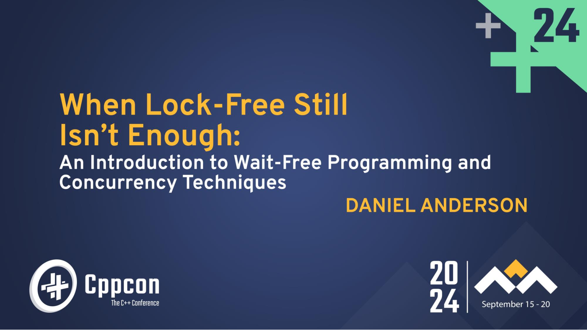

<!-- truncate -->

[유튜브 링크](https://youtu.be/kPh8pod0-gk?si=fnCqMylNxru464Ot)

이 글은 CppCon 2024에서 카네기 멜런 대학교의 조교수(assistant teaching professor), 
Daniel Anderson이 발표한 자료를 바탕으로 작성되었다.

---

## 배울 내용

- 동시성과 lock-free 프로그래밍에 대한 간단한 복습
- lock-free 설계 패턴의 "기본적인" 내용 검토
- wait-free 알고리즘의 정의와 실제 적용에 대한 이해
- 우아한 wait-free 알고리즘과 wait-free 설계의 예시
- 간단한 벤치마크 결과

### 해결하고자 하는 문제

sticky counter (0에서 멈추는 카운터)를 구현하고 싶다고 가정하자.

`Counter` 구조체의 기본적인 인터페이스는 다음과 같다.

```cpp
// Precondition: The counter is not zero
struct Counter {
    // If the counter is greater than zero, add one and return true
    // otherwise do nothing and return false
    bool increment_if_not_zero();
    
    // Decrement the counter. If the counter now equals zero,
    // return true. Otherwise return false.
    bool decrement();
    
    uint64_t read(); // Return the current value of the counter
};
```

`Counter` 구조체는 다음과 같은 세 가지 주요 기능을 제공한다.

- `increment_if_not_zero()` : 카운터 증가를 시도
    - 카운터가 `0`보다 크면 `1`을 더하고 `true` 반환
    - 카운터가 `0`이면 아무것도 하지 않고 `false` 반환
- `decrement()` : 카운터를 감소
    - 카운터를 감소시킨 후  `0`이 되면 `true` 반환
    - 카운터를 감소시킨 후  `0`이 아니라면 `false` 반환
- `read()` : 현재 카운터 값을 반환

:::note

이런 방식의 카운터는 매우 실용적이다. 
동시성 자료구조나, 멀티스레딩 환경에서의 메모리 관리에 매우 적합하다.

예로 들어 `std::weak_ptr<T>::lock`에 이런 방식의 카운터가 필요하다.

`std::weak_ptr<T>::lock` 의 주요 기능은 다음과 같다.

- `weak_ptr`가 가리키는 객체가 아직 유효한지 확인
- 유효하다면 해당 객체에 대한 `shared_ptr`를 반환
- 객체가 이미 삭제되었다면 빈 `shared_ptr` (`nullptr`을 가리킴)을 반환

따라서 `weak_ptr`은 다음과 같이 동작해야 한다.

- 객체의 수명을 추적하되 reference count는 증가되지 않음
- `lock()` 호출 시 객체가 아직 존재하는지 확인해야 함
- 확인하는 동안 다른 스레드에서 객체를 삭제할 수 있음

여기서 `Counter` 의 역할은 다음과 같다.

- 객체가 아직 살아있는지(reference count > 0) 확인
- 살아있다면 reference count를 증가시켜 객체 수명 연장
- 이 두 작업이 atomic하게 이뤄져야 함

:::

이제 인터페이스를 구현해보자.

## 첫 번째 구현

```cpp
struct Counter {
    bool increment_if_not_zero() {
        if (counter > 0) {
            counter++;
            return true;
        }
        return false;
    }

    bool decrement() {
        return (--counter == 0);
    }

    uint64_t read() { return counter; }

    uint64_t counter{1};
};
```

동시성 환경을 고려하지 않은 단순한 구현이다. 이런 방식의 구현은 싱글 스레드 환경에서는 문제가 없지만, 멀티 스레드 환경에서는 문제가 생길 것임을 알아차릴 수 있을 것이다.

### Thread safe 하게 만들기

```cpp
struct Counter {
    bool increment_if_not_zero() {
        std::lock_guard g_{m};
        if (counter > 0) {
            counter++;
            return true;
        }
        return false;
    }

    bool decrement() {
        std::lock_guard g_{m};
        return (--counter == 0);
    }
    
    std::mutex m;
    
    uint64_t counter{1};
}
```

두 함수를 스레드-안전하게 만들었다.

:::info

`std::lock_guard`는 C++의 RAII(Resource Acquisition Is Initialization) 패턴을 활용한 mutex wrapper 클래스이다.

이를 통해 뮤텍스를 lock하면, 명시적인 unlock 대신 스코프를 벗어나면 자동으로 소멸되게 만들어 mutex도 자동으로 해제된다.

:::

이를 통해 무엇을 알 수 있는가?

## 시사점

- 이런 방식은 동시성 문제의 대부분을 해결할 수 있다
- 하지만 이는 실질적으로 **동시성을 제거**함으로써 해결하는 것.
- 이런 방식은 대체로(항상은 아님) 성능에 큰 영향을 미친다
    - 주의사항: 성능에 대해 **추측하지 마라**. 항상 **성능을 측정**해야 한다.

:::note

실질적으로 동시성을 제거함으로써 해결하는 것이라는 비판은 critical section에 대해 얘기하는 것 같다.

코드의 일부분에 대해 **동시성 상황을 차단**해버림으로써, 동시성 상황이 애초부터 일어나지 않으므로 당연히 동시성 문제는 발생하지 않는다.

이는 어떻게 보면 매우 단순한 해결 방법이라고 할 수 있다. 문제를 해결하는 것이 아니라 **문제가 발생할 것 같은 상황**을 차단해버리는 것이기 때문이다.

:::

그렇다면 더 발전된 방식은 어떤것들이 있는가?

## 진행 보장(Progress guarantees)

진행 보장이란 동시성 알고리즘을 이론적으로 분류하는 방법이다.

- **Blocking**: 보장 없음
    - 앞서 본 뮤텍스를 사용한 방식이 한 예시
    - 다른 스레드가 mutex를 보유하고 있으면, 현재 스레드는 무조건 대기해야 한다
    - 다른 모든 스레드가 중단되더라도(isolation 상태), mutex를 보유한 스레드가 살아있지 않다면 영원히 진행하지 못할 수 있음 - deadlock 발생 가능성
- **Obstruction free** (isolation에서의 진행): 하나의 스레드가 격리된 상태에서 실행되면 유한한 수의 단계 내에 연산을 완료
    - 어떠한 스레드든지 간에, 하나의 스레드 외에 다른 모든 스레드가 중단된 상태라면 어떠한 상황이든지 간에 반드시 유한한 단계 내에 작업을 완료할 수 있어야 한다.
    - 따라서 이 방식은 deadlock에 면역
- **Lock free** (최소 하나의 스레드가 진행): 어느 시점에서든 최소한 하나의 스레드는 자신의 연산에서 진행을 이루고 있음
    - 시스템 전체의 처리량을 보장. 일부 연산은 항상 완료되고 있지만, 개별 연산의 완료는 절대 보장되지 않음
- **Wait free** (모든 스레드가 진행): 다른 동시 연산에 관계없이 모든 연산이 유한한 수의 단계 내에 완료됨
    - 모든 개별 연산에 대해 유한한 완료 시간을 보장함

이제 `Counter` 를 lock-free로 구현해보자.

## lock-free 구현

### `counter` 변수

```cpp
std::atomic<uint64_t> counter{1};
```

lock-free 프로그래밍을 할려면, atomic 변수를 사용해야 한다.

### `increment_if_not_zero()` 를 구현

```cpp
bool increment_if_not_zero() {
    auto current = counter.load();
    while (current > 0 && !counter.compare_exchange_weak(current, current + 1)) { }
    return current > 0;
}
```

여기서 `compare_exchange_weak()` 라는 연산이 등장한다.

`counter.compare_exchange_weak(current, current + 1)` 코드의 의미는 다음과 같다.

- `counter`의 현재 값이 `current`와 같다면
    - `counter` 값을 `current + 1`로 변경
    - `true` 반환
- 다르다면
    - `current`를 `counter`의 현재 값으로 업데이트
    - `false` 반환

`compare_exchange_weak()` 연산은 다음과 같이 이루어진다.

```cpp
compare_exchange(expected&, desired) {
    if (current_value == expected) {
        current_value = desired; 
        return true; 
    } else { 
        expected = current_value; 
        return false; 
    }
}
```

:::warning

실제 `compare_exchange` 연산의 구현은 **하드웨어의 지원 없이는 불가능**하다.
코드로 구현하려면 결국 어떠한 형태로든 lock이 필요하기 때문에 atomic함을 보장할 수 없다.

실제로는 ARM, x86_64 등의 아키텍처에서 atomic 연산을 위한 명령어를 제공하므로 이를 통해 구현한다.

:::

이런 방식을 **CAS loop**라고 한다.

### `decrement()` 구현

```cpp
bool decrement() {
    return counter.fetch_sub(1) == 1;
}
```

`counter.fetch_sub(1)` 코드의 의미는 다음과 같다.

- `counter`를 `1` 감소시키고 원래의 `counter` 값 반환

따라서 반환값이  `1`이었다면 감소 후 `0`이 되었다는 의미이므로 `true` 를 반환한다.

### 전체 코드

```cpp
struct Counter {
    bool increment_if_not_zero() {
        auto current = counter.load();
        while (current > 0 && !counter.compare_exchange_weak(current, current + 1)) { }
        return current > 0;
    }
    
    bool decrement() {
        return counter.fetch_sub(1) == 1;
    }
    
    uint64_t read() { return counter.load(); }
    
    std::atomic<uint64_t> counter{1};
}
```

## **CAS loop**

이런 CAS loop(compare-and-swap loop) 방식은 lock-free 알고리즘과 데이터 구조의 기본이 되는 설계 패턴이다.

- 데이터 구조의 현재 상태를 읽음
- 현재 상태로부터 새로운 원하는 상태를 계산
- 다른 누군가가 이미 변경하지 않았을 때만 변경을 커밋(compare-exchange)
- 다른 누군가가 변경했다면, 다시 시도

진행은 **lock-free**이다.

- 만약 한 연산이 진행하지 못했다면(compare-exchange가 false를 반환) 
이는 다른 연산이 진행했기 때문
- 스레드별 개별 연산은 실패하더라도, **시스템 전체적으로 진행**은 보장

:::note

CAS loop 방식이 기존의 blocking 방식과 다른 핵심적인 이유는 결국 **진행 가능 여부를 판단하는 상태**에 있다. 

CAS loop는 `counter` **값 자체**가 진행 가능 여부를 결정한다.

- 실제 작업 대상(`counter`)과 진행 가능 여부 판단이 결합되어 있음
- `counter` 값이 변경되었다는 것 → 다른 스레드가 진행했다는 것

Mutex는 mutex라는 **별도의 상태값**으로 진행 가능 여부를 결정

- 실제 작업 대상(`counter`)과 진행 가능 여부 판단이 분리되어 있음
- `mutex` 획득 실패 → 진행 불가, 하지만 이것이 다른 스레드의 진행을 보장하지는 않음

이 차이로 인해

- CAS loop는 진행 실패가 곧 다른 스레드의 진행을 의미
- Mutex는 진행 실패가 다른 스레드의 진행을 보장하지 않음

따라서 lock-free의 시스템 전체적 진행 보장은 상태값과 작업이 결합되어 있다는 특성에서 자연스럽게 도출되는 것이다.

:::

**wait-free는 아니다.** 

- 특정 연산이 경쟁하는 연산들이 성공하면서 CAS loop에서 영원히 실패할 수 있기 때문
- 극단적인 예시로는, 멀티 스레드 환경에서 하나의 스레드만이 진행하고 다른 모든 스레드들이 계속 실패할 수도 있다.

:::info

좀 더 전문적인 용어로는, lock-free 방식은 blocking 방식과는 달리 deadlock 현상을 방지하지만, 개별 스레드가 영원히 진행하지 못하는 **starvation** 현상은 막지 못한다고 설명할 수 있다.

그리고 이 starvation 현상까지도 막는 것이 wait-free 방식의 목표 중 하나이다.

:::

그렇다면 wait-free는 어떻게 설계해야 하는가?

## Wait Freedom 도구들

wait-free 알고리즘은 무한한 CAS 루프를 포함할 수 없다.

- 이는 compare-exchange를 사용할 수 없다는 의미가 아니라, 단지 무한 루프 안에서 사용할 수 없다는 의미!

대부분의 wait-free 알고리즘은 atomic read-modify-write 연산을 사용한다.

- compare_exchange_weak/strong(expected, desired)
    - Atomically replaces the current value with desired if current equals expected, otherwise loads the current value
- fetch_add(x) / fetch_sub(x)
    - Atomically add/subtract x from the given variable and return the original value
- exchange(desired)
    - Stores the value desired and returns the old value

## Wait-free 알고리즘을 향하여

기존의 lock-free 알고리즘의 핵심은 CAS loop

- 스레드들이 다른 스레드들의 진행을 **방해**함
- 즉 스레드들이 다른 스레드들을 **희생**시키면서 자신의 연산을 먼저 완료하려고 경쟁!
- wait freedom을 달성하기 위해서는, 스레드들이 경쟁하는 스레드들에 의해 **차단되어서는 안 됨**

wait-free 알고리즘의 설계

- 경쟁적이기보다는 **협력적**이어야 함
- Wait-free 알고리즘 설계의 핵심은 **helping**
- 진행 중인 다른 연산과 동시에 실행되는 연산들은 그들을 기다리거나 그들과 경쟁하는 대신 그들의 진행을 돕기 위해 시도
- 진행 중인 다른 연산들을 감지할 수 있는 방법이 필요

:::note

발표자 Daniel Anderson 교수에 따르면, 이는 쉽지 않은 방법이다. 
어떠한 CAS loop 방식이건 간에 helping 방식으로 바꾸는게 가능한것도 아니다.

바꾸는게 가능하더라도, blocking 방식을 lock-free로 바꾸는 것보다, 
일반적으로 훨씬 큰 알고리즘의 재설계가 필요하다.

그럼에도 불구하고 wait-free 알고리즘의 장점이 뚜렷하기 때문에 우리는 알아야 한다.

:::

## Wait-free counter design

wait-free 방식 counter를 만들기 위해 요구되는 것은 2가지이다.

- 연산들이 다른 연산들이 진행 중인지 감지할 방법이 필요
- 다른 스레드들에게 우리가 counter를 0으로 설정할 계획이 있거나 이미 설정했다는 것을 알릴 방법이 필요
    - 스레드들끼리 **협력**하기 위해서 이런 정보를 알아야 한다. 이것이 이전의 방식과의 핵심 차별점이다.

**핵심 아이디어**: counter의 상위 비트들 중 일부를 플래그로 사용한다.


 

- 최상위 플래그는, 어떠한 스레드가 counter가 0으로 설정되었다는 것을 **알리기 위해** 사용
- 두 번째 플래그는 **helping**을 위해 사용

우선 읽기가 없는 카운터를 만들어보자.

### Wait-free counter without read

우선 `is_zero` flag를 설정하자.

```cpp
static constexpr uint64_t is_zero = 1ull << 63;
```

그리고 `decrement()` 연산을 정의한다.

```cpp
bool decrement() {
    if (counter.fetch_sub(1) == 1) {
        uint64_t e = 0;
        return counter.compare_exchange_strong(e, is_zero);
    }
    return false;
}
```

동작 방식은 다음과 같다.

1. `counter`를 `1` 감소시키고 이전 값을 반환(`fetch_sub()`)
2. 만약 이전 값이 `1`이었다면:
    - `counter`가 `0`이 되었을 것이므로
    - `counter`가 아직 `0`인지 확인하고(e = 0)
    - 맞다면 `is_zero` flag를 설정
3. 그 외의 경우 `false` 반환

`0`이 되는 순간을 정확히 감지하고 flag를 설정하는 것이 핵심이다.

마지막으로 CAS loop 없이 어떻게 increment를 하는지 flag의 마법을 보자.

```cpp
bool increment_if_not_zero() {
    return (counter.fetch_add(1) & is_zero) == 0;
}
```

동작 방식은 다음과 같다.

1. `counter`를 `1` 증가시키고 이전 값을 반환(`fetch_add()`)
2. 이전 값의 최상위 비트(`is_zero` flag)를 확인
3. flag가 `0`이면 `true` 반환 (`counter`가 `0`이 아니었음을 의미)
4. flag가 `1`이면 `false` 반환 (이미 `counter`가 `0`이었음을 의미)

최상위 비트가 `1` 이면, 카운터는 `0` 이고 하위 비트들은 보지 않는 것이 핵심이다.


다음과 같이 하위 비트가 계속 증가하더라도, 최상위 비트가 `1`이므로 카운터는 하위 비트와 상관없이 `0`이다.

전체 코드는 다음과 같다.

```cpp
struct Counter {
    static constexpr uint64_t is_zero = 1ull << 63;

    bool increment_if_not_zero() {
        return (counter.fetch_add(1) & is_zero) == 0;
    }

    bool decrement() {
        if (counter.fetch_sub(1) == 1) {
            uint64_t e = 0;
            return counter.compare_exchange_strong(e, is_zero);
        }
        return false;
    }

    std::atomic<uint64_t> counter{1};
}
```

여기까지만 보면 꽤 좋은 아이디어 같아 보인다. 그러나 이 구현은 **문제점이 있다**.

`decrement()` 구현의 일부분을 보자.

```cpp
if (counter.fetch_sub(1) == 1) {    // counter가 1에서 0으로 변함
    uint64_t e = 0;
    return counter.compare_exchange_strong(e, is_zero); // 이 compare_exchange가 실패하면??
}
```

이 부분에서,

1. `decrement()` 연산이 실제로 `counter`를 0으로 만듦
2. `increment()`가 그 사이에 발생
3. `decrement()`연산이 마치 `increment()` 이후에 발생한 것처럼 처리

그러나 이 특징은 **read가 없다면** 문제가 되지 않는다.

`decrement()` 목적은 결국 

- `counter`가 `0`이 되는 순간을 포착
- 그 순간을 다른 스레드들에게 영구적으로 알리는 것

인데, 만약 CAS가 실패한다면

- 다른 스레드가 이미 `counter`를 증가시켰다는 의미
- 즉 우리가 관찰한 "0이 되는 순간"은 실제로 의미있는 순간이 아니었음
- `counter`는 진짜로 "멈춘" 적이 없었던 것

따라서 이는 우리가 구현한 카운터의 의미와 부합한다.

그렇다면 read가 있다면 어떤 문제가 발생하는가?

### Adding a read operation. How hard can it be?

`read()` 를 추가한다.

```cpp
uint64_t read() {
    auto val = counter.load();
    return (val & is_zero) ? 0 : val;
}
```

`val` 을 불러오고, `is_zero` flag가 켜져있으면 `0`, 아니면 `val`을 반환한다.

다음과 같은 시나리오를 생각해보자.

1. `read()`는 `counter`가 `0`이라고 판단했지만
2. 실제로는 `decrement()`가 `false`를 반환(CAS 실패)
3. `increment()`는 성공
4. 결과적으로 `counter`는 `1`이어야 하는데 `read()`는 `0`을 반환

즉 `read()` 연산이 **관찰한 상태와 실제 연산의 결과가 불일치**하는 문제가 발생한다.

따라서 **`val` 이 `0` 일 때** 문제가 발생할 수 있다. 코드를 수정해야 한다.

```cpp
uint64_t read() {
    auto val = counter.load();
    if (val == 0 then what?
}
```

이때 해야 하는 게 **helping**이다!

```cpp
uint64_t read() {
    auto val = counter.load();
    if (val == 0 && counter.compare_exchange_strong(val, is_zero)) return 0; // helping!
    return (val & is_zero) ? 0 : val;
}
```

다음과 같이 읽어들인 값이 `0`이라면, `is_zero` flag 설정을 `read()` 가 **도와준다**.

그러나 이 방법은 다음과 같은 **문제점을 초래**한다.

- `read()`가 `is_zero` flag를 설정하면, 어떤 `decrement()`도 `true`를 반환하지 않음!

:::note

만약 레퍼런스 카운터로 이런 방식을 취한다면, 다음과 같은 문제점을 발생시킨다.
레퍼런스 카운터는 **참조 카운트가 0이 되면 반드시 객체가 삭제**돼야 한다.

그러나 이런 방식을 사용하면, `true`를 반환한 `decrement()` 가 없는데도 카운트가 `0` 이 되었으므로, 누구도 삭제 책임을 지지 않아 **메모리가 누수**될 수 있다.

:::

이런 문제의 해결을 위해서, 추가적인 flag가 필요하다.

### Almost there

다음과 같은 helped flag를 추가한다.

```cpp
static constexpt uint64_t helped = 1ull << 62;
```

`read()`가 `is_zero` flag를 설정할 때, 이 `helped` flag를 설정한다.

그리고 `decrement()` 를 수정한다.

```cpp
bool decrement() {
    if (counter.fetch_sub(1) == 1) {
        uint64_t e = 0;
        if (counter.compare_exchange_strong(e, is_zero)) return true;
        else if ((e & helped) && (counter.exchange(is_zero) & helped)) return true;
    }
    return false;
}
```

핵심적인 부분은 `e & helped) && (counter.exchange(is_zero) & helped` 이 부분이다.

1. `(e & helped)`
    - `helped` flag가 설정되어 있는지 확인
    - 즉, `read()` 연산이 도와주었는지 확인
2. `exchange(is_zero)` 
    - 현재 값을 is_zero로 교체하고 이전 값을 반환
    - `helped` flag는 제거됨 (`is_zero`만 설정)
3. `(exchange(is_zero) & helped)`
    - `exchange`가 반환한 이전 값에 helped flag가 있는지 확인
    - `exchange`는 atomic하므로 정확히 하나의 `decrement`만 `helped` flag를 볼 수 있음
    - 다른 `decrement`들은 이미 `helped` flag가 제거된 값을 보게 됨

따라서 이 코드는,

- `read`가 도와주었는지 확인하고
- atomic하게 `helped` flag를 제거하면서
- 정확히 하나의 `decrement`만 true를 반환하도록 보장

마지막으로 `read()` 를 수정한다.

```cpp
uint64_t read() {
    auto val = counter.load();
    if (val == 0 && counter.compare_exchange_strong(val, is_zero | helped)) return 0; // helping!
    return (val & is_zero) ? 0 : val; 
}
```

기존의 코드에, `counter`를 `is_zero` flag를 설정하는데 **도와주었다면** `helped` flag도 추가적으로 설정하는 부분을 추가했다.

전체 코드는 다음과 같다.

```cpp
struct Counter {
    static constexpr uint64_t is_zero = 1ull << 63;

    static constexpt uint64_t helped = 1ull << 62;

    bool increment_if_not_zero() {
        return (counter.fetch_add(1) & is_zero) == 0; }
        bool decrement() {
        if (counter.fetch_sub(1) == 1) {
            uint64_t e = 0;
            if (counter.compare_exchange_strong(e, is_zero)) return true;
            else if ((e & helped) && (counter.exchange(is_zero) & helped)) return true;
        }
        return false;
    }
    
    uint64_t read() {
        auto val = counter.load();
        if (val == 0 && counter.compare_exchange_strong(val, is_zero | helped)) 
            return 0; // helping!
        return (val & is_zero) ? 0 : val; 
    }
    
    std::atomic<uint64_t> counter{1};
}
```

wait-free 알고리즘을 완성했다. 기존의 방법과 나아졌을까?

앞서 말했듯이, 성능에 대해 추측하지 말고, 성능을 측정해야 한다.

## 벤치마크

Daniel Anderson 교수가  `atomic<shared_ptr>` 구현에서 wait-free counter와 lock-free counter를 비교했다.

결과는 다음과 같다.

**p개의 스레드가 `atomic<shared_ptr>`에서 load하는 경우**


**p개의 스레드, 50%는 load, 나머지 50%는 store**


**p개의 스레드, 10%는 load, 나머지 90%는 store**


비록 간단한 벤치마크이지만, 다음과 같은 결론을 얻을 수 있다.

- 어떤 알고리즘이 최선인지는 종종 워크로드에 달려있음
- 얼마나 많은 read vs write가 있는지
- 얼마나 많은 스레드/코어가 있는지
- Wait-free는 read-mostly 워크로드에서 더 나았지만, lock-free는 write-mostly에서 더 나아 보임

## 핵심 메시지

성능 관련

- 절대 성능에 대해 추측하지 말 것
- 하지만 알고리즘의 progress guarantees를 분석하여 성능을 가설화하고, 이러한 progress guarantees를 알고리즘 설계의 지침으로 사용할 것
- 그리고 나서 벤치마크를 수행할 것

Progress guarantees (진행 보장)

- 동시성 알고리즘을 분류하는 유용한 이론적 기준이며 알고리즘 설계에 도움을 줄 수 있음
- Lock-free 알고리즘은 한 스레드가 진행함을 보장하는 반면, Wait-free 알고리즘은 모든 스레드의 진행을 보장함

Wait-free 알고리즘 설계

- 핵심 기법은 helping - 연산들이 서로 대기하거나(blocking) 경쟁하는(lock-free) 대신 동시 실행되는 연산을 도와줌

---

## 추가

오타나 잘못된 정보가 일부 있을 수 있습니다. 정정 사항이 있으면 댓글로 남겨주시면 감사하겠습니다.