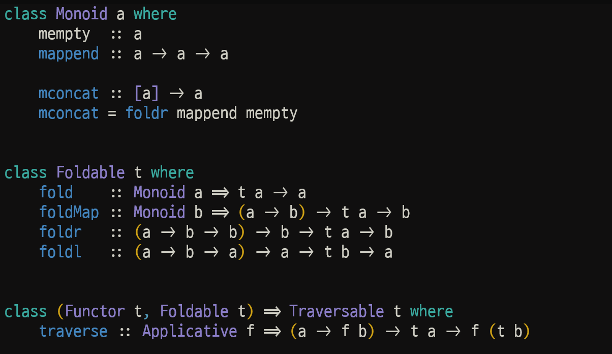

<!-- truncate -->

이 글에서는 하스켈에서 데이터 구조의 값들을 처리하는 세 가지 일반적인 패턴을 소개한다. 먼저 값을 결합하는 데 결합 연산자(associative operator)를 사용하는 **모노이드(monoids)** 로 시작해, 그 다음으로 리스트에 대한 폴딩(folding) 개념을 매개변수화된 타입으로 일반화하는 **폴더블(foldables)** 을 살펴보고, 매핑(mapping)의 개념을 더욱 일반화하는 **트래버서블(traversables)** 로 마무리할 것이다.

## Monoids
수학에서 모노이드란 집합의 두 원소를 결합하는 결합 연산자(associative operator)와, 그 연산자에 대한 항등원(identity element)을 갖춘 집합이다. 예를 들어, 정수 집합은 덧셈 연산과 항등원인 0으로 모노이드를 형성한다. 

하스켈에서는 모노이드의 개념이 다음과 같은 내장 클래스 선언으로 구현된다.

```haskell
class Monoid a where
    mempty  :: a
    mappend :: a -> a -> a

    mconcat :: [a] -> a
    mconcat = foldr mappend mempty
```
즉, 어떤 타입이 `Monoid` 클래스의 인스턴스가 되려면, 모노이드의 항등원과 결합 연산자의 역할을 수행하는 `mempty` 값과 `mappend` 함수를 지원해야 한다. 실제 코드에서는 `mappend` 함수 양쪽에 역따옴표(back quote)를 붙여 ``x `mappend` y``와 같이 중위(infix) 연산자로 사용하는 경우가 많다.

`Monoid` 클래스는 이 두 가지 기본 요소 외에도, 리스트의 각 cons를 `mappend`로, 비어있는 리스트(`[]`)를 `mempty`로 대체하여 리스트의 값들을 모두 결합하는 `mconcat` 함수도 기본 정의로 제공한다. 예를 들어, `[x,y,z]` 형태의 리스트에 mconcat을 적용하면 다음과 같다.

``x `mappend` (y `mappend` (z `mappend` mempty))``

수학에서와 마찬가지로, `Monoid` 클래스의 두 기본 요소는 다음의 항등 법칙과 결합 법칙을 반드시 만족해야 한다.
- ``mempty `mappend` x`` = `x`
- ``x `mappend` mempty`` = `x`
- ``x `mappend` (y `mappend` z)`` = ``(x `mappend` y) `mappend` z``

예를 들어, 이 법칙들을 사용하면 `mconcat [x,y,z]`의 결과는 더 간단한 형태로 작성될 수 있다. 모노이드 법칙은 괄호나 `mempty`가 결과에 영향을 주지 않음을 보장하므로, 이를 생략할 수 있다.
```haskell
x `mappend` y `mappend` z
```
:::info

향후 하스켈의 `Monoid` 클래스는 두 개의 개별 클래스로 나뉠 수도 있다.  
하나는 결합 연산자를 제공하는 클래스이고, 다른 하나는 항등원을 제공하는 클래스이다.

:::

### Examples

`Data.Monoid` 라이브러리에는 여러 표준 모노이드가 제공된다. 가장 간단한 예는 리스트 모노이드인데, 여기서 `mempty`와 `mappend`는 각각 빈 리스트와 리스트 결합 연산자로 구현된다
```haskell
instance Monoid [a] where
    -- mempty :: [a]
    mempty = []
  
    -- mappend :: [a] -> [a] -> [a]
    mappend = (++)
```
:::note

메서드의 이름 `mempty`와 `mappend`는 이 인스턴스에서 따온 것이지만, 일반적으로 모노이드의 기본 연산이 무조건 빈 값이나 값을 추가하는 기능에 해당할 필요는 없기 때문에 이름 선택이 다소 아쉽다고 볼 수 있다.  
모노이드 법칙을 만족하는 두 개의 기본 연산만 만족하면 충분하다.

:::

두 번째 예로, `Maybe a` 타입도 매개변수 타입 `a`가 모노이드라면 모노이드로 만들 수 있다.
```haskell
instance Monoid a => Monoid (Maybe a) where
    -- mempty :: Maybe a
    mempty = Nothing
    
    -- mappend :: Maybe a -> Maybe a -> Maybe a
    Nothing  `mappend` my         = my
    mx       `mappend` Nothing    = mx
    Just x   `mappend` Just y     = Just (x `mappend` y)
```
여기서 `mempty`는 실패를 나타내는 `Nothing`이고, `mappend`는 실패할 수 있는 두 인수의 결과를 조합한다. 
한쪽 인수가 실패하면 다른 쪽 인수를 반환하고, 둘 다 성공하면 매개변수 타입 `a`의 `mappend`를 사용해 두 결과값을 결합한다.
한쪽이 실패하면 다른 쪽 인수를 반환하고, 둘 다 성공하면 매개변수 타입 `a`의 `mappend`로 두 결과값을 합친다.

하나의 타입이 여러 가지 방식으로 모노이드를 구성할 수 있다. 예를 들어 정수가 덧셈에서 모노이드를 이룬다는 것을 이미 살펴봤으므로, 다음과 같이 간단한 인스턴스를 선언할 수 있다.

```haskell
instance Monoid Int where
    -- mempty :: Int
    mempty = 0
    
    -- mappend :: Int -> Int -> Int
    mappend = (+)
```

정수는 곱셈에서도 모노이드를 이루며, 이때 항등원은 1이므로 다음과 같이 선언할 수도 있다.

```haskell
instance Monoid Int where
    -- mempty :: Int
    mempty = 1
    
    -- mappend :: Int -> Int -> Int
    mappend = (*)
```

하지만 하스켈에서는 같은 타입에 대해 같은 클래스의 인스턴스를 여러 개 선언할 수 없다. 따라서 `Monoid Int`에 대해 이런 식으로 두 개의 별도 인스턴스를 선언하려 하면 오류가 발생한다. 

해결책은 각 인스턴스마다 전용 래퍼 타입을 만드는 것이다.

덧셈의 경우, 모노이드 라이브러리는 새로운 타입 `Sum a`를 선언하는데, 이는 `Sum`이라는 더미 생성자를 가지고 있으며 타입 `a`의 단일 인수를 받는다. 또한 생성자를 제거하는 함수도 함께 제공한다.

```haskell
newtype Sum a = Sum a
    deriving (Eq, Ord, Show, Read)

getSum :: Sum a -> a
getSum (Sum x) = x
```

위의 `deriving` 절은 `Sum a` 타입의 값들이 표준 동등성 및 순서 연산자를 지원하고, 문자열로 변환하거나 문자열에서 변환할 수 있도록 보장한다. 이제 숫자 타입(`Int` 같은)인 매개변수 타입 `a`에 대해, `Sum a` 타입을 모노이드로 만들 수 있다. `mempty`는 `Sum 0`으로, `mappend`는 `Sum a` 타입 값들에 대한 덧셈 연산자로 정의한다.

```haskell
instance Num a => Monoid (Sum a) where
    -- mempty :: Sum a
    mempty = Sum 0

    -- mappend :: Sum a -> Sum a -> Sum a
    Sum x `mappend` Sum y = Sum (x+y)
```

예를 들어, 이 인스턴스를 사용하면 다음과 같다.
```haskell
> mconcat [Sum 2, Sum 3, Sum 4]
Sum 9
```

:::info

GHCi에서 이런 예제를 시도해보려면 먼저 ```import Data.Monoid```를 입력해 모노이드 라이브러리를 로드해야 한다.

:::

특히, 리스트의 각 숫자에 `Sum`을 적용하면 `mconcat`이 합계를 구하기 위해 모노이드를 사용하게 된다.

마찬가지로 숫자 곱셈의 경우, 모노이드 라이브러리는 덧셈과 같은 접근 방식을 사용해 새로운 타입 `Product a`를 선언한다.
```haskell
newtype Product a = Product a
    deriving (Eq, Ord, Show, Read)

getProduct :: Product a -> a
getProduct (Product x) = x
```

그러면 `Product a` 타입을 곱셈에 적합한 방식으로 두 기본 연산을 정의해서 `Monoid` 클래스의 인스턴스로 만들 수 있다.
```haskell
instance Num a => Monoid (Product a) where
    -- mempty :: Product a
    mempty = Product 1
    
    -- mappend :: Product a -> Product a -> Product a
    Product x `mappend` Product y = Product (x*y)
```

예를 들어
```haskell
> mconcat [Product 2, Product 3, Product 4]
Product 24
```

비슷한 방식으로, 논리값 타입은 논리곱과 논리합 모두에 대해 모노이드를 형성한다. 이를 위해 모노이드 라이브러리는 `Bool` 타입을 위한 `All`과 `Any`라는 wrapper 타입을 제공한다. 예를 들어, `All`에 대한 `mconcat` 함수는 리스트의 모든 논리값이 `True`인지 결정하고, `Any`에 대해서는 그런 값이 하나라도 있는지 결정한다.

```haskell
> mconcat [All True, All True, All True]
All True

> mconcat [Any False, Any False, Any False]
Any False
```
:::info

하스켈 라이브러리는 ``x <> y`` = ``x `mappend` y``로 정의되는 `mappend`의 중위(infix) 버전을 제공한다.  
이는 `x <> y <> z`에서처럼 모노이드 표현식을 더 간결하게 작성할 수 있게 해준다. 이 연산자는 실제 응용 프로그램에서 자주 사용되지만, 이 장에서는 설명의 목적으로 `mappend` 기본 함수를 직접 사용했다.

:::

## Foldables

하스켈에서 모노이드의 주요 응용 중 하나는 데이터 구조의 모든 값을 결합하여 단일 값을 만드는 것이다. 
예를 들어 리스트의 경우 이 아이디어를 구현하는 `fold` 함수를 다음과 같이 정의할 수 있다.
```haskell
fold :: Monoid a => [a] -> a
fold []     = mempty
fold (x:xs) = x `mappend` fold xs
```

즉, 빈 리스트에 `fold`를 적용하면 모노이드의 항등원 `mempty`가 나오고, 비어있지 않은 리스트의 경우에는 모노이드 연산자 `mappend`를 사용해 리스트의 머리와 꼬리를 재귀적으로 처리한 결과를 결합한다. 

예를 들어 `[x,y,z]` 형태의 리스트에 fold를 적용하면
```haskell
x `mappend` (y `mappend` (z `mappend` mempty))
```

다시 말해, `fold`는 모노이드를 사용해 리스트를 '접는' 간단한 방법을 제공하며, 이것이 함수 이름을 선택한 이유다.  
`fold`는 `Monoid` 클래스의 `mconcat`과 같은 방식으로 작동하지만, `foldr`을 사용하는 대신 명시적 재귀를 사용해 정의된다는 점에 주목하자. 

비슷한 방식으로, leaf에 데이터를 가진 이진 트리 타입에 대해서도 `fold` 버전을 정의할 수 있다.
```haskell
data Tree a = Leaf a | Node (Tree a) (Tree a)
    deriving Show

fold :: Monoid a => Tree a -> a
fold (Leaf x)   = x
fold (Node l r) = fold l `mappend` fold r
```

즉, leaf의 경우에는 단순히 그것이 포함하는 값을 반환하고, 노드의 경우에는 두 하위 트리를 재귀적으로 접고 `mappend`를 사용해 결과 값들을 결합한다. 이 예제에서는 이런 타입의 트리가 항상 비어있지 않기 때문에 정의에서 항등원 `mempty`를 사용할 필요가 없다.

더 일반적으로, 모노이드를 사용해 데이터 구조의 값들을 접는 아이디어는 리스트나 이진 트리 같은 타입에만 한정되지 않고, 다양한 매개변수화된 타입으로 추상화할 수 있다. 하스켈에서는 이 개념이 `Data.Foldable` 라이브러리의 다음 클래스 선언으로 구현되어 있다.
```haskell
class Foldable t where
    fold    :: Monoid a => t a -> a
    foldMap :: Monoid b => (a -> b) -> t a -> b
    foldr   :: (a -> b -> b) -> b -> t a -> b
    foldl   :: (a -> b -> a) -> a -> t b -> a
```
즉, 매개변수화된 타입이 `Foldable` 클래스의 인스턴스가 되려면 지정된 타입의 다양한 `fold` 함수를 지원해야 한다. 위의 선언에서 관례적으로 `foldable` 타입은 보통 `t`로 표시된다.

직관적으로, `Foldable` 클래스의 일반화된 `fold`는 원소들이 타입 `a`를 가진 타입 `t a`의 데이터 구조를 받아서, 이 타입에 대한 모노이드 기본 연산을 사용해 원소들을 결합하여 타입 `a`의 단일 값을 만든다. 
반면 `foldMap`은 타입 `a -> b`의 함수를 추가 인수로 받아 `fold`를 일반화하는데, 이 함수는 구조의 각 원소에 적용된 후 타입 `b`에 대한 모노이드 기본 연산을 사용해 결과 값들을 결합한다.

위 클래스 선언의 마지막 두 함수인 `foldr`과 `foldl`은 리스트용 고차 함수를 다른 데이터 구조로 일반화한 것이다. 
이 두 함수는 두 값을 결합하는 시작 값과 함수가 인수로 명시적으로 제공되기 때문에 기본 모노이드가 필요하지 않다는 점에 주목하자.

완전한 버전의 `Foldable` 클래스에는 여러 다른 유용한 함수들과 기본 정의들이 포함되어 있지만, 위에서 제시한 축약된 버전을 살펴보는 것부터 시작하겠다.

### Examples

예상할 수 있듯이, 리스트 타입은 폴딩(folding) 기본 함수들을 적절한 방식으로 정의함으로써 폴더블 타입으로 만들 수 있다.

```haskell
instance Foldable [] where
    -- fold :: Monoid a => [a] -> a
    fold []     = mempty
    fold (x:xs) = x `mappend` fold xs
    
    -- foldMap :: Monoid b => (a -> b) -> [a] -> b
    foldMap _ []     = mempty
    foldMap f (x:xs) = f x `mappend` foldMap f xs
    
    -- foldr :: (a -> b -> b) -> b -> [a] -> b
    foldr _ v []     = v
    foldr f v (x:xs) = f x (foldr f v xs)
    
    -- foldl :: (a -> b -> a) -> a -> [b] -> a
    foldl _ v []     = v
    foldl f v (x:xs) = foldl f (f v x) xs
```
예를 들어, 이전 섹션의 숫자 모노이드를 사용하면, `foldMap`은 이제 숫자 리스트의 합계와 곱을 계산하는 데 사용될 수 있다.

```haskell
> getSum (foldMap Sum [1..10])
55

> getProduct (foldMap Product [1..10])
3628800
```
:::info

이 예제를 실행하려면, `Data.Monoid`와 `Data.Foldable`을 임포트해야 한다.

::: 

이진 트리 또한 비슷한 방식으로 인스턴스를 정의할 수 있다. 
단, `foldr`과 `foldl`이 트리 내의 값들을 각각 오른쪽-에서-왼쪽 순서와 왼쪽-에서-오른쪽 순서로 결합하도록 주의해야 한다.

```haskell
instance Foldable Tree where
    -- fold :: Monoid a => Tree a -> a
    fold (Leaf x)   = x
    fold (Node l r) = fold l `mappend` fold r
    
    -- foldMap :: Monoid b => (a -> b) -> Tree a -> b
    foldMap f (Leaf x)   = f x
    foldMap f (Node l r) = foldMap f l `mappend` foldMap f r
    
    -- foldr :: (a -> b -> b) -> b -> Tree a -> b
    foldr f v (Leaf x)   = f x v
    foldr f v (Node l r) = foldr f (foldr f v r) l
    
    -- foldl :: (a -> b -> a) -> a -> [b] -> a
    foldl f v (Leaf x)   = f v x
    foldl f v (Node l r) = foldl f (foldl f v l) r
```
예를 들어, 다음과 같은 정수 트리를 생각해보자.
```haskell
tree :: Tree Int
tree = Node (Node (Leaf 1) (Leaf 2)) (Leaf 3)
```
이때 `foldr (+) 0 tree`를 평가하면 `(1+(2+(3+0)))`의 결과인 `6`이 나오는데, 덧셈이 오른쪽에서 왼쪽으로 수행된다. 
반면 `foldl (+) 0 tree`는 `(((0+1)+2)+3)`의 결과 `6`을 내놓으며, 덧셈은 왼쪽에서 오른쪽으로 수행된다. 
덧셈은 결합 법칙이 성립하므로 이 경우 결과는 같지만, `foldl`이 더 효율적일 수 있다.

### Other primitives and defaults

네 가지 기본적인 폴딩 함수 외에도, `Foldable` 클래스는 데이터 구조 내의 값들을 결합하기 위한 다양하고 유용한 다른 함수들도 포함한다.  
첫 번째 그룹은 리스트에 익숙한 함수들을 일반화한다.

```haskell
null    :: t a -> Bool
length  :: t a -> Int
elem    :: Eq a => a -> t a -> Bool
maximum :: Ord a => t a -> a
minimum :: Ord a => t a -> a
sum     :: Num a => t a -> a
product :: Num a => t a -> a
```
예를 들어, `null`은 구조가 비어 있는지(원소가 없는지) 결정하고, `length`는 `t a` 타입의 구조 안에 있는 `a` 타입 원소의 수를 센다. 따라서 이 함수들은 리스트와 트리 모두에 적용될 수 있다.

```haskell
> null []
True

> null (Leaf 1)
False

> length [1..10]
10

> length (Node (Leaf 'a') (Leaf 'b'))
2
```

또한, 이 클래스는 적어도 하나의 원소를 포함하여 시작 값이 필요 없는 구조를 위한 `foldr`과 `foldl`의 버전도 포함한다.

```haskell
foldr1 :: (a -> a -> a) -> t a -> a
foldl1 :: (a -> a -> a) -> t a -> a
```

예를 들면 다음과 같다.

```haskell
> foldr1 (+) [1..10]
55

> foldl1 (+) (Node (Leaf 1) (Leaf 2))
3
```

클래스의 마지막 기본 함수는 데이터 구조를 리스트로 펼치는(flatten) 것으로, 예를 들어 `Node (Leaf 1) (Leaf 2)` 트리를 `[1,2]` 리스트로 변환한다.

```haskell
toList :: t a -> [a]
```

사실 `toList` 함수는 `Foldable` 클래스 선언에서 특별한 역할을 한다. 클래스 내 대부분의 다른 기본 함수들에 대한 **기본 정의(default definitions)** 를 리스트에 대한 기본 함수를 이용해 제공하는 데 사용될 수 있기 때문이다.  

구체적으로, 다음과 같은 기본 정의들을 갖는다.

```haskell
foldr f v = foldr f v . toList
foldl f v = foldl f v . toList
foldr1 f  = foldr1 f  . toList
foldl1 f  = foldl1 f  . toList

null      = null . toList
length    = length . toList
elem x    = elem x . toList
maximum   = maximum . toList
minimum   = minimum . toList
sum       = sum . toList
product   = product . toList
```

예를 들어, `null = null . toList`라는 정의는 어떤 데이터 구조가 비어있는지 아닌지를 먼저 그 구조를 리스트로 펼친(flatten) 다음, 그 리스트가 비어있는지 확인하는 방식으로 결정할 수 있다는 것을 의미한다. 다른 정의들도 비슷하게 간단한 해석을 갖는다.

`Foldable` 클래스의 마지막 세 가지 기본 정의는 `fold`, `foldMap`, `toList` 기본 함수들 간의 중요한 관계를 설정한다.

```haskell
fold      = foldMap id
foldMap f = foldr (mappend . f) mempty
toList    = foldMap (\x -> [x])
```
즉,
- `fold`는 각 원소를 결합하기 전에 항등 함수(`id`)를 적용하는 `foldMap`의 특별한 경우로 볼 수 있다.
- `foldMap`은 각 원소에 함수 `f`를 적용한 후, 모노이드 기본 함수들(`mappend`, `mempty`)을 사용하여 결합하는 `foldr`의 관점에서 정의될 수 있다.
- `toList`는 각 원소를 원소가 하나인 리스트(singleton list)로 변환한 다음, 리스트 모노이드를 사용하여 그 결과들을 이어 붙이는 `foldMap`의 관점에서 정의될 수 있다.

요약하자면, `Foldable` 클래스는 데이터 구조 내의 값들을 처리하기 위한 다양하고 유용한 함수들을 제공하며, 이들 대부분은 리스트에 대한 특정 인스턴스나 클래스 내의 다른 일반화된 함수를 이용한 기본 정의를 갖는다. 이 시점에서 세 가지 질문을 던질 수 있다.

1. 왜 클래스에 그렇게 많은 함수가 있는가? 특히, `null`, `length` 등과 같은 추가적인 기본 함수들이 왜 폴더블 라이브러리의 정의가 아닌 `Foldable` 클래스의 메소드로 제공되는지 물을 수 있다. 그 이유는 필요할 경우 기본 정의를 오버라이드(override)할 수 있도록 허용하기 위함이며, 만약 이 함수들이 최상위 함수(top-level functions)로 정의되었다면 이것이 불가능했을 것이다.
2. 무엇을 수동으로 정의해야 하는가? `Foldable` 클래스의 인스턴스를 위한 **최소 완전 정의(minimal complete definition)** 는 `foldMap`이나 `foldr` 둘 중 하나를 정의하는 것이다. 클래스의 다른 모든 함수들은 이 두 함수 중 하나로부터 기본 정의와 리스트 인스턴스를 사용하여 파생될 수 있기 때문이다. 리스트와 트리에서 이미 보았듯이, `foldMap` 함수를 정의하는 것이 가장 간단한 경우가 많다.
3. 효율성은 어떤가? 많은 응용 프로그램에서는 클래스에 제공된 기본 정의를 사용하는 것으로 충분하지만, 더 높은 효율성이 요구된다면 위에서 언급했듯이 이들을 오버라이드할 수 있다. 실제로 GHC 시스템은 우리가 제시한 단순한 버전보다 더 효율적인 기본 정의를 사용하지만, 이들은 기능적으로 우리의 더 간단한 버전과 동일하다.

GHC가 `Data.Foldable` 라이브러리를 자동으로 임포트하지만, 현재 클래스의 `fold`와 `toList` 메소드는 숨긴다는 점을 언급하며 이 섹션을 마무리한다. 이러한 이유로, 우리는 폴더블 타입을 프로그래밍할 때 자동으로 제공되는 축소된 버전에 의존하기보다는 `Data.Foldable`을 명시적으로 임포트하는 것을 일반적으로 선호한다.

### Generic functions

폴더블 타입의 개념을 추상화하는 것의 중요한 이점은 `Foldable` 클래스의 기본 함수들을 사용하여 어떤 폴더블 타입과도 함께 사용할 수 있는 일반화된 함수를 정의하는 능력이다. 예를 들어, 정수 리스트의 평균을 계산하는 함수를 다음과 같이 정의했다면

```haskell
average :: [Int] -> Int
average ns = sum ns `div` length ns
```

이제 `sum`과 `length`가 리스트에만 국한되지 않고 어떤 폴더블 타입과도 사용될 수 있다는 것을 보았으므로, `average`의 타입 정의 자체를 변경할 필요 없이 일반화될 수 있다.

```haskell
average :: Foldable t => t Int -> Int
average ns = sum ns `div` length ns
```

따라서, 이 함수는 이제 리스트와 트리 모두에 적용될 수 있다.

```haskell
> average [1..10]
5

> average (Node (Leaf 1) (Leaf 3))
2
```

비슷한 방식으로, `Data.Foldable` 라이브러리는 논리값 리스트에 대해 동작하는 익숙한 함수들의 일반화된 버전을 제공한다.


```haskell
and :: Foldable t => t Bool -> Bool
and = getAll . foldMap All

or :: Foldable t => t Bool -> Bool
or = getAny . foldMap Any

all :: Foldable t => (a -> Bool) -> t a -> Bool
all p = getAll . foldMap (All . p)

any :: Foldable t => (a -> Bool) -> t a -> Bool
any p = getAny . foldMap (Any . p)
```

각 경우, `foldMap`을 적절한 모노이드 기본 함수와 함께 사용하면 원하는 동작을 일반화된 방식으로 얻을 수 있다.

```haskell
> and [True,False,True]
False

> or (Node (Leaf True) (Leaf False))
True

> all even [1,2,3]
False

> any even (Node (Leaf 1) (Leaf 2))
True
```

마지막 예제로, 리스트의 리스트를 이어 붙이는 `concat :: [[a]] -> [a]` 함수는 이제 리스트 모노이드를 사용하여 간단히 폴딩함으로써, 원소가 리스트인 임의의 폴더블 타입에 대해 일반화될 수 있다.

```haskell
concat :: Foldable t => t [a] -> [a]
concat = fold
```

예를 들면 다음과 같다.

```haskell
> concat ["ab","cd","ef"]
"abcdef"

> concat (Node (Leaf [1,2]) (Leaf [3]))
[1,2,3]
```

결론적으로, 하스켈에서 새로운 타입을 선언할 때, 그 타입을 폴더블 타입으로 만들 수 있는지 고려하는 것이 유용하다. 그렇게 하는 것의 장점은 `Foldable` 클래스에 포함된 기본 정의들과 이 기본 함수들을 이용해 정의된 다른 일반화된 함수들을 통해, 해당 타입을 위한 다양하고 유용한 함수들을 본질적으로 '공짜로' 제공받는다는 점이다.

## Traversables

데이터 구조의 각 원소 위로 함수를 매핑하는 아이디어는 펑터라는 개념으로 포착된다.

```haskell
class Functor f where
    fmap :: (a -> b) -> f a -> f b
```

예를 들어, 리스트의 경우 기본 `fmap`은 다음과 같이 재귀적으로 정의될 수 있는 익숙한 라이브러리 함수 `map`이다.

```haskell
map :: (a -> b) -> [a] -> [b]
map g [] = []
map g (x:xs) = g x : map g xs
```

하지만 리스트 위로 함수를 매핑하는 아이디어는 일반화될 수 있다. 예를 들어, 각 원소에 적용되는 함수 `g`가 실패할 수 있다고 가정해보자. 즉, `a -> b`가 아닌 `a -> Maybe b` 타입을 갖는다는 의미이다. 그리고 전체 매핑은 모든 개별 적용이 성공할 경우에만 성공한다고 하자. `Maybe`가 어플리커티브(applicative)라는 사실을 이용하면, 이 동작을 구현하는 함수를 쉽게 정의할 수 있다.

```haskell
traverse :: (a -> Maybe b) -> [a] -> Maybe [b]
traverse g []     = pure []
traverse g (x:xs) = pure (:) <*> g x <*> traverse g xs
```

이 정의의 재귀 구조는 `map`과 본질적으로 동일하지만, 실패 가능성을 관리하기 위해 어플리커티브 메커니즘이 사용되었다는 점이 다르다. 이런 식으로, `traverse`는 실패할 수 있는 함수를 사용하여 리스트의 원소를 순회하는 간단한 수단을 제공한다. 예를 들어, 정수가 양수일 때만 1을 감소시키는 함수를 정의하기 위해 `Maybe` 타입을 사용한다고 가정해보자.

```haskell
dec :: Int -> Maybe Int
dec n = if n > 0 then Just (n-1) else Nothing
```

그러면 다음과 같다.

```haskell
> traverse dec [1,2,3]
Just [0,1,2]

> traverse dec [2,1,0]
Nothing
```

놀랍지 않게도, 위와 같은 방식으로 데이터 구조를 순회하는 아이디어는 리스트 타입에만 국한되지 않으며, 실패할 수 있는 인자 함수에만 특정되지도 않는다. 이러한 일반화된 매핑을 지원하는 타입 클래스를 순회 가능한 타입(traversable types), 줄여서 **트래버서블(traversables)** 이라고 부른다. 

하스켈에서 이 개념은 다음과 같은 내장 클래스 선언으로 구현된다.

```haskell
class (Functor t, Foldable t) => Traversable t where
    traverse :: Applicative f => (a -> f b) -> t a -> f (t b)
```

즉, 펑터이면서 폴더블인 매개변수화된 타입 `t`가 `Traversable` 클래스의 인스턴스가 되려면, 명시된 타입의 `traverse` 함수를 지원해야 한다.

- `t`가 **펑터(functor)** 여야 한다는 요구사항은 트래버서블이 매핑의 아이디어를 일반화하므로 `fmap` 기본 함수를 지원할 것으로 기대된다는 사실을 반영한다.
- `t`가 **폴더블(foldable)** 이어야 한다는 요구사항은 트래버서블 타입의 값들이 원한다면 폴딩될 수도 있음을 보장한다.

### Examples

리스트는 펑터이면서 폴더블이기 때문에, 리스트 타입은 `traverse`를 `Maybe` 타입에서 임의의 어플리커티브로 단순하게 일반화함으로써 트래버서블로 만들 수 있다. 즉, 정의는 동일하게 유지되지만 타입은 일반화된다.

```haskell
instance Traversable [] where
    -- traverse :: Applicative f => (a -> f b) -> [a] -> f [b]
    traverse g []     = pure []
    traverse g (x:xs) = pure (:) <*> g x <*> traverse g xs
```

트리에 대한 인스턴스도 비슷한 방식으로 정의될 수 있지만, 인자 함수의 적용이 기본 케이스(base case)에서 일어난다는 점이 다르다.

```haskell
instance Traversable Tree where
    -- traverse :: Applicative f => (a -> f b) -> Tree a -> f (Tree b)
    traverse g (Leaf x)   = pure Leaf <*> g x
    traverse g (Node l r) = pure Node <*> traverse g l <*> traverse g r
```

예를 들어, 이제 `traverse`는 이전 섹션의 `dec`와 같이 실패할 수 있는 함수를 리스트와 트리 모두에 매핑하는 데 사용될 수 있다.

```haskell
> traverse dec [1,2,3]
Just [0,1,2]

> traverse dec [2,1,0]
Nothing

> traverse dec (Node (Leaf 1) (Leaf 2))
Just (Node (Leaf 0) (Leaf 1))

> traverse dec (Node (Leaf 0) (Leaf 1))
Nothing
```

### Other primitives and defaults

`traverse` 기본 함수 외에도 `Traversable` 클래스는 다음과 같은 추가 함수와 기본 정의를 포함한다.

```haskell
sequenceA :: Applicative f => t (f a) -> f (t a)
sequenceA = traverse id
```

`sequenceA`의 타입은 이 함수가 어플리커티브 액션을 원소로 갖는 데이터 구조를, 데이터 구조를 반환하는 단일 액션으로 변환함을 나타낸다. 그리고 그 정의는 항등 함수를 사용하여 구조를 순회함으로써 이를 달성한다고 말하는데, 이 경우 항등 함수는 `f a -> f a` 타입을 갖는다. 예를 들어, `sequenceA`는 실패할 수 있는 원소들을 포함하는 데이터 구조를 변환하는 데 사용될 수 있다.

```haskell
> sequenceA [Just 1, Just 2, Just 3]
Just [1,2,3]

> sequenceA [Just 1, Nothing, Just 3]
Nothing

> sequenceA (Node (Leaf (Just 1)) (Leaf (Just 2)))
Just (Node (Leaf 1) (Leaf 2))

> sequenceA (Node (Leaf (Just 1)) (Leaf Nothing))
Nothing
```

반대로, 클래스 선언은 `sequenceA`를 이용한 `traverse`의 기본 정의도 포함한다. 이는 effect가 있는 함수를 사용하여 데이터 구조를 순회하기 위해, 먼저 `fmap`을 사용하여 각 원소에 함수를 적용한 다음 `sequenceA`를 사용하여 모든 effect를 결합할 수 있음을 표현한다.

```haskell
-- traverse :: Applicative f => (a -> f b) -> t a -> f (t b)
traverse g = sequenceA . fmap g
```

`Traversable` 클래스의 인스턴스를 선언하려면 `traverse`나 `sequenceA` 중 하나를 정의하는 것으로 충분하다. 다른 하나는 위 기본 정의를 사용하여 파생될 수 있기 때문이다. 하지만 `traverse`의 기본 정의는 데이터 구조를 두 번 순회(한 번은 `fmap`, 한 번은 `sequenceA`)하므로, `sequenceA`보다는 `traverse`를 정의하는 것이 일반적으로 선호된다.

마지막으로, 클래스는 관련된 효과가 어플리커티브가 아닌 모나드인 특별한 경우를 위해 두 트래버서블 기본 함수에 대한 특별한 이름도 제공한다.

```haskell
mapM     :: Monad m => (a -> m b) -> t a -> m (t b)
mapM     = traverse

sequence :: Monad m => t (m a) -> m (t a)
sequence = sequenceA
```

결론적으로, 새로운 타입을 선언할 때 `traverse`나 `sequenceA` 기본 함수 중 하나를 정의함으로써 그 타입을 트래버서블 타입으로 만들 수 있는지 고려하는 것이 유용하다. 그렇게 하는 것의 장점은 `Traversable` 클래스의 기본 정의들을 통해 해당 타입을 사용한 effectful 프로그래밍을 위한 여러 유용한 함수들을 제공받는다는 점이다.
