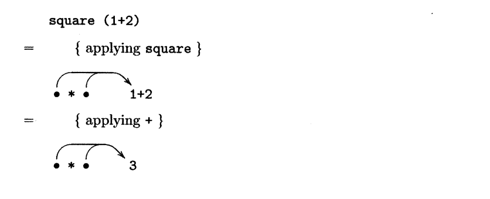
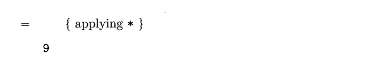
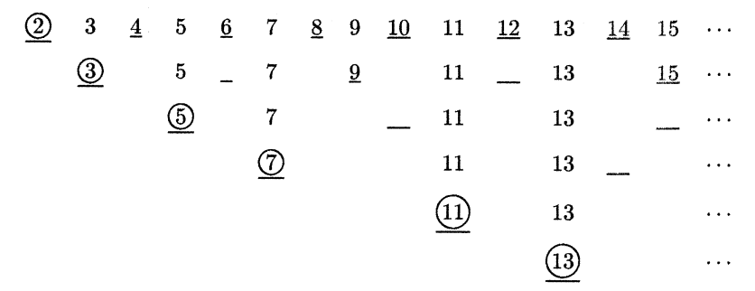

In this chapter we introduce lazy evaluation, the mechanism used to evaluate expressions in Haskell. We start by reviewing the notion of evaluation, then consider evaluation strategies and their properties, discuss infinite structures and modular programming, and conclude with a special form of function application that can improve the space performance of programs.

<!-- truncate -->

## Introduction

As we have seen throughout this book, the basic method of computation in Haskell is the application of functions to arguments. For example, suppose that we define a function that increments an integer:

```haskell
inc :: Int -> Int
inc n = n + 1
```

Then the expression `inc (2*3)` can be evaluated as follows:

```haskell
inc (2*3)
= { applying * }
inc 6
= { applying inc }
6 + 1
= { applying + }
7
```

Alternatively, the same final result can also be obtained by performing the first two function applications in the opposite order:

```haskell
inc (2*3)
= { applying inc }
(2*3) + 1
= { applying * }
6 + 1
= { applying + }
7
```

The fact that changing the order in which functions are applied does not affect the final result is not specific to simple examples such as the above, but is an important general property of function application in Haskell. More formally, in Haskell any two different ways of evaluating the same expression will always produce the same final value, provided that they both terminate. We will return to the issue of termination later on in this chapter.

We also note that the above property does not hold for most imperative programming languages, in which the basic method of computation is changing stored values. For example, consider the imperative expression `n + (n = 1)` that adds the current value of the variable n to the result of changing its value to one. Assuming that n initially has the value zero, this expression can be evaluated by first performing the left-hand side of the addition

```haskell
n + (n = 1)
= { applying n }
0 + (n = 1)
= { applying = }
0 + 1
= { applying + }
1
```

or alternatively, by first performing the right-hand side:

```haskell
n + (n = 1)
= { applying = }
n + 1
= { applying n }
1 + 1
= { applying + }
2
```

The final value is different in each case. The general problem illustrated by this example is that the precise time at which an assignment is performed in an imperative language may affect the value that results from a computation. In contrast, the time at which a function is applied to an argument in Haskell never affects the value that results from a computation. Nonetheless, as we shall see in the remainder of this chapter, there are important practical issues concerning the order and nature of the evaluation process.

## Evaluation strategies

An expression that has the form of a function applied to one or more arguments that can be ‘reduced’ by performing the application is called a **reducible expression**, or **redex** for short. As indicated by the use of quotations marks in the preceding sentence, such reductions do not necessarily decrease the size of an expression, although in practice this is often the case.

By way of example, suppose that we define a function `mult` that takes a pair of integers and returns their product:

```haskell
mult :: (Int,Int) -> Int
mult (x,y) = x * y
```

Now consider the expression mult `(1+2,2+3)`. This expression contains three redexes, namely the sub-expressions `1+2` and `2+3`, which have the form of the addition operator `+` applied to two arguments, and the entire expression itself `mult (1+2,2+3)`, which has the form of the function `mult` applied to a pair of arguments. Performing the corresponding reductions gives the expressions `mult (3,2+3)`, `mult (1+2,5)`, and `(1+2) * (2+3)`.

When evaluating an expression, in what order should the reductions be performed? One common strategy, known as **innermost evaluation**, is to always choose a redex that is innermost, in the sense that it contains no other redex. If there is more than one innermost redex, by convention we choose the one that begins at the leftmost position in the expression.

For example, both of the sub-expressions `1+2` and `2+3` contain no other redexes and hence innermost within the expression mult `(1+2,2+3)`, with the redex `1+2` beginning at the leftmost position. More generally, our example expression is evaluated using innermost evaluation as follows:

```haskell
  mult (1+2, 2+3)
= { applying the first + }
  mult (3, 2+3)
= { applying + }
  mult (3, 5)
= { applying mult }
  3 * 5
= { applying * }
  15
```

Innermost evaluation can also be characterised in terms of how arguments are passed to functions. In particular, using this strategy ensures that arguments are always fully evaluated before functions are applied. That is, arguments are passed **by value**. For example, as shown above, evaluating `mult (1+2,2+3)` using innermost evaluation proceeds by first evaluating the arguments `1+2` and `2+3`, and then applying `mult`. The fact that we always choose the leftmost innermost redex ensures that the first argument is evaluated before the second.

Another common strategy for evaluating an expression, dual to innermost evaluation, is to always choose a redex that is outermost, in the sense that it is contained in no other redex. If there is more than one such redex then as previously we choose that which begins at the leftmost position. Not surprisingly, this evaluation strategy is known as **outermost evaluation**.

For example, the expression `mult (1+2,2+3)` is contained in no other redex and is hence outermost within itself. More generally, evaluating this expression using outermost evaluation proceeds as follows:

```haskell
  mult (1+2, 2+3)
= { applying mult }
  (1+2) * (2+3)
= { applying the first + }
  3 * (2+3)
= { applying + }
  3 * 5
= { applying * }
  15
```

In terms of how arguments are passed to functions, using outermost evaluation allows functions to be applied before their arguments are evaluated. For this reason, we say that arguments are passed **by name**. For example, as shown above, evaluating `mult (1+2,2+3)` using outermost evaluation proceeds by first applying the function mult to the two unevaluated arguments `1+2` and `2+3`, and then evaluating these two expressions in turn.

We conclude this section by noting that many built-in functions require their arguments to be evaluated before being applied, even when using outermost evaluation. For example, as illustrated in the calculation above, built-in arithmetic operators such as `*` and `+` cannot be applied until their two arguments have been evaluated to numbers. Functions with this property are called **strict**, and will be discussed in further detail at the end of this chapter.

### Lambda expressions

Let us now define a curried version of `mult` that takes its arguments one at a time, using a lambda expression to make the use of currying explicit:

```haskell
mult :: Int -> Int -> Int
mult x = \y -> x * y
```

Then using innermost evaluation, for example, we have:

```haskell
  mult (1+2) (2+3)
= { applying the first + }
  mult 3 (2+3)
= { applying mult }
  (\y -> 3 * y) (2+3)
= { applying + }
  (\y -> 3 * y) 5
= { applying the lambda }
  3 * 5
= { applying * }
  15
```

That is, the two arguments are now substituted into the body of the function `mult` one at a time, as we would expect using currying, rather than at the same time as in the previous section. This behaviour arises because `mult 3` is the leftmost innermost redex in the expression `mult 3 (2+3)`, as opposed to `2+3` in the expression `mult (3,2+3)`. Performing a reduction on `mult 3` in the second step of the calculation above gives the lambda expression `\y -> 3 * y`, which awaits the result of evaluating the second argument.

Note that in Haskell, the selection of redexes within the bodies lambda expressions is prohibited. The rationale for not ‘reducing under lambdas’ is that functions are viewed as black boxes that we are not permitted to look inside. More formally, the only operation that can be performed on a function is that of applying it to an argument. As such, reduction within the body of a function is only permitted once the function has been applied.

For example, the function `\x -> 1 + 2` is deemed to already be fully evaluated, even though its body contains the redex `1 + 2`, but once this function has been applied to an argument, evaluation of this redex can then proceed:

```haskell
  (\x -> 1 + 2) 0
= { applying the lambda }
  1 + 2
= { applying + }
  3
```

Using innermost and outermost evaluation, but not within lambda expressions, is normally referred to as **call-by-value** and **call-by-name** evaluation, respectively. In the next two sections we explore how these two evaluation strategies compare in terms of two important properties, namely their termination behaviour and the number of reduction steps that they require.

:::note

현대 프로그래밍에서는 두 용어 pass-by-value와 call-by-value를 거의 같은 의미로 혼용하지만, 엄밀히 따지면 약간의 관점 차이가 있다.

- pass-by-value: 함수가 적용되기 전에 인자가 항상 완전히 평가되야 함
    - 함수에 인자를 전달하는 **메커니즘**에 초점을 맞춘, 보다 구체적이고 기술적인 설명
- call-by-value: 람다 표현식 내부를 축약하지 않는 방식의 innermost evaluation
    - 프로그램의 **평가 전략(Evaluation Strategy)** 에 초점을 맞춘, 보다 추상적이고 이론적인 개념

즉, call-by-value 라는 평가 전략을 구현하는 가장 일반적인 방법이 바로 pass-by-value 메커니즘이다.

:::

## Termination

Consider the following recursive definition:

```haskell
inf :: Int
inf = 1 + inf
```

That is, the integer `inf` (abbreviating infinity) is defined as the successor of itself. Evaluating inf produces a larger and larger expression, regardless of the evaluation strategy, and hence does not terminate:

```haskell
  inf
= { applying inf }
  1 + inf
= { applying inf }
  1 + (1 + inf)
= { applying inf }
  1 + (1 + (1 + inf))
= { applying inf }
  ⋮
```

Now consider the expression `fst (0,inf)` that contains the value `inf`, where `fst` is the library function that selects the first component of a pair, defined by `fst (x,y) = x`. Using call-by-value evaluation with this expression results in non-termination in a similar manner to `inf` itself:

```haskell
  fst (0, inf)
= { applying inf }
  fst (0, 1 + inf)
= { applying inf }
  fst (0, 1 + (1 + inf))
= { applying inf }
  fst (0, 1 + (1 + (1 + inf)))
= { applying inf }
  ⋮
```

In contrast, using call-by-name evaluation results in termination with the result zero in just one step, by immediately applying the definition of `fst` and hence avoiding the evaluation of the non-terminating expression `inf`:

```haskell
  fst (0, inf)
= { applying fst }
  0
```

This simple example shows that call-by-name evaluation may produce a result when call-by-value evaluation fails to terminate. More generally, we have the following important property: if there exists any evaluation sequence that terminates for a given expression, then call-by-name evaluation will also terminate for this expression, and produce the same final result.

In summary, call-by-name evaluation is preferable to call-by-value for the purpose of ensuring that evaluation terminates as often as possible.

## Number of reductions

Now consider the following definition:

```haskell
square :: Int -> Int
square n = n * n
```

For example, using call-by-value evaluation, we have:

```haskell
  square (1+2)
= { applying + }
  square 3
= { applying square }
  3 * 3
= { applying * }
  9
```

In contrast, using call-by-name evaluation requires one extra reduction step, due to the fact that the argument expression `1+2` is duplicated when the function `square` is applied, and hence must be evaluated twice:

```haskell
  square (1+2)
= { applying square }
  (1+2) * (1+2)
= { applying the first + }
  3 * (1+2)
= { applying + }
  3 * 3
= { applying * }
  9
```

This example shows that call-by-name evaluation may require more reduction steps than call-by-value evaluation, in particular when an argument is used more than once in the body of a function. More generally, we have the following property: arguments are evaluated precisely once using call-by-value evaluation, but may be evaluated many times using call-by-name.

Fortunately, the above efficiency problem with call-by-name evaluation can easily be solved, by using pointers to indicate sharing of expressions during evaluation. That is, rather than physically copying an argument if it is used many times in the body of a function, we simply keep one copy of the argument and make many pointers to it. In this manner, any reductions that are performed on the argument are automatically shared between each of the pointers to that argument. For example, using this strategy we have:




That is, when applying the definition `square n = n * n` in the first step, we keep a single copy of the argument expression `1+2`, and make two pointers to it. In this manner, when the expression `1+2` is reduced in the second step, both pointers in the expression share the result.

The use of call-by-name evaluation in conjunction with sharing is known as **lazy evaluation**. This is the evaluation strategy that is used in Haskell, as a result of which Haskell is known as a lazy programming language. Being based upon call-by-name evaluation, lazy evaluation has the property that it ensures that evaluation terminates as often as possible. Moreover, using sharing ensures that lazy evaluation never requires more steps than call-by-value evaluation. The use of the term ‘lazy’ will be explained in the next section.

## Infinite structures

An additional property of call-by-name evaluation, and hence lazy evaluation, is that it allows what at first may seem impossible: programming with infinite structures. We have already seen a simple example of this idea earlier in this chapter, in the form of the evaluation of `fst (0,inf)` avoiding the production of the infinite structure `1 + (1 + (1 + ...))` defined by `inf`.

More interesting forms of behaviour occur when we consider infinite lists. For example, consider the following recursive definition:

```haskell
ones :: [Int]
ones = 1 : ones
```

That is, the list `ones` is defined as a single one followed by itself. As with `inf`, evaluating ones does not terminate, regardless of the strategy used:

```haskell
  ones
= { applying ones }
  1 : ones
= { applying ones }
  1 : (1 : ones)
= { applying ones }
  1 : (1 : (1 : ones))
= { applying ones }
  ...
```

In practice, evaluating `ones` using GHCi will produce a never-ending list of ones, until the user eventually decides to terminate this process:

```haskell
> ones
[1,1,1,1,1,1,1,1,1,1,...
```

Now consider the expression `head ones`, where `head` is the library function that selects the first element of a list, defined by head `(x:_) = x`. Using call-by-value evaluation in this case also results in non-termination:

```haskell
  head ones
= { applying ones }
  head (1 : ones)
= { applying ones }
  head (1 : (1 : ones))
= { applying ones }
  head (1 : (1 : (1 : ones)))
= { applying ones }
  ...
```

In contrast, using lazy evaluation (or call-by-name evaluation, as sharing is not required in this example) results in termination in two steps:

```haskell
  head ones
= { applying ones }
  head (1 : ones)
= { applying head }
  1
```

This behaviour arises because lazy evaluation proceeds in a lazy manner as its name suggests, only evaluating arguments as and when this is strictly necessary in order to produce results. For example, when selecting the first element of a list, the remainder of the list is not required, and hence in `head (1 : ones)` the further evaluation of the infinite list `ones` is avoided. More generally, we have the following property: using lazy evaluation, expressions are only evaluated as much as required by the context in which they are used.

Using this idea, we now see that under lazy evaluation `ones` is not an infinite list as such, but rather a **potentially infinite** list, which is only evaluated as much as required by the context. This idea is not restricted to lists, but applies equally to any form of data structure in Haskell. For example, infinite trees are considered in the exercises for this chapter.

## Modular programming

Lazy evaluation also allows us to separate **control** from **data** in our computations. For example, a list of three ones can be produced by selecting the first three elements (control) of the infinite list of ones (data):

```haskell
> take 3 ones
[1,1,1]
```

Using the definition of `take` from the standard prelude

```haskell
take 0 _ = []
take _ [] = []
take n (x:xs) = x : take (n-1) xs
```

this behaviour arises using lazy evaluation as follows:

```haskell
  take 3 ones
= { applying ones }
  take 3 (1 : ones)
= { applying take }
  1 : take 2 ones
= { applying ones }
  1 : take 2 (1 : ones)
= { applying take }
  1 : 1 : take 1 ones
= { applying ones }
  1 : 1 : take 1 (1 : ones)
= { applying take }
  1 : 1 : 1 : take 0 ones
= { applying take }
  1 : 1 : 1 : []
= { list notation }
  [1,1,1]
```

That is, the data is only evaluated as much as required by the control, and these two parts take it in turn to perform reductions. Without lazy evaluation, the control and data parts would need to be combined in the form of a single function that produces a list of `n` identical elements, such as:

```haskell
replicate :: Int -> a -> [a]
replicate 0 _ = []
replicate n x = x : replicate (n-1) x
```

Being able to modularise programs by separating them into logically distinct parts is an important goal in programming, and being able to separate control from data is one of the most important benefits of lazy evaluation.

Note that care is still required when programming with infinite lists, to avoid non-termination. For example, the expression

```haskell
filter (<= 5) [1..]
```

(where `[n..]` produces the infinite list of integers beginning with `n`) will produce the integers $1, 2, 3, 4, 5$ and then loop forever, because the function `filter (<= 5)` keeps testing elements of the infinite list in a vain attempt to find another that is less than or equal to five. 

In contrast, the expression

```haskell
takeWhile (<= 5) [1..]
```

will produce the same integers and then terminate, because `takeWhile (<= 5)` stops as soon as it finds an element that is greater than five.

We conclude this section with an example concerning prime numbers. Recall that in chapter 5, we wrote a function to generate prime numbers up to a given limit. In contrast, here is a simple procedure for generating the infinite sequence of all prime numbers, as opposed to a finite prefix of this sequence:

1. write down the infinite sequence $2, 3, 4, 5, 6, ...$;
2. mark the first number, $p$, in the sequence as prime;
3. delete all multiples of $p$ from the sequence;
4. return to the second step.

Note that the first and third steps each require an infinite amount of work, and hence in practice the steps must be interleaved. The first few iterations of this procedure can be illustrated as follows:



Each row corresponds to one iteration of the procedure, with the first row being the initial sequence (step two), the first number in each row being circled to indicate its primality (step two), and all multiples of this number being underlined to indicate their deletion (step three) prior to the next iteration. In this manner, we can imagine the initial sequence of numbers falling downwards, with certain numbers being sieved out at each stage by the underlining, and the circled numbers forming the infinite sequence of primes:

$$
2, 3, 5, 7, 11, 13, ...
$$

The above procedure for generating prime numbers is known as the **sieve of Eratosthenes**, after the Greek mathematician who first described it. This procedure can be translated directly into Haskell:

```haskell
primes :: [Int]
primes = sieve [2..]

sieve :: [Int] -> [Int]
sieve (p:xs) = p : sieve [x | x <- xs, x `mod` p /= 0]
```

That is, starting with the infinite list `[2..]` (step one), we apply the function `sieve` that retains the first number `p` as being prime (step two), and then calls itself recursively with a new list obtained by filtering all multiples of `p` from this list (steps three and four). Lazy evaluation ensures that this program does indeed produce the infinite list of all prime numbers:

```haskell
> primes
[2,3,5,7,11,13,17,19,23,29,31,37,41,43,47,53,59,61,67,...
```

By freeing the generation of prime numbers from the constraint of finiteness, we have obtained a modular program on which different control parts can be used in different situations. For example, the first ten prime numbers, and the prime numbers less than ten, can be produced as follows:

```haskell
> take 10 primes
[2,3,5,7,11,13,17,19,23,29]

> takeWhile (< 10) primes
[2,3,5,7]
```

## Strict application

Haskell uses lazy evaluation by default, but also provides a special **strict** version of function application, written as `$!`, which can sometimes be useful. Informally, an expression of the form `f $! x` behaves in the same way as the normal functional application `f x`, except that the top-level of evaluation of the argument expression `x` is forced before the function `f` is applied.

For example, if the argument has a basic type, such as `Int` or `Bool`, then top-level evaluation is simply complete evaluation. On the other hand, for a pair type such as `(Int,Bool)`, evaluation is performed until a pair of expressions is obtained, but no further. Similarly, for a list type, evaluation is performed until the empty list or the cons of two expressions is obtained.

More formally, an expression of the form `f $! x` is only a redex once evaluation of the argument `x`, using lazy evaluation as normal, has reached the point where it is known that the result is not an undefined value, at which point the expression can be reduced to the normal application `f x`. For example, using the definition `square n = n * n`, evaluation of the application `square $! (1+2)` proceeds in a call-by-value manner, by first evaluating the argument expression `1+2` to give the value `3`, and then applying the function `square`:

```haskell
  square $! (1+2)
= { applying + }
  square $! 3
= { applying $! }
  square 3
= { applying square }
  3 * 3
= { applying * }
  9
```

When used with a curried function with multiple arguments, strict application can be used to force top-level evaluation of any combination of arguments. For example, if `f` is a curried function with two arguments, an application of the form `f x y` can be modified to have three different behaviours:

- `(f $! x) y` forces top-level evaluation of `x`

- `f x $! y` forces top-level evaluation of `y`

- `(f $! x) $! y` forces top-level evaluation of `x` and `y`

In Haskell, strict application is mainly used to improve the space performance of programs. For example, consider a function `sumwith` that calculates the sum of a list of integers using an accumulator value:

```haskell
sumwith :: Int -> [Int] -> Int
sumwith v [] = v
sumwith v (x:xs) = sumwith (v+x) xs
```

Then, using lazy evaluation, we have:

```haskell
  sumwith 0 [1,2,3]
= { applying sumwith }
  sumwith (0+1) [2,3]
= { applying sumwith }
  sumwith ((0+1)+2) [3]
= { applying sumwith }
  sumwith (((0+1)+2)+3) []
= { applying the first + }
  sumwith ((1)+2)+3
= { applying the first + }
  sumwith (3)+3
= { applying + }
  6
```

Note that the entire summation `((0+1)+2)+3` is constructed before any of the component additions are actually performed. More generally, `sumwith` will construct a summation whose size is proportional to the number of integers in the original list, which for a long list may require a significant amount of space. 

In practice, it would be preferable to perform each addition as soon as it is introduced, to improve the space performance of the function. This behaviour can be achieved by redefining sumwith using strict application, to force evaluation of its accumulator value:

```haskell
sumwith v [] = v
sumwith v (x:xs) = (sumwith $! (v+x)) xs
```

For example, we now have:

```haskell
  sumwith 0 [1,2,3]
= { applying sumwith }
  (sumwith $! (0+1)) [2,3]
= { applying + }
  (sumwith $! 1) [2,3]
= { applying $! }
  sumwith 1 [2,3]
= { applying sumwith }
  (sumwith $! (1+2)) [3]
= { applying + }
  (sumwith $! 3) [3]
= { applying $! }
  sumwith 3 [3]
= { applying sumwith }
  (sumwith $! (3+3)) []
= { applying + }
  (sumwith $! 6) []
= { applying $! }
  sumwith 6 []
= { applying sumwith }
  6
```

This evaluation requires more steps than previously, due to the additional overhead of using strict application, but now performs each addition as soon as it is introduced, rather than constructing a large summation.

Generalising from the above example, the library `Data.Foldable` provides a strict version of the higher-order library function `foldl` that forces evaluation of its accumulator prior to processing the tail of the list:

```haskell
foldl' :: (a -> b -> a) -> a -> [b] -> a
foldl' f v [] = v
foldl' f v (x:xs) = ((foldl' f) $! (f v x)) xs
```

For example, using this function we can define `sumwith = foldl' (+)`. It is important to note, however, that strict application is not a silver bullet that automatically improves the space behaviour of Haskell programs. Even for relatively simple examples, the use of strict application is a specialist topic that requires careful consideration of the behaviour of lazy evaluation.
