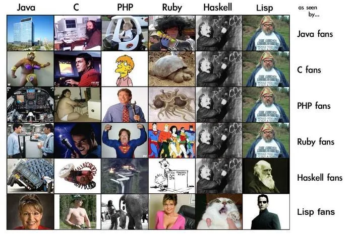

<!-- truncate -->

예전 묘한 호기심에 빠져서 구했다가 급격한 열정 감소(?)로 까먹어서 책장에 처박아둔 책이 있었는데, 이번에 다시 눈에 들어와서 하스켈 공부를 해버렸다.

대략 이런 목적으로 공부를 시작했다.
- 함수형 프로그래밍 좀 멋지고 요새 뜨는거 같은데 잘은 몰라서 이번에 좀 제대로 알고 싶다
- 하스켈이 도대체 뭐길래 개발자들 사이에서 어렵다고 악명이 자자한가

## 책에 대해 느낀점

이 책의 저자 Graham Hutton 교수는 전문성으로 따지면 최고 수준
- Nottinghum 대학교의 컴퓨터 과학 교수로, 20년이 넘는 시간 동안 하스켈을 가르쳤다고 한다.
- Journal of Functional Programming의 에디터이고, 하스켈 심퍼지움

## 하스켈에 대해 느낀점
## 함수형 프로그래밍에 대한 고찰
