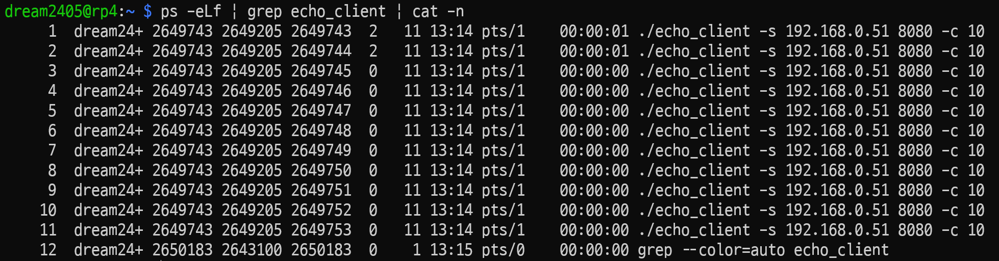
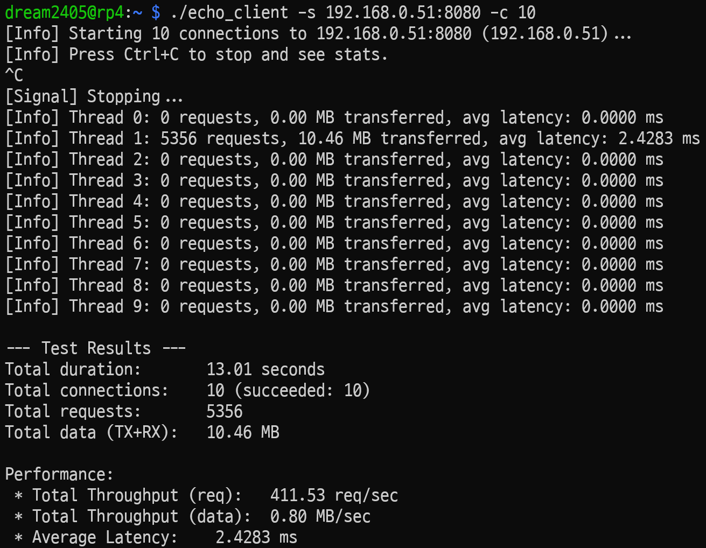
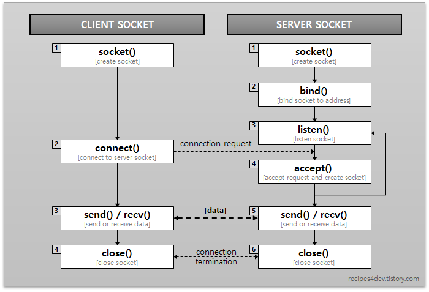
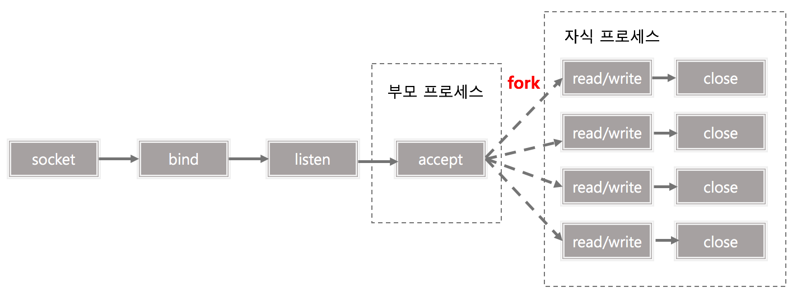
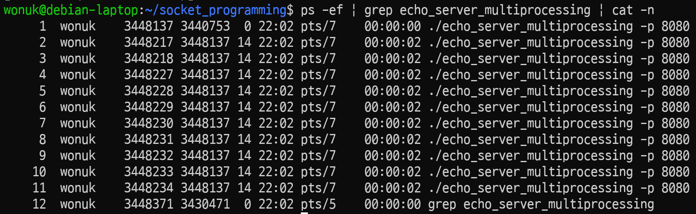
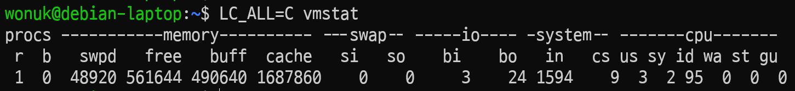
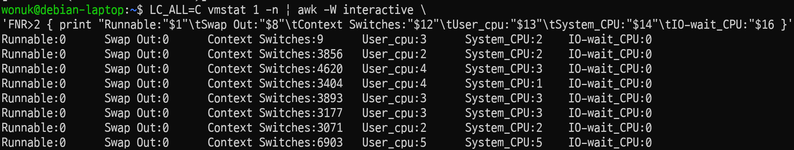

이 게시물에서는 네트워크 프로그램의 성능을 높이기 위한 기본적인 방법들을 알아보겠다.

<!-- truncate -->

테스트를 진행할 환경은 다음과 같다.

**서버**
- 하드웨어
    - CPU: Intel(R) Core(TM) i3-6100U CPU @ 2.30GHz, 4코어
    - 메모리: 3.7Gi
- 소프트웨어
    - OS: Debian GNU/Linux 13 (trixie)
    - libc 버전: GLIBC 2.41
    - 커널 버전: 6.12.48+deb13-amd64

**클라이언트**
- 하드웨어
    - CPU: Cortex-A72, 4코어
    - 메모리: 3.7Gi
- 소프트웨어
    - OS: Debian GNU/Linux 12 (bookworm)
    - libc 버전: GLIBC 2.36
    - 커널 버전: 6.12.47+rpt-rpi-v8

:::info

서버와 클라이언트는 같은 사설 네트워크 상에 있다.  
서버의 주소는 `192.168.0.51`, 클라이언트는 `192.168.0.50`이다.

:::

## 클라이언트 코드

테스트에 사용할 TCP 클라이언트 코드는 다음과 같다.

```c title="echo_client.c"
#include <stdio.h>
#include <stdlib.h>
#include <string.h>
#include <unistd.h>
#include <sys/types.h>
#include <sys/socket.h>
#include <netinet/in.h>
#include <arpa/inet.h>
#include <netdb.h>
#include <pthread.h>
#include <signal.h>
#include <time.h>

#define BUFFER_SIZE 1024

volatile sig_atomic_t running = 1; // 프로그램 실행 상태 플래그

void sigint_handler(int signum);
void *client_worker(void *arg);

// 스레드에 전달할 인자 구조체
struct thread_args {
    struct sockaddr_in server_addr;
};

// 스레드가 반환할 결과 구조체
struct thread_result {
    long long requests;
    long long bytes;
    double    latency_ns;
};

double get_time_diff_ns(struct timespec start, struct timespec end) {
    return (end.tv_sec - start.tv_sec) * 1e9 + (end.tv_nsec - start.tv_nsec);
}

int main(int argc, char *argv[]) {
    char *hostname;
    int port;
    srand(time(NULL));

    /* ############ 명령행 인수 파싱 ############ */
    if (argc != 5 || strcmp(argv[1], "-s") != 0 || strcmp(argv[3], "-c") != 0) {
        fprintf(stderr, "Usage: %s -s <host:port> -c <# of connections>\n", argv[0]);
        exit(EXIT_FAILURE);
    }

    char *server_str = argv[2];
    int num_connections = atoi(argv[4]);

    if (num_connections <= 0) {
        fprintf(stderr, "ERROR: Invalid number of connections\n");
        exit(EXIT_FAILURE);
    }

    /* ############ "host:port" 문자열 파싱 ############ */
    char *colon = strchr(server_str, ':');
    if (colon == NULL) {
        fprintf(stderr, "ERROR: Invalid server format. Use host:port\n");
        exit(EXIT_FAILURE);
    }
    *colon = '\0';
    hostname = server_str;
    port = atoi(colon + 1);
    
    if (port <= 0) {
        fprintf(stderr, "ERROR: Invalid port\n");
        exit(EXIT_FAILURE);
    }

    /* ############ 시그널 핸들러 등록 (Ctrl+C) ############ */
    signal(SIGINT, sigint_handler);

    /* ############ 스레드 배열 동적 할당 ############ */
    pthread_t *threads = malloc(sizeof(pthread_t) * num_connections);
    if (threads == NULL) {
        perror("ERROR malloc for threads");
        exit(EXIT_FAILURE);
    }

    /* ############ 스레드 인자 생성 ############ */
    struct hostent *server = gethostbyname(hostname);
    if (server == NULL) {
        fprintf(stderr, "ERROR, no such host: %s\n", hostname);
        free(threads);
        exit(EXIT_FAILURE);
    }
    struct thread_args args;
    memset(&args.server_addr, 0, sizeof(args.server_addr));
    args.server_addr.sin_family = AF_INET;
    args.server_addr.sin_port = htons(port);
    memcpy(&args.server_addr.sin_addr.s_addr, server->h_addr_list[0], server->h_length);

    printf("[Info] Starting %d connections to %s:%d (%s)...\n", 
           num_connections, hostname, port, inet_ntoa(args.server_addr.sin_addr));
    printf("[Info] Press Ctrl+C to stop and see stats.\n");

    /* ############ 워커 스레드 생성 ############ */
    struct timespec start_time, end_time; // 전체 시간 측정
    clock_gettime(CLOCK_MONOTONIC, &start_time);

    for (int i = 0; i < num_connections; i++) {
        if (pthread_create(&threads[i], NULL, client_worker, &args) != 0) {
            fprintf(stderr, "ERROR creating thread %d\n", i);
            running = 0;
            num_connections = i;
            break; 
        }
    }

    /* ############ 스레드 종료 대기 및 결과 합산 ############ */
    long long total_requests = 0;
    long long total_bytes = 0;
    double total_latency_ns = 0.0;
    int successful_threads = 0;
    
    for (int i = 0; i < num_connections; i++) {
        void *thread_return;
        pthread_join(threads[i], &thread_return);
        
        if (thread_return != NULL) {
            struct thread_result *result = (struct thread_result *)thread_return;
            
            printf("[Info] Thread %d: %lld requests, %.2f MB transferred, avg latency: %.4f ms\n",
                   i, result->requests, (result->bytes * 2.0) / (1024.0 * 1024.0),
                   (result->requests > 0) ? (result->latency_ns / result->requests) / 1e6 : 0.0);

            total_requests += result->requests;
            total_bytes += result->bytes;
            total_latency_ns += result->latency_ns;
            successful_threads++;

            free(result);
        } else {
            fprintf(stderr, "[Warn] Thread %d failed or returned NULL\n", i);
        }
    }

    /* ############ 모든 스레드 종료 후 통계 계산 ############ */
    clock_gettime(CLOCK_MONOTONIC, &end_time);
    double total_duration_sec = get_time_diff_ns(start_time, end_time) / 1e9;

    printf("\n--- Test Results ---\n");
    printf("Total duration:       %.2f seconds\n", total_duration_sec);
    printf("Total connections:    %d (succeeded: %d)\n", num_connections, successful_threads);
    printf("Total requests:       %lld\n", total_requests);
    printf("Total data (TX+RX):   %.2f MB\n", (total_bytes * 2.0) / (1024.0 * 1024.0));

    if (total_duration_sec > 0 && total_requests > 0) {
        double req_per_sec = total_requests / total_duration_sec;
        double mb_per_sec = (total_bytes * 2.0 / (1024.0 * 1024.0)) / total_duration_sec;
        double avg_latency_ms = (total_latency_ns / total_requests) / 1e6; // ns to ms

        printf("\nPerformance:\n");
        printf(" * Throughput (req):   %.2f req/sec\n", req_per_sec);
        printf(" * Throughput (data):  %.2f MB/sec\n", mb_per_sec);
        printf(" * Average Latency:    %.4f ms\n", avg_latency_ms);
    } else {
        printf("\nNo requests completed. Cannot calculate stats.\n");
    }

    free(threads);
    return 0;
}

void sigint_handler(int signum) {
    write(STDOUT_FILENO, "\n[Signal] Stopping...\n", 22);
    running = 0;
}

void *client_worker(void *arg) {
    struct thread_args *args = (struct thread_args *)arg;
    int sockfd = -1;
    struct timespec start, end;

    long long local_requests = 0;
    long long local_bytes = 0;
    double    local_latency_ns = 0.0;

    char send_buf[BUFFER_SIZE];
    char recv_buf[BUFFER_SIZE];
    int n;

    // 소켓 생성
    sockfd = socket(AF_INET, SOCK_STREAM, 0);
    if (sockfd < 0) {
        perror("ERROR opening socket");
        return NULL; 
    }

    // 서버에 연결
    if (connect(sockfd, (struct sockaddr *)&args->server_addr, sizeof(args->server_addr)) < 0) {
        if (running) perror("ERROR connecting");
        close(sockfd);
        return NULL;
    }

    // 랜덤 데이터 생성
    for (int i = 0; i < BUFFER_SIZE; i++) {
        send_buf[i] = (char)(rand() % 256);
    }

    while (running) {
        clock_gettime(CLOCK_MONOTONIC, &start);

        // 데이터 전송
        n = write(sockfd, send_buf, BUFFER_SIZE);
        if (n < 0) {
            if (running) perror("ERROR writing to socket");
            break;
        }

        int bytes_read = 0;
        while (bytes_read < BUFFER_SIZE && running) {
            n = read(sockfd, recv_buf + bytes_read, BUFFER_SIZE - bytes_read);
            if (n <= 0) {
                if (running) {
                    if (n < 0) perror("ERROR reading from socket");
                    else printf("[Info] Server closed connection\n");
                }
                goto client_done; // 이중 루프 탈출
            }
            bytes_read += n;
        }

        clock_gettime(CLOCK_MONOTONIC, &end);

        if (bytes_read == BUFFER_SIZE) { // 성공한 경우에만 집계
            local_latency_ns += get_time_diff_ns(start, end);
            local_requests++;
            local_bytes += bytes_read; // (TX 기준)
        }
    }

client_done:
    close(sockfd);

    struct thread_result *result = malloc(sizeof(struct thread_result));
    if (result) {
        result->requests = local_requests;
        result->bytes = local_bytes;
        result->latency_ns = local_latency_ns;
    }
    
    return (void *)result;
}
```

빌드 및 실행 방법
```bash
gcc echo_client.c -lpthread -lrt -o echo_client
./echo_client -s <host:port> -c <connection 개수>
```

동작은 다음과 같다.
- 클라이언트가 서버에 접속하는 순간부터 랜덤 데이터를 서버에 반복적으로 전송
- 서버는 받은 데이터를 그대로 클라이언트에게 다시 전송
- 클라이언트에 Ctrl + C를 입력하면
    - 초당 몇 개의 데이터를 전송할 수 있는지 처리량 표시, 평균 지연시간 표시
    - 그리고 종료


## 기본적인 Echo Server

단순한 단일 클라이언트 서버를 보자.

### 코드

```c title="echo_server_simple.c"
#include <stdio.h>
#include <stdlib.h>
#include <string.h>
#include <unistd.h>
#include <sys/types.h>
#include <sys/socket.h>
#include <netinet/in.h>
#include <arpa/inet.h>

#define BUFFER_SIZE 1024
#define QUEUE_SIZE 10

int main(int argc, char *argv[]) {
    int listenfd, connfd;
    struct sockaddr_in serv_addr, cli_addr;
    socklen_t cli_len;
    int port = 0;

    /* ############ 명령행 인수 파싱 ############ */
    if (argc == 3 && strcmp(argv[1], "-p") == 0) {
        port = atoi(argv[2]);
    } else {
        fprintf(stderr, "Usage: %s -p <port>\n", argv[0]);
        exit(EXIT_FAILURE);
    }

    /* ############ 리스닝 소켓 생성 ############ */
    if ((listenfd = socket(AF_INET, SOCK_STREAM, 0)) < 0) {
        perror("socket error");
        exit(EXIT_FAILURE);
    }

    /* ############ 서버 주소 구조체 설정 ############ */
    memset(&serv_addr, 0, sizeof(serv_addr));
    serv_addr.sin_family = AF_INET;
    serv_addr.sin_addr.s_addr = htonl(INADDR_ANY); // 모든 IP에서 수신
    serv_addr.sin_port = htons(port);

    /* ############ 소켓에 주소 할당 ############ */
    if (bind(listenfd, (struct sockaddr *)&serv_addr, sizeof(serv_addr)) < 0) {
        perror("bind error");
        close(listenfd);
        exit(EXIT_FAILURE);
    }

    /* ############ 연결 요청 대기 큐 설정 ############ */
    if (listen(listenfd, QUEUE_SIZE) < 0) {
        perror("listen error");
        close(listenfd);
        exit(EXIT_FAILURE);
    }

    printf("Echo server listening on port %d...\n", port);

    /* ############ 클라이언트 연결 수락 ############ */
    cli_len = sizeof(cli_addr);
    
    printf("Waiting for connection...\n");

    connfd = accept(listenfd, (struct sockaddr *)&cli_addr, &cli_len);
    if (connfd < 0) {
        perror("accept error");
        close(listenfd);
        exit(EXIT_FAILURE);
    }

    printf("Connection accepted from %s:%d\n", 
            inet_ntoa(cli_addr.sin_addr), ntohs(cli_addr.sin_port));

    /* ############ 클라이언트 에코 처리 ############ */
    char buf[BUFFER_SIZE];
    int read_bytes;

    while ((read_bytes = read(connfd, buf, sizeof(buf))) > 0) {
        printf("Received %d bytes\n", read_bytes);
        // 받은 데이터를 그대로 클라이언트에게 전송 (에코)
        write(connfd, buf, read_bytes);
    }

    if (read_bytes < 0) {
        perror("read error");
    } else {
        printf("Client disconnected.\n");
    }

    close(connfd);
    close(listenfd);
    
    return 0;
}
```

빌드 및 실행 방법
```bash
gcc echo_server_simple.c -o echo_server_simple
./echo_server -p <port>
```

### 벤치마크

이제 성능 측정을 해보자.  

프로그램이 실행되는 동안 머신 상태를 모니터링해야 하므로, 각 머신에서 두개의 터미널창을 띄우거나 tmux 같은 툴을 사용해야 한다.  

필자는 tmux를 사용했다.  

우선 서버를 실행한다.
```bash
./echo_server -p 8080
```

그리고 클라이언트를 실행한다.
```bash
./echo_client -s 192.168.0.51:8080 -c 10
```

실행 도중 클라이언트 머신에서 다른 터미널을 통해 스레드의 개수를 확인해보면, 클라이언트에서는 connection 개수 10에 메인 스레드까지 총 11개가 돌아간다는걸 확인할 수 있다.


서버의 경우 스레드가 하나밖에 없다.


조금 기다렸다가 클라이언트가 돌아가는 터미널에서 Ctrl + C를 입력하면 결과를 볼 수 있다.

여기서는 다음과 같은 결과가 나왔다.



### 분석

connection은 10개 다 성공했는데 실제 통신은 한 스레드에서만 이루어지고 있다.  
원인을 분석해보자.

우선 소켓이란 네트워크상에서의 프로세스간 통신을 위한 채널을 의미한다.
기본적인 소켓 api의 흐름은 다음과 같다.



원인은 **대기 큐의 길이** 때문이다.

```c title="echo_server_simple.c"
...
#define QUEUE_SIZE 10
...
    if (listen(listenfd, QUEUE_SIZE) < 0) {
        ...
    }
...
```

`echo_server_simple.c` 코드에서 `listen()`함수를 통해 연결 대기 큐의 길이를 10으로 정했기 때문에, 실제 데이터 전달은 한 소켓과만 가능하더라도, connection은 여러개를 받을 수 있게 설정이 되었다.

그럼 클라이언트의 연결 개수를 20으로 늘리면 어떻게 될까?
```bash
./echo_client -s 192.168.0.51:8080 -c 20
```

실행 결과는 다음과 같다.

```
[Info] Starting 20 connections to 192.168.0.51:8080 (192.168.0.51)...
[Info] Press Ctrl+C to stop and see stats.
ERROR reading from socket: Connection reset by peer
ERROR reading from socket: Connection reset by peer
ERROR reading from socket: Connection reset by peer
ERROR reading from socket: Connection reset by peer
ERROR reading from socket: Connection reset by peer
ERROR reading from socket: Connection reset by peer
ERROR reading from socket: Connection reset by peer
ERROR reading from socket: Connection reset by peer
^C
[Signal] Stopping...
[Info] Thread 0: 81964 requests, 160.09 MB transferred, avg latency: 2.0130 ms
[Info] Thread 1: 0 requests, 0.00 MB transferred, avg latency: 0.0000 ms
[Info] Thread 2: 0 requests, 0.00 MB transferred, avg latency: 0.0000 ms
[Info] Thread 3: 0 requests, 0.00 MB transferred, avg latency: 0.0000 ms
[Info] Thread 4: 0 requests, 0.00 MB transferred, avg latency: 0.0000 ms
[Info] Thread 5: 0 requests, 0.00 MB transferred, avg latency: 0.0000 ms
[Info] Thread 6: 0 requests, 0.00 MB transferred, avg latency: 0.0000 ms
[Info] Thread 7: 0 requests, 0.00 MB transferred, avg latency: 0.0000 ms
[Info] Thread 8: 0 requests, 0.00 MB transferred, avg latency: 0.0000 ms
[Info] Thread 9: 0 requests, 0.00 MB transferred, avg latency: 0.0000 ms
[Info] Thread 10: 0 requests, 0.00 MB transferred, avg latency: 0.0000 ms
[Info] Thread 11: 0 requests, 0.00 MB transferred, avg latency: 0.0000 ms
[Info] Thread 12: 0 requests, 0.00 MB transferred, avg latency: 0.0000 ms
[Info] Thread 13: 0 requests, 0.00 MB transferred, avg latency: 0.0000 ms
[Info] Thread 14: 0 requests, 0.00 MB transferred, avg latency: 0.0000 ms
[Info] Thread 15: 0 requests, 0.00 MB transferred, avg latency: 0.0000 ms
[Info] Thread 16: 0 requests, 0.00 MB transferred, avg latency: 0.0000 ms
[Info] Thread 17: 0 requests, 0.00 MB transferred, avg latency: 0.0000 ms
[Info] Thread 18: 0 requests, 0.00 MB transferred, avg latency: 0.0000 ms
[Info] Thread 19: 0 requests, 0.00 MB transferred, avg latency: 0.0000 ms

--- Test Results ---
Total duration:       165.02 seconds
Total connections:    20 (succeeded: 20)
Total requests:       81964
Total data (TX+RX):   160.09 MB

Performance:
 * Total Throughput (req):   496.70 req/sec
 * Total Throughput (data):  0.97 MB/sec
 * Average Latency:    2.0130 ms
```

:::info

이 경우 165초가 넘는 시간동안 기다렸는데, 좀 더 짧은 시간 내에 Ctrl + C 를 하면 에러 메시지 `ERROR connecting: Connection timed out`이 안나올 수도 있다.  

이는 리눅스에서 TCP 연결 시도를 위한 **SYN 패킷 재전송 횟수**가 정해져있기 때문이다.
실제로 설정된 값은 다음 명령어로 확인할 수 있다.

```bash
sudo sysctl net.ipv4.tcp_syn_retries
```

필자의 환경에서는 6이 나왔으며, 이는 운영체제에서 TCP를 6번 재시도할 수 있고, 실패할때마다 대기 시간을 2배로 늘린다.  
- 첫 SYN 전송: 1초 대기
- SYN 재전송 1회: 2초 대기
- SYN 재전송 2회: 4초 대기
- SYN 재전송 3회: 8초 대기
- SYN 재전송 4회: 16초 대기
- SYN 재전송 5회: 32초 대기
- SYN 재전송 6회: 64초 대기

따라서 1 + 2 + 4 + 8 + 16 + 32 + 64 = 127초 정도 시간이 지난 후에야 타임아웃 에러가 발생한다.

:::

여기서 재미난 일이 발생한다. 연결 대기 큐의 길이를 10으로 정했는데, 연결이 실제로는 12개가 발생했다.  
그 이유를 알아보니 리눅스 커널은 `listen(fd, N)`을 호출해도, 내부적으로 실제 큐의 크기를 `N + 1`로 설정한다고 한다.  

서버와 클라이언트를 다시 돌려두고, 서버 머신의 다른 터미널에서 아래의 명령어를 입력해 확인해볼 수 있다.
```bash
ss -lnt | grep :8080
```
`ss` 명령어는 LISTEN 상태의 소켓에 대해 두 가지 정보를 보여준다.
- Recv-Q: 현재 Accept 큐에 쌓여있는 연결 개수 (아직 `accept()` 안 된 것)
- Send-Q: 이 큐의 최대 허용 길이 (Max Backlog) (커널이 실제로 설정한 값)

이 명령어의 결과는 다음과 같다.
```
LISTEN 11     10                         0.0.0.0:8080       0.0.0.0:*
```

즉, 보이는 크기가 10이더라도 커널이 내부적으로 실제 큐의 크기를 11로 정한 것이고,  
따라서 성공한 연결은 1 (서버가 처리 중) + 11 (Accept 큐에서 대기 중) = 12개가 되는 것이다.

:::note

리눅스 커널 소스 코드를 찾아보면 실제 로직이 다음과 같이 구현돼있다.
```c title="net/ipv4/tcp_input.c/tcp_v4_syn_recv_sock()"
struct sock *tcp_v4_syn_recv_sock(const struct sock *sk, 
                                  struct sk_buff *skb,
                                  struct request_sock *req,
                                  struct dst_entry *dst,
                                  struct request_sock *req_unhash,
                                  bool *own_req)
{
    ...
    // highlight-next-line
    if (sk_acceptq_is_full(sk))
        goto exit_overflow;
    ...
}
```
이 코드에서 `sk_acceptq_is_full()` 함수를 통해 큐가 찼는지 확인한다.  
그리고 실제 함수는 외부에서 인라인 함수로 정의되어 있다.
```c title="include/net/sock.h/sk_acceptq_is_full()"
static inline bool sk_acceptq_is_full(const struct sock *sk)
{
    return READ_ONCE(sk->sk_ack_backlog) > READ_ONCE(sk->sk_max_ack_backlog);
}
```
따라서, `>` 연산자로 비교하기 때문에, 실제 연결이 설정값을 초과해서 일어나야 대기큐가 가득 찼다고 판단하여 `N + 1`만큼 받는 것이다.

`>=` 연산자로 비교하면, 길이가 `N`인 큐에 `N`개의 대기 연결이 차있는 정상적인 상황에서 타임아웃이 발생한다. 그래서 구현이 `>`로 된것 같다.

:::

### 개선방안

벤치마크 결과에서 볼 수 있듯이, 기본적인 단일 클라이언트 서버기 때문에 **Blocking I/O**가 발생  
‣ 한 클라이언트와의 통신이 끝날 때까지 (혹은 데이터가 도착할 때까지) 다른 모든 작업이 중단

따라서 여러 연결이 가능해도, 결국 데이터 통신은 한 스레드와만 가능  
‣ Throughput 저하: 서버의 동시 처리 능력이 1로 고정

따라서 다중 클라이언트로 **동시성**을 확보해야 한다. 그 방법들은 
- Multi-processing: 클라이언트당 별도의 프로세스 할당 (Isolation)
- Multi-threading: 클라이언트당 별도의 스레드 할당 (Sharing)
- I/O Multiplexing: 단일 스레드에 여러 I/O 이벤트를 감시

## 멀티 프로세싱 다중 클라이언트 서버

이제 멀티 프로세싱을 사용하여 다중 클라이언트 처리를 해보자.

프로그램 구조는 다음과 같다.



클라이언트 연결 요청 시 `fork()` 시스템 콜을 사용하여, 요청이 들어올때마다 자식 프로세스를 복제한다.

### 코드

시그널 핸들러 코드를 추가하여 좀비 프로세스를 방지하였다.

```c title="echo_server_multiprocessing.c"
#include <stdio.h>
#include <stdlib.h>
#include <string.h>
#include <unistd.h>
#include <sys/types.h>
#include <sys/socket.h>
#include <sys/wait.h>
#include <signal.h>
#include <netinet/in.h>
#include <arpa/inet.h>

#define BUFFER_SIZE 1024
#define QUEUE_SIZE 10

void sig_chld_handler(int signo) {
    int status;
    // WNOHANG: 종료된 자식이 없으면 즉시 리턴 (블로킹 방지)
    // -1: 아무 자식 프로세스나 기다림
    // 루프를 도는 이유: 시그널이 여러 번 발생했으나 핸들러가 한 번만 호출될 경우(Signal Coalescing) 대비
    while (waitpid(-1, &status, WNOHANG) > 0);
}

int main(int argc, char *argv[]) {
    int listenfd, connfd;
    struct sockaddr_in serv_addr, cli_addr;
    socklen_t cli_len;
    int port = 0;

    /* ############ 명령행 인수 파싱 ############ */
    if (argc == 3 && strcmp(argv[1], "-p") == 0) {
        port = atoi(argv[2]);
    } else {
        fprintf(stderr, "Usage: %s -p <port>\n", argv[0]);
        exit(EXIT_FAILURE);
    }

    /* ############ 리스닝 소켓 생성 ############ */
    if ((listenfd = socket(AF_INET, SOCK_STREAM, 0)) < 0) {
        perror("socket error");
        exit(EXIT_FAILURE);
    }

    /* ############ 서버 주소 구조체 설정 ############ */
    memset(&serv_addr, 0, sizeof(serv_addr));
    serv_addr.sin_family = AF_INET;
    serv_addr.sin_addr.s_addr = htonl(INADDR_ANY); // 모든 IP에서 수신
    serv_addr.sin_port = htons(port);

    /* ############ 소켓에 주소 할당 ############ */
    if (bind(listenfd, (struct sockaddr *)&serv_addr, sizeof(serv_addr)) < 0) {
        perror("bind error");
        close(listenfd);
        exit(EXIT_FAILURE);
    }

    /* ############ 연결 요청 대기 큐 설정 ############ */
    if (listen(listenfd, QUEUE_SIZE) < 0) {
        perror("listen error");
        close(listenfd);
        exit(EXIT_FAILURE);
    }

    signal(SIGCHLD, sig_chld_handler); // 자식 프로세스 종료 시그널 핸들러 설정

    printf("Echo server listening on port %d...\n", port);

    while (1) {
        /* ############ 클라이언트 연결 수락 ############ */
        printf("Waiting for connection...\n");
        cli_len = sizeof(cli_addr);
        connfd = accept(listenfd, (struct sockaddr *)&cli_addr, &cli_len);
        if (connfd < 0) {
            perror("accept error");
            close(listenfd);
            exit(EXIT_FAILURE);
        }

        printf("Connection accepted from %s:%d\n", 
            inet_ntoa(cli_addr.sin_addr), ntohs(cli_addr.sin_port));

        /* ############ 자식 프로세스 생성 ############ */
        pid_t pid = fork();
        
        if (pid < 0) {
            perror("fork error");
            close(connfd);
        } else if (pid == 0) {
            /* ############ 클라이언트 에코 처리 ############ */
            close(listenfd); // 자식은 리스닝 소켓 닫기
            
            char buf[BUFFER_SIZE];
            int read_bytes;
            while ((read_bytes = read(connfd, buf, sizeof(buf))) > 0) {
                printf("Received %d bytes\n", read_bytes);
                // 받은 데이터를 그대로 클라이언트에게 전송 (에코)
                write(connfd, buf, read_bytes);
            }
        
            if (read_bytes < 0) {
                perror("read error");
            } else {
                printf("Client disconnected.\n");
            }
            
            close(connfd);
            
            exit(EXIT_SUCCESS);
        } else {
            close(connfd); // 부모는 연결 소켓 닫기
        }
    }
    
    close(listenfd);
    return 0;
}
```

### 벤치마크

기존과 똑같이 서버를 실행해보자.

```bash
./echo_server_multiprocessing -p 8080
```

그리고 다른 터미널에서 클라이언트를 실행해보자. 우선 커넥션 개수를 10으로 뒀다.
```bash
./echo_client -s 192.168.0.51:8080 -c 10
```

실행 도중 다른 터미널에서 서버의 프로세스 개수를 확인해보면, 부모 프로세스 1개에 실제 클라이언트와 통신하는 프로세스 10개 총 11개가 만들어진 것을 확인할 수 있다.



실행 결과는 다음과 같다.

```
[Info] Starting 10 connections to 192.168.0.51:8080 (192.168.0.51)...
[Info] Press Ctrl+C to stop and see stats.
^C
[Signal] Stopping...
[Info] Thread 0: 9714 requests, 18.97 MB transferred, avg latency: 6.9066 ms
[Info] Thread 1: 9786 requests, 19.11 MB transferred, avg latency: 6.8569 ms
[Info] Thread 2: 9732 requests, 19.01 MB transferred, avg latency: 6.8940 ms
[Info] Thread 3: 9790 requests, 19.12 MB transferred, avg latency: 6.8538 ms
[Info] Thread 4: 9724 requests, 18.99 MB transferred, avg latency: 6.9001 ms
[Info] Thread 5: 9777 requests, 19.10 MB transferred, avg latency: 6.8620 ms
[Info] Thread 6: 9746 requests, 19.04 MB transferred, avg latency: 6.8846 ms
[Info] Thread 7: 9762 requests, 19.07 MB transferred, avg latency: 6.8723 ms
[Info] Thread 8: 9756 requests, 19.05 MB transferred, avg latency: 6.8765 ms
[Info] Thread 9: 9787 requests, 19.12 MB transferred, avg latency: 6.8552 ms

--- Test Results ---
Total duration:       67.11 seconds
Total connections:    10 (succeeded: 10)
Total requests:       97574
Total data (TX+RX):   190.57 MB

Performance:
 * Total Throughput (req):   1453.98 req/sec
 * Total Throughput (data):  2.84 MB/sec
 * Average Latency:    6.8761 ms
```

스레드 10개가 전부 데이터 통신에 성공했다. 그리고 예상대로 처리량이 0.97 MB/sec에서 2.84 MB/sec로 크게 늘어났다.

서버에서 다중 클라이언트와의 통신이 가능하다는걸 확인했으니, 클라이언트 연결 개수를 다양하게 변화시키면서 측정해보자.

- 연결 개수가 **20**일 때:
```
--- Test Results ---
Total duration:       44.62 seconds
Total connections:    20 (succeeded: 20)
Total requests:       110563
Total data (TX+RX):   215.94 MB

Performance:
 * Total Throughput (req):   2478.14 req/sec
 // highlight-start
 * Total Throughput (data):  4.84 MB/sec
 * Average Latency:    8.0669 ms
 // highlight-end
```
- 연결 개수가 **40**일 때:
```
--- Test Results ---
Total duration:       144.32 seconds
Total connections:    40 (succeeded: 40)
Total requests:       522589
Total data (TX+RX):   1020.68 MB

Performance:
 * Total Throughput (req):   3621.13 req/sec
 // highlight-start
 * Total Throughput (data):  7.07 MB/sec
 * Average Latency:    11.0446 ms
 // highlight-end
```
- 연결 개수가 **80**일 때:
```
--- Test Results ---
Total duration:       64.82 seconds
Total connections:    80 (succeeded: 80)
Total requests:       297979
Total data (TX+RX):   581.99 MB

Performance:
 * Total Throughput (req):   4596.67 req/sec
 // highlight-start
 * Total Throughput (data):  8.98 MB/sec
 * Average Latency:    17.3937 ms
 // highlight-end
```
- 연결 개수가 **160**일 때:
```
--- Test Results ---
Total duration:       77.92 seconds
Total connections:    160 (succeeded: 160)
Total requests:       399783
Total data (TX+RX):   780.83 MB

Performance:
 * Total Throughput (req):   5130.97 req/sec
 // highlight-start
 * Total Throughput (data):  10.02 MB/sec
 * Average Latency:    31.1409 ms
 // highlight-end
```
- 연결 개수가 **320**일 때:
```
--- Test Results ---
Total duration:       78.13 seconds
Total connections:    320 (succeeded: 320)
Total requests:       395192
Total data (TX+RX):   771.86 MB

Performance:
 * Total Throughput (req):   5058.07 req/sec
 // highlight-start
 * Total Throughput (data):  9.88 MB/sec
 * Average Latency:    63.0776 ms
 // highlight-end
```

앞선 결과에서 다음과 같은 사실을 알 수 있다.
- 대기 시간은 연결 개수가 늘어날수록 계속 증가한다.
- c=80 → c=160 구간에서, 처리량은 조금 증가하고 대기 시간이 폭등했다.
- 처리량은 연결 개수 160까지는 증가하다가, 320에서는 감소했다.

### 분석

앞서 봤듯이 눈여겨 봐야 하는 지점은 2가지이다.
1. c=80 → c=160 구간: 처리량은 거의 그대로인데, 대기 시간이 폭등
2. c=160 → c=320 구간: 총 처리량이 오히려 감소

이는 첫번째 구간이 서버가 가진 리소스의 한계에 거의 도달했고, 두번째 구간에서 시스템의 한계를 벗어났다는 것을 의미한다.

정확한 원인을 진단하기 위해 `vmstat` 명령어로 서버를 모니터링할 것이다.


여기서 눈여겨 봐야 할 필드들은 다음과 같다.
- procs (프로세스 상태)
    - `r` (Runnable): 실행 중이거나 CPU를 할당받기 위해 대기 중인 프로세스의 수

> `r` 값이 서버의 CPU 코어 수(4코어)보다 지속적으로 훨씬 크다면, CPU를 사용하려는 프로세스들이 길게 줄을 서 있다는 의미

- swap (스왑 활동)
    - `si` (Swap In): 디스크(스왑)에서 RAM으로 메모리를 가져오는 양 (초당)
    - `so` (Swap Out): RAM에서 디스크(스왑)로 메모리를 내보내는 양 (초당)

> 디스크 I/O는 RAM보다 수천 배 느리기 때문에, 스와핑이 발생하는 즉시 성능이 급격히 저하되고 대기 시간이 폭등

- system (시스템 이벤트)
    - `cs` (Context Switches): 초당 발생하는 컨텍스트 스위치 수

> 이 수치가 높다는 것은 CPU가 실제 일(Echo)보다 프로세스 전환 작업에 시간을 낭비하고 있다는 강력한 증거

- cpu (CPU 사용률)
    - `us` (User): 애플리케이션(echo_server) 같은 사용자 코드 실행에 사용된 CPU 비율
    - `sy` (System): OS 커널(컨텍스트 스위칭, I/O 관리, 시스템 콜) 실행에 사용된 CPU 비율
    - `wa` (IO-wait): CPU는 놀고 있지만, I/O 작업(주로 디스크)을 기다리며 대기한 비율

> 컨텍스트 스위칭이 원인일 경우: us (애플리케이션) 비율은 떨어지고, sy (커널) 비율이 급격히 증가   
> 스와핑이 원인일 경우: si/so가 발생하면서 wa (IO 대기) 비율이 높음

`vmstat 1 -n` 명령어로 1초 단위로 주기적으로 모니터링하고, `awk`로 깔끔하게 정리할 수 있다.

```bash
LC_ALL=C vmstat 1 -n | (trap '' INT; awk -W interactive '
FNR>2 {
    print "Runnable:"$1"\tSwap Out:"$8"\tContext Switches:"$12"\tUser_cpu:"$13"\tSystem_CPU:"$14"\tIO-wait_CPU:"$16;
    sum_r += $1;
    sum_so += $8;
    sum_cs += $12;
    sum_us += $13;
    sum_sy += $14;
    sum_wa += $16;
    count++;
}
END {
    print "\n------";
    print "Processed " count " seconds.";
    if (count > 0) {
        printf "Avg Runnable: %.2f\n", (sum_r / count);
        printf "Avg Swap Out: %.2f\n", (sum_so / count);
        printf "Avg Context Switches: %.2f\n", (sum_cs / count);
        printf "Avg User_cpu: %.2f\n", (sum_us / count);
        printf "Avg System_CPU: %.2f\n", (sum_sy / count);
        printf "Avg IO-wait_CPU: %.2f\n", (sum_wa / count);
    }
}')
```

실행 예시


이제 연결개수가 80일때부터 다시 모니터링 해보자.

- 연결 개수가 **80**일 때:
```
...
Runnable:13     Swap Out:0      Context Switches:23472  User_cpu:11     System_CPU:36   IO-wait_CPU:0
Runnable:0      Swap Out:0      Context Switches:20324  User_cpu:6      System_CPU:32   IO-wait_CPU:0
Runnable:0      Swap Out:0      Context Switches:20284  User_cpu:9      System_CPU:33   IO-wait_CPU:0
Runnable:0      Swap Out:0      Context Switches:21638  User_cpu:11     System_CPU:33   IO-wait_CPU:0
Runnable:9      Swap Out:0      Context Switches:23142  User_cpu:14     System_CPU:33   IO-wait_CPU:0
Runnable:1      Swap Out:0      Context Switches:12814  User_cpu:8      System_CPU:20   IO-wait_CPU:0
Runnable:16     Swap Out:0      Context Switches:15916  User_cpu:7      System_CPU:23   IO-wait_CPU:0
Runnable:33     Swap Out:0      Context Switches:21505  User_cpu:10     System_CPU:31   IO-wait_CPU:0
Runnable:0      Swap Out:0      Context Switches:19458  User_cpu:11     System_CPU:29   IO-wait_CPU:0
Runnable:12     Swap Out:0      Context Switches:23311  User_cpu:11     System_CPU:34   IO-wait_CPU:0
Runnable:1      Swap Out:0      Context Switches:23201  User_cpu:13     System_CPU:36   IO-wait_CPU:0
Runnable:0      Swap Out:0      Context Switches:21779  User_cpu:10     System_CPU:34   IO-wait_CPU:0
Runnable:0      Swap Out:0      Context Switches:21283  User_cpu:7      System_CPU:36   IO-wait_CPU:0
Runnable:5      Swap Out:0      Context Switches:21016  User_cpu:9      System_CPU:33   IO-wait_CPU:0
Runnable:1      Swap Out:0      Context Switches:21784  User_cpu:9      System_CPU:36   IO-wait_CPU:0
Runnable:12     Swap Out:0      Context Switches:22642  User_cpu:10     System_CPU:38   IO-wait_CPU:0
Runnable:0      Swap Out:0      Context Switches:22047  User_cpu:11     System_CPU:34   IO-wait_CPU:0
Runnable:8      Swap Out:0      Context Switches:22008  User_cpu:9      System_CPU:32   IO-wait_CPU:0
Runnable:19     Swap Out:0      Context Switches:20441  User_cpu:9      System_CPU:35   IO-wait_CPU:0
Runnable:23     Swap Out:0      Context Switches:14896  User_cpu:8      System_CPU:19   IO-wait_CPU:0
Runnable:0      Swap Out:0      Context Switches:23713  User_cpu:15     System_CPU:30   IO-wait_CPU:0
Runnable:2      Swap Out:0      Context Switches:17557  User_cpu:8      System_CPU:28   IO-wait_CPU:0
Runnable:0      Swap Out:0      Context Switches:11186  User_cpu:4      System_CPU:14   IO-wait_CPU:0
...
```
- 연결 개수가 **160**일 때:
```
...
Runnable:16     Swap Out:0      Context Switches:24118  User_cpu:10     System_CPU:38   IO-wait_CPU:0
Runnable:13     Swap Out:0      Context Switches:23763  User_cpu:10     System_CPU:38   IO-wait_CPU:0
Runnable:0      Swap Out:0      Context Switches:21877  User_cpu:9      System_CPU:36   IO-wait_CPU:0
Runnable:20     Swap Out:0      Context Switches:24122  User_cpu:13     System_CPU:36   IO-wait_CPU:0
Runnable:0      Swap Out:0      Context Switches:23018  User_cpu:10     System_CPU:38   IO-wait_CPU:0
Runnable:27     Swap Out:0      Context Switches:25136  User_cpu:10     System_CPU:36   IO-wait_CPU:0
Runnable:15     Swap Out:0      Context Switches:24673  User_cpu:10     System_CPU:39   IO-wait_CPU:0
Runnable:32     Swap Out:0      Context Switches:23534  User_cpu:12     System_CPU:38   IO-wait_CPU:0
Runnable:2      Swap Out:0      Context Switches:24601  User_cpu:11     System_CPU:40   IO-wait_CPU:0
Runnable:0      Swap Out:0      Context Switches:24656  User_cpu:11     System_CPU:36   IO-wait_CPU:0
Runnable:4      Swap Out:0      Context Switches:23344  User_cpu:13     System_CPU:34   IO-wait_CPU:0
Runnable:1      Swap Out:0      Context Switches:20706  User_cpu:9      System_CPU:35   IO-wait_CPU:0
Runnable:7      Swap Out:0      Context Switches:24720  User_cpu:10     System_CPU:37   IO-wait_CPU:0
Runnable:3      Swap Out:0      Context Switches:24465  User_cpu:11     System_CPU:41   IO-wait_CPU:0
Runnable:0      Swap Out:0      Context Switches:23097  User_cpu:13     System_CPU:34   IO-wait_CPU:0
Runnable:0      Swap Out:0      Context Switches:24709  User_cpu:13     System_CPU:37   IO-wait_CPU:0
Runnable:0      Swap Out:0      Context Switches:23846  User_cpu:11     System_CPU:34   IO-wait_CPU:0
Runnable:0      Swap Out:0      Context Switches:24614  User_cpu:11     System_CPU:32   IO-wait_CPU:0
Runnable:30     Swap Out:0      Context Switches:25478  User_cpu:13     System_CPU:36   IO-wait_CPU:0
Runnable:1      Swap Out:0      Context Switches:12455  User_cpu:6      System_CPU:15   IO-wait_CPU:0
Runnable:20     Swap Out:0      Context Switches:23626  User_cpu:9      System_CPU:38   IO-wait_CPU:0
Runnable:16     Swap Out:0      Context Switches:23439  User_cpu:9      System_CPU:35   IO-wait_CPU:0
Runnable:1      Swap Out:0      Context Switches:23515  User_cpu:11     System_CPU:33   IO-wait_CPU:0
Runnable:1      Swap Out:0      Context Switches:23924  User_cpu:12     System_CPU:38   IO-wait_CPU:0
...
```
- 연결 개수가 **320**일 때:
```
...
Runnable:0      Swap Out:0      Context Switches:24966  User_cpu:15     System_CPU:38   IO-wait_CPU:0
Runnable:6      Swap Out:0      Context Switches:22946  User_cpu:10     System_CPU:33   IO-wait_CPU:0
Runnable:2      Swap Out:0      Context Switches:22238  User_cpu:10     System_CPU:36   IO-wait_CPU:0
Runnable:0      Swap Out:0      Context Switches:22153  User_cpu:9      System_CPU:36   IO-wait_CPU:0
Runnable:1      Swap Out:0      Context Switches:23429  User_cpu:10     System_CPU:35   IO-wait_CPU:0
Runnable:17     Swap Out:0      Context Switches:24163  User_cpu:10     System_CPU:40   IO-wait_CPU:0
Runnable:0      Swap Out:0      Context Switches:24008  User_cpu:13     System_CPU:38   IO-wait_CPU:0
Runnable:25     Swap Out:0      Context Switches:24705  User_cpu:13     System_CPU:33   IO-wait_CPU:0
Runnable:0      Swap Out:0      Context Switches:25012  User_cpu:15     System_CPU:33   IO-wait_CPU:0
Runnable:0      Swap Out:0      Context Switches:21142  User_cpu:8      System_CPU:37   IO-wait_CPU:0
Runnable:14     Swap Out:0      Context Switches:27594  User_cpu:13     System_CPU:38   IO-wait_CPU:0
Runnable:2      Swap Out:0      Context Switches:22547  User_cpu:13     System_CPU:38   IO-wait_CPU:0
Runnable:16     Swap Out:0      Context Switches:22714  User_cpu:8      System_CPU:36   IO-wait_CPU:0
Runnable:0      Swap Out:0      Context Switches:21488  User_cpu:10     System_CPU:34   IO-wait_CPU:0
Runnable:6      Swap Out:0      Context Switches:22376  User_cpu:11     System_CPU:37   IO-wait_CPU:0
Runnable:0      Swap Out:0      Context Switches:25347  User_cpu:13     System_CPU:38   IO-wait_CPU:0
Runnable:2      Swap Out:0      Context Switches:24994  User_cpu:14     System_CPU:37   IO-wait_CPU:0
Runnable:0      Swap Out:0      Context Switches:22823  User_cpu:9      System_CPU:33   IO-wait_CPU:0
Runnable:3      Swap Out:0      Context Switches:23817  User_cpu:10     System_CPU:36   IO-wait_CPU:0
Runnable:0      Swap Out:0      Context Switches:21124  User_cpu:9      System_CPU:32   IO-wait_CPU:0
Runnable:0      Swap Out:0      Context Switches:27207  User_cpu:15     System_CPU:38   IO-wait_CPU:0
Runnable:0      Swap Out:0      Context Switches:23140  User_cpu:11     System_CPU:37   IO-wait_CPU:0
Runnable:0      Swap Out:0      Context Switches:24659  User_cpu:12     System_CPU:34   IO-wait_CPU:0
Runnable:0      Swap Out:0      Context Switches:24681  User_cpu:9      System_CPU:37   IO-wait_CPU:0
Runnable:0      Swap Out:0      Context Switches:21425  User_cpu:12     System_CPU:35   IO-wait_CPU:0
...
```