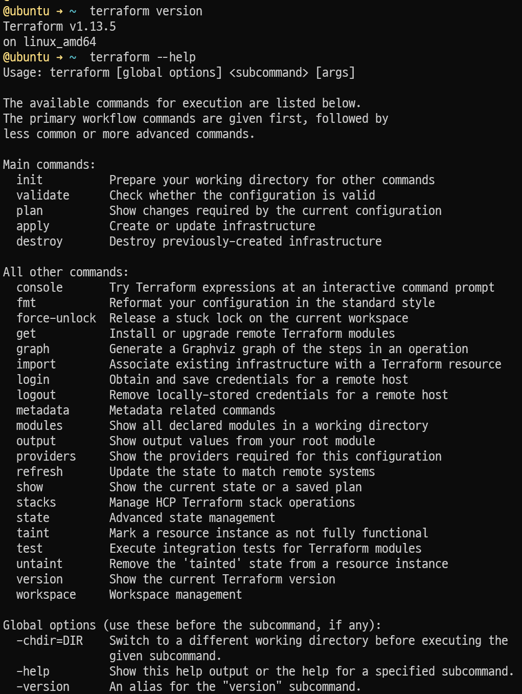
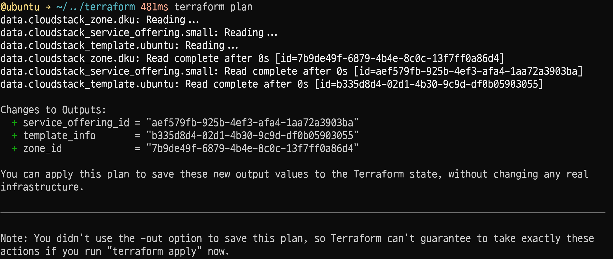
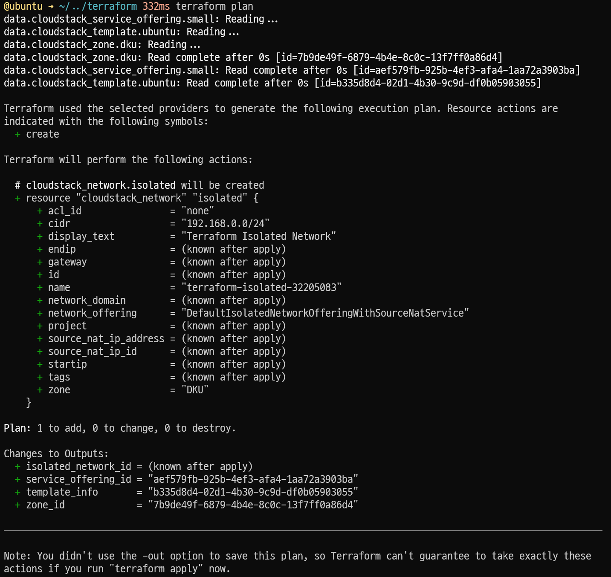

## 인프라 프로비저닝

Kubernetes 클러스터용 VM, 네트워크, 방화벽을 코드로 정의

### 테라폼 설치

테라폼 설치

```bash
wget -O - https://apt.releases.hashicorp.com/gpg | sudo gpg --dearmor -o /usr/share/keyrings/hashicorp-archive-keyring.gpg
echo "deb [arch=$(dpkg --print-architecture) signed-by=/usr/share/keyrings/hashicorp-archive-keyring.gpg] https://apt.releases.hashicorp.com $(grep -oP '(?<=UBUNTU_CODENAME=).*' /etc/os-release || lsb_release -cs) main" | sudo tee /etc/apt/sources.list.d/hashicorp.list
sudo apt update && sudo apt install terraform
```

Terraform 설치 확인

```bash
terraform version
terraform --help
```



Terraform 작업 디렉토리 생성 및 이동

```bash
mkdir terraform
cd terraform
```

### CloudStack provider 설정

`provider.tf` 파일 생성

```tf title="terraform/provider.tf"
terraform {
    required_providers {
        cloudstack = {
        source  = "cloudstack/cloudstack"
        version = "~> 0.5.0"
        }
    }
    required_version = ">= 1.0"
}

provider "cloudstack" {
    api_url    = "https://dku.kloud.zone/client/api"
    api_key    = "..."
    secret_key = "..."
}
```

Provider 초기화 실행
```bash
terraform init
```

`data.tf` 파일 생성

```tf title="terraform/data.tf"
data "cloudstack_template" "ubuntu" {
    template_filter = "featured"
    filter {
        name  = "name"
        value = "Ubuntu_24.04"
    }
}

data "cloudstack_zone" "dku" {
    filter {
        name  = "name"
        value = "DKU"
    }
}

data "cloudstack_service_offering" "small" {
    filter {
        name  = "name"
        value = "Small"
    }
}

output "template_info" {
    value = data.cloudstack_template.ubuntu.id
}

output "zone_id" {
    value = data.cloudstack_zone.dku.id
}

output "service_offering_id" {
    value = data.cloudstack_service_offering.small.id
}
```

API 연결 테스트



### Isolated Network 및 Port Forwarding Rule 생성

Isolated Network 생성을 위해 정의 파일 작성

```tf title="terraform/network.tf"
resource"cloudstack_network" "isolated" {
    name             = "terraform-isolated-32205083"
    display_text     = "Terraform Isolated Network"
    cidr             = "192.168.0.0/24"
    network_offering = "DefaultIsolatedNetworkOfferingWithSourceNatService"
    zone             = data.cloudstack_zone.dku.name
}

output "isolated_network_id" {
    value = cloudstack_network.isolated.id
}
```

Isolated Network 생성 plan 확인



Isolated Network 생성

```
@ubuntu ➜ ~/../terraform 524ms terraform apply
data.cloudstack_service_offering.small: Reading...
data.cloudstack_zone.dku: Reading...
data.cloudstack_template.ubuntu: Reading...
data.cloudstack_zone.dku: Read complete after 0s [id=7b9de49f-6879-4b4e-8c0c-13f7ff0a86d4]
data.cloudstack_service_offering.small: Read complete after 0s [id=aef579fb-925b-4ef3-afa4-1aa72a3903ba]
data.cloudstack_template.ubuntu: Read complete after 0s [id=b335d8d4-02d1-4b30-9c9d-df0b05903055]

Terraform used the selected providers to generate the following execution plan. Resource actions are indicated with the
following symbols:
  + create

Terraform will perform the following actions:

  # cloudstack_network.isolated will be created
  + resource "cloudstack_network" "isolated" {
      + acl_id                = "none"
      + cidr                  = "192.168.0.0/24"
      + display_text          = "Terraform Isolated Network"
      + endip                 = (known after apply)
      + gateway               = (known after apply)
      + id                    = (known after apply)
      + name                  = "terraform-isolated-32205083"
      + network_domain        = (known after apply)
      + network_offering      = "DefaultIsolatedNetworkOfferingWithSourceNatService"
      + project               = (known after apply)
      + source_nat_ip_address = (known after apply)
      + source_nat_ip_id      = (known after apply)
      + startip               = (known after apply)
      + tags                  = (known after apply)
      + zone                  = "DKU"
    }

Plan: 1 to add, 0 to change, 0 to destroy.

Changes to Outputs:
  + isolated_network_id = (known after apply)
  + service_offering_id = "aef579fb-925b-4ef3-afa4-1aa72a3903ba"
  + template_info       = "b335d8d4-02d1-4b30-9c9d-df0b05903055"
  + zone_id             = "7b9de49f-6879-4b4e-8c0c-13f7ff0a86d4"

Do you want to perform these actions?
  Terraform will perform the actions described above.
  Only 'yes' will be accepted to approve.

  Enter a value: yes

cloudstack_network.isolated: Creating...
cloudstack_network.isolated: Creation complete after 0s [id=84c27010-a7c8-4cf8-91d3-f25bb8ab022d]

Apply complete! Resources: 1 added, 0 changed, 0 destroyed.

Outputs:

isolated_network_id = "84c27010-a7c8-4cf8-91d3-f25bb8ab022d"
service_offering_id = "aef579fb-925b-4ef3-afa4-1aa72a3903ba"
template_info = "b335d8d4-02d1-4b30-9c9d-df0b05903055"
zone_id = "7b9de49f-6879-4b4e-8c0c-13f7ff0a86d4"
```


VM 생성을 위해 필요한 정보 정의

## 쿠버네티스 클러스터 자동 구성

## DevOps 환경 구축

## 환경 검증